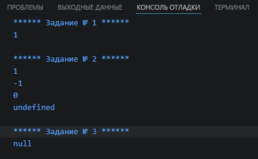
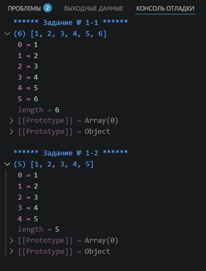
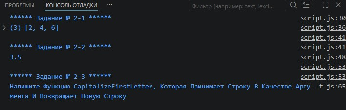
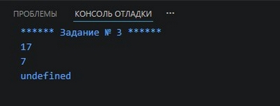
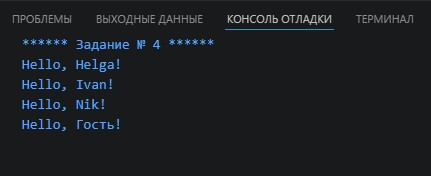
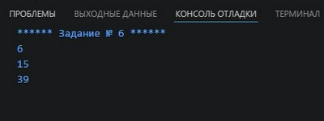

# Урок 2. Семинар: Функциональный Javascript

## План урока

- Выполнение практических заданий в соответствии с [презентацией](https://gbcdn.mrgcdn.ru/uploads/asset/5855353/attachment/b3586e9ee26ed21a3fe18cbb5223ad20.pdf) к уроку

## Домашняя работа ([решение](https://github.com/olgashenkel/GeekBrains-technological_specialization-ELECTIVES/blob/main/01.%20JavaScript%20about%20ECMAScript/02.%20Seminar_01/homework/script.js))

1) Дан массив `const arr = [1, 5, 7, 9]` с помощью `Math.min` и `spread оператора`, найти минимальное число в массиве, решение задание должно состоять из одной строки
2) Напишите функцию `createCounter`, которая создает счетчик и возвращает объект с двумя методами: `increment` и `decrement`. Метод `increment` должен увеличивать значение счетчика на 1, а метод `decrement` должен уменьшать значение счетчика на 1. Значение счетчика должно быть доступно только через методы объекта, а не напрямую.
3) Напишите рекурсивную функцию `findElementByClass`, которая принимает корневой элемент дерева `DOM` и название класса в качестве аргументов и возвращает первый найденный элемент с указанным классом в этом дереве.
```
Пример
const rootElement = document.getElementById('root');
const targetElement = findElementByClass(rootElement, 'my-class');
console.log(targetElement);
```

***Результат выполнения Домашней работы:***
```
/* **************** Задание № 1 **************** */
console.log(`****** Задание № 1 ******`);

const arr = [1, 5, 7, 9];
console.log(Math.min(...arr));


/* **************** Задание № 2 **************** */
console.log(`\n****** Задание № 2 ******`);

function createCounter() {
    let count = 0;
    return {
        increment() {
            count++;
            return count;
        },
        decrement() {
            count--;
            return count;
        },
        getValue() {
            return count;
        }
    };
}

console.log(createCounter().increment());
console.log(createCounter().decrement());
console.log(createCounter().getValue());
console.log(createCounter().count);


/* **************** Задание № 3 **************** */
console.log(`\n****** Задание № 3 ******`);

function findElementByClass(root, className) {

        if (!root) return null;

        // Проверяем, есть ли класс у текущего элемента
        if (root.classList && root.classList.contains(className)) {
                return root;
        }

        // Рекурсивно обходим всех детей
        for (let child of root.children) {
                const result = findElementByClass(child, className);
                if (result) return result; // Если нашли в глубине, прокидываем наверх
        }

        return null;
}

const rootElement = document.getElementById('root');
const targetElement = findElementByClass(rootElement, 'my-class');
console.log(targetElement);
```




## Практическая работа с семинара ([решение](https://github.com/olgashenkel/GeekBrains-technological_specialization-ELECTIVES/blob/main/01.%20JavaScript%20about%20ECMAScript/02.%20Seminar_01/seminar_01/script.js)):


### Задание 1 (тайминг 20 минут)
Текст задания
1. Создайте функцию `mergeArrays`, которая принимает два массива и возвращает новый массив, содержащий все элементы из обоих массивов. Используйте `spread оператор` для объединения массивов.
`mergeArrays([1, 2, 3], [4, 5, 6]);` 
*(Ожидаемый результат: [1, 2, 3, 4, 5, 6])*
2. Создайте функцию `removeDuplicates`, которая принимает любое количество аргументов и возвращает новый массив, содержащий только уникальные значения.
Используйте `rest оператор` для сбора всех аргументов в массив а затем `filter` для определения дубликатов.
`removeDuplicates(1, 2, 3, 2, 4, 1, 5);` 
*(Ожидаемый результат: [1, 2, 3, 4, 5])*


***Результат выполнения Задания № 1:***
```
//           ****** Задание № 1-1 ******
console.log(`****** Задание № 1-1 ******`);

function mergeArrays(...arrays) {
  return [].concat(...arrays);
}

const array1 = [1, 2, 3];
const array2 = [4, 5, 6];
console.log(mergeArrays(...array1, ...array2));


//           ****** Задание № 1-2 ******
console.log(`\n****** Задание № 1-2 ******`);

function removeDuplicates() {
  return [...new Set(arguments)];
};

console.log(removeDuplicates(1, 2, 3, 2, 4, 1, 5));
```




### Задание 2. Чистые функции (тайминг 25 минут)
Текст задания
1. Напишите функцию `getEvenNumbers`, которая принимает массив чисел в качестве аргумента и возвращает новый массив, содержащий только четные числа.
2. Задача: Напишите функцию `calculateAverage`, которая принимает
массив чисел в качестве аргумента и возвращает среднее значение
этих чисел.
3. Напишите функцию `capitalizeFirstLetter`, которая принимает строку в
качестве аргумента и возвращает новую строку, в которой первая
буква каждого слова является заглавной.

***Результат выполнения Задания № 2:***
```

//           ****** Задание № 2-1 ******
console.log(`****** Задание № 2-1 ******`);

const getEvenNumbers = (...arrays) => {
  return arrays.filter(index => index % 2 === 0);
};

console.log(getEvenNumbers(1, 2, 3, 4, 5, 6));


//           ****** Задание № 2-2 ******
console.log(`****** Задание № 2-2 ******`);

const calculateAverage = (...arrays) => {
  const sum = arrays.reduce((acc, val) => acc + val, 0);
  return sum / arrays.length;
};

console.log(calculateAverage(1, 2, 3, 4, 5, 6));


//           ****** Задание № 2-3 ******
console.log(`****** Задание № 2-3 ******`);

const capitalizeFirstLetter = (string) => {
  if (!string) return "Строка не передана"; // Возвращаем пустую строку, если на вход пришло null или ""

  return string
    .trim() // Убираем лишние пробелы в начале и конце
    .split(/\s+/) // Разделяем по любому количеству пробелов (один или более)
    .map(str => str.charAt(0).toUpperCase() + str.slice(1))
    .join(' ');
};

console.log(capitalizeFirstLetter('Напишите функцию capitalizeFirstLetter, которая принимает строку в качестве аргумента и возвращает новую строку'));
```



### Задание 3. Замыкания (тайминг 20 минут)
Текст задания

1. Напишите функцию `createCalculator`, которая принимает начальное значение и возвращает объект с двумя методами: `add` и `subtract`. 
   Метод add должен увеличивать значение на переданное число, а метод `subtract` должен уменьшать значение на переданное число. 
   Значение должно быть доступно только через методы объекта, а не напрямую


***Результат выполнения Задания № 3:***
```
console.log(`****** Задание № 3 ******`);

function createCalculator(number) {
  let startValue = number;
  return {
    add (value) {
      return startValue + value;
    },
    subtract (value) {
      return startValue - value;
    }

  }
}

console.log(createCalculator(12).add(5));     // 17
console.log(createCalculator(12).subtract(5)); // 7
console.log(createCalculator(12).startValue);  // undefined
```



### Задание 4. Лексический контекст (тайминг 15 минут)
Текст задания
1. Напишите функцию `createGreeting`, которая принимает имя пользователя и возвращает функцию, которая будет выводить приветствие с использованием этого имени.
```
// Пример использования:
const greeting = createGreeting('John');
greeting(); 
// Ожидаемый результат: "Hello, John!"
```

***Результат выполнения Задания № 4:***
```
console.log(`****** Задание № 4 ******`);

function createGreeting(userName) {
  const name = userName ? userName.trim() : "Гость"; // Убираем лишние пробелы и проверяем на null или undefined
  return `Hello, ${name.charAt(0).toUpperCase() + name.slice(1).toLowerCase()}!`;
}

console.log(createGreeting('    Helga      ')); // "Hello, Helga!"
console.log(createGreeting('iVAN')); // "Hello, Ivan!"
console.log(createGreeting('    NIK      ')); // "Hello, Nik!"
```




### Задание 5 (тайминг 15 минут)
Текст задания
1. Задача: Напишите функцию `createPasswordChecker`, которая принимает допустимую длину пароля в качестве аргумента и возвращает функцию для проверки введенного пароля.
   Возвращаемая функция должна принимать пароль и возвращать `true`, если его длина соответствует допустимой, и `false` в противном случае.

```   
// Пример использования:
const isPasswordValid = createPasswordChecker(8);
console.log(isPasswordValid('password')); 
// Ожидаемый результат:
false
console.log(isPasswordValid('secret')); 
// Ожидаемый результат: true
```

***Результат выполнения Задания № 5:***
```
console.log(`****** Задание № 5 ******`);

function createPasswordChecker(passwordLength) {
  return function(password) {
    if (typeof password !== 'string') {
      return "Пароль должен быть строкой";
    } else if (password.length === 0) {
      return "Пароль не может быть пустым";
    } else {
      return password.length <= passwordLength;
    }
  };
}

const checkPassword = createPasswordChecker(8);
console.log(checkPassword("password11")); // false
console.log(checkPassword("pass"));     // true
```

### Задание 6. Рекурсия (тайминг 25 минут)
Текст задания
1. Напишите рекурсивную функцию `sumDigits`, которая принимает положительное целое число в качестве аргумента и возвращает сумму его цифр.
```
// Пример использования:
console.log(sumDigits(123)); 
// Ожидаемый результат: 6 (1 + 2 + 3)
console.log(sumDigits(456789)); 
// Ожидаемый результат: 39 (4 + 5 + 6 + 7 + 8 + 9)
```

***Результат выполнения Задания № 6:***
```
console.log(`****** Задание № 6 ******`);

function sumDigits(number) {
  const digits = Math.abs(number).toString();
  let sum = 0;
  for (let i = 0; i < digits.length; i++) {
    sum += parseInt(digits[i]);
  }
  return sum;
}

console.log(sumDigits(123));
console.log(sumDigits(-456));
console.log(sumDigits(456789));
```

