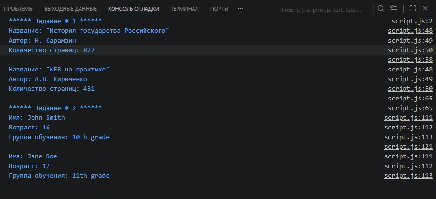
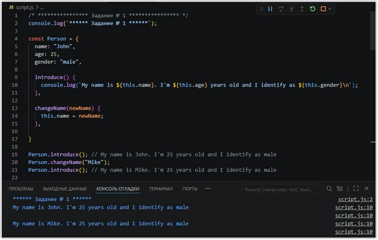
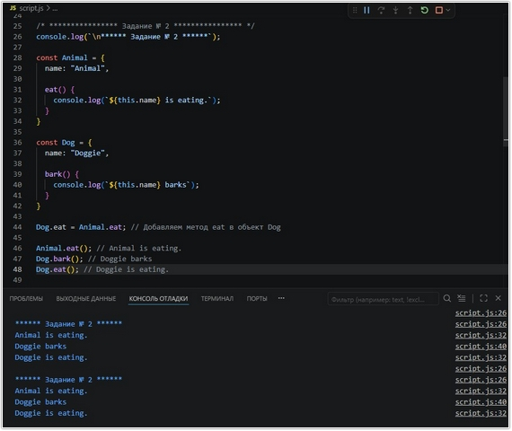
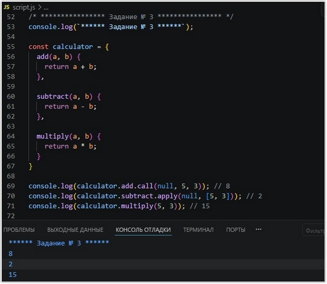
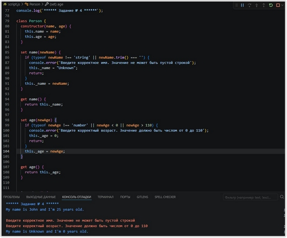
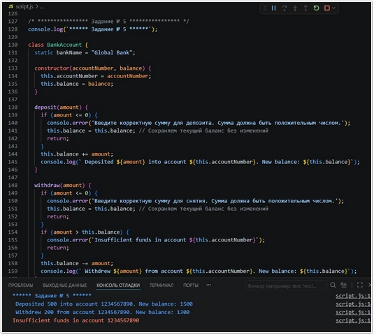
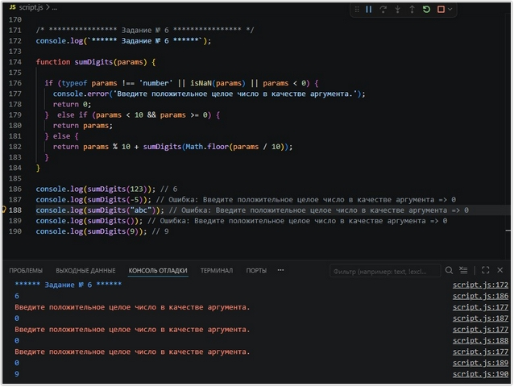

# Урок 4. Семинар: Основы ООП (объектно-ориентированного программирования)

## План урока

- Выполнение практических заданий в соответствии с [презентацией](https://gbcdn.mrgcdn.ru/uploads/asset/5855355/attachment/ae3c9c33039d2aec852bea4397dc6102.pdf) к уроку

## Домашняя работа ([решение](https://github.com/olgashenkel/GeekBrains-technological_specialization-ELECTIVES/blob/main/01.%20JavaScript%20about%20ECMAScript/04.%20Seminar_02/homework/script.js))

**Задание 1: "Управление библиотекой книг"**

Реализуйте класс `Book`, представляющий книгу, со следующими свойствами и методами:

Свойство `title` (название) - строка, название книги.
Свойство `author` (автор) - строка, имя автора книги.
Свойство `pages` (количество страниц) - число, количество страниц в книге.
Метод `displayInfo()` - выводит информацию о книге (название, автор и количество страниц).


**Задание 2: "Управление списком студентов"**

Реализуйте класс `Student`, представляющий студента, со следующими свойствами и методами:

Свойство `name` (имя) - строка, имя студента.
Свойство `age` (возраст) - число, возраст студента.
Свойство `grade` (класс) - строка, класс, в котором учится студент.
Метод `displayInfo()` - выводит информацию о студенте (имя, возраст и класс).

```
// Пример использования класса
const student1 = new Student(""John Smith"", 16, ""10th grade"");
student1.displayInfo();
// Вывод:
// Name: John Smith
// Age: 16
// Grade: 10th grade

const student2 = new Student(""Jane Doe"", 17, ""11th grade"");
student2.displayInfo();
// Вывод:
// Name: Jane Doe
// Age: 17
// Grade: 11th grade"
```

***Результат выполнения Домашней работы:***
```
/* **************** Задание № 1 **************** */
console.log(`****** Задание № 1 ******`);

class Book {
        constructor(title, author, pages) {
                this.title = title;
                this.author = author;
                this.pages = pages;
        }

        set title(newTitle) {
                if (typeof newTitle === 'string' && newTitle.trim() !== '') {
                        this._title = newTitle;
                } else {
                        console.error('Ошибка: Введите корректное название книги.');
                }
        }

        get title() {
                return this._title;
        }

        set author(newAuthor) {
                if (typeof newAuthor === 'string' && newAuthor.trim() !== '') {
                        this._author = newAuthor;
                } else {
                        console.error('Ошибка: Введите корректное имя автора.');
                }
        }

        get author() {
                return this._author;
        }

        set pages(newPages) {
                if (Number.isInteger(newPages) && newPages > 0) {
                        this._pages = newPages;
                } else {
                        console.error('Ошибка: Введите корректное количество страниц (целое число больше 0).');
                }
        }

        get pages() {
                return this._pages;
        }

        displayInfo() {
                console.log(`Название: "${this.title}"`);
                console.log(`Автор: ${this.author}`);
                console.log(`Количество страниц: ${this.pages}`);
        }
}

const book1 = new Book("История государства Российского", "Н. Карамзин", 827);
const book2 = new Book("WEB на практике", "А.В. Кириченко", 431);

book1.displayInfo();
console.log(''); // Пустая строка для разделения информации о книгах
book2.displayInfo();


/* **************** Задание № 2 **************** */
console.log(`\n****** Задание № 2 ******`);

class Student {
        constructor(name, age, grade) {
                this.name = name;
                this.age = age;
                this.grade = grade;
        }

        set name(newName) {
                if (typeof newName === 'string' && newName.trim() !== '') {
                        this._name = newName;
                } else {
                        console.error('Ошибка: Введите корректное имя студента.');
                }
        }

        get name() {
                return this._name;
        }

        set age(newAge) {
                if (Number.isInteger(newAge) && newAge > 15 && newAge < 70) {
                        this._age = newAge;
                } else {
                        console.error('Ошибка: Введите корректный возраст (целое число от 15 до 69).');
                }
        }
         
        get age() {
                return this._age;
        }

        set grade(newGrade) {
                if (typeof newGrade === 'string' && newGrade.trim() !== '') {
                        this._grade = newGrade;
                } else {
                        console.error('Ошибка: Введите корректные сведения о группе обучения студента.');
                }
        }

        get grade() {
                return this._grade;
        }

        displayInfo() {
                console.log(`Имя: ${this.name}`);
                console.log(`Возраст: ${this.age}`);
                console.log(`Группа обучения: ${this.grade}`);
        }
}

const student1 = new Student("John Smith", 16, "10th grade");
const student2 = new Student("Jane Doe", 17, "11th grade");

student1.displayInfo();
console.log('');
student2.displayInfo();
```





## Практическая работа с семинара ([решение](https://github.com/olgashenkel/GeekBrains-technological_specialization-ELECTIVES/blob/main/01.%20JavaScript%20about%20ECMAScript/04.%20Seminar_02/seminar_02/script.js)):


### Задание 1 (тайминг 20 минут)
Текст задания
1. Создайте объект `Person`, представляющий человека, со следующими свойствами: `name`, `age` и `gender`. Добавьте также методы `introduce` и `changeName`. 
Метод `introduce` должен выводить информацию о человеке, включая его имя, возраст и пол. Метод `changeName` должен изменять имя человека на новое заданное значение.
```
Person.name = "John";
Person.age = 25;
Person.gender = "male";
Person.introduce(); // Ожидаемый результат: My name is John. I'm 25 years old and I identify as male.
Person.changeName("Mike");
```


***Результат выполнения Задания № 1:***
```
console.log(`****** Задание № 1 ******`);

const Person = {
  name: "John",
  age: 25,
  gender: "male",

  introduce() {
    console.log(`My name is ${this.name}. I'm ${this.age} years old and I identify as ${this.gender}\n`);
  },

  changeName(newName) {
    this.name = newName;
  }
}

Person.introduce(); // My name is John. I'm 25 years old and I identify as male
Person.changeName("Mike");
Person.introduce(); // My name is Mike. I'm 25 years old and I identify as male
```




### Задание 2 (тайминг 20 минут)
Текст задания
1. Создайте объект `Animal` со свойством `name` и методом `eat()`, который выводит сообщение о том, что животное ест. Создайте объект `Dog` со свойством `name` и методом `bark()`, который выводит сообщение о том, что собака лает. Используйте одалживание метода `eat()` из объекта `Animal` для объекта `Dog`, чтобы вывести сообщение о том, что собака ест.
```
// Одалживание метода eat() из объекта Animal к объекту Dog
Dog.eat = Animal.eat;
Dog.eat(); // Вывод: Rex is eating.
```

***Результат выполнения Задания № 2:***
```
console.log(`\n****** Задание № 2 ******`);

const Animal = {
  name: "Animal",

  eat() {
    console.log(`${this.name} is eating.`);
  }
}

const Dog = {
  name: "Doggie",

  bark() {
    console.log(`${this.name} barks`);
  }
}

Dog.eat = Animal.eat; // Добавляем метод eat в объект Dog

Animal.eat(); // Animal is eating.
Dog.bark(); // Doggie barks
Dog.eat(); // Doggie is eating.
```




### Задание 3. Call, apply (тайминг 20 минут)
Текст задания
1. Создайте объект `calculator` с методами `add()`, `subtract()` и `multiply()`, которые выполняют соответствующие математические операции над двумя числами. Используйте методы `call` и `apply` для вызова этих методов с передачей аргументов.
```
console.log(calculator.add.call(null, 5, 3)); // Вывод: 8
console.log(calculator.subtract.apply(null, [5, 3])); // Вывод: 2
```

***Результат выполнения Задания № 3:***
```
console.log(`****** Задание № 3 ******`);

const calculator = {
  add(a, b) {
    return a + b;
  },

  subtract(a, b) {
    return a - b;
  },

  multiply(a, b) {
    return a * b;
  }
}

console.log(calculator.add.call(null, 5, 3)); // 8
console.log(calculator.subtract.apply(null, [5, 3])); // 2
console.log(calculator.multiply(5, 3)); // 15
```




### Задание 4. Объекты через class (тайминг 25 минут)
Текст задания
1. Создайте класс Person, который имеет свойства `name` и `age`, а также метод `introduce()`, который выводит сообщение с представлением имени и возраста персоны.

```
const person = new Person("John", 25);
person.introduce(); // Вывод: My name is John and I'm 25 years old.
```

***Результат выполнения Задания № 4:***
```
console.log(`****** Задание № 4 ******`);

class Person {
  constructor(name, age) {
    this.name = name;
    this.age = age;
  }

  set name(newName) {
    if (typeof newName !== 'string' || newName.trim() === '') {
      console.error('Введите корректное имя. Значение не может быть пустой строкой');
      this._name = "Unknown";
      return;
    }
    this._name = newName;
  }

  get name() {
    return this._name;
  }

  set age(newAge) {
    if (typeof newAge !== 'number' || newAge < 0 || newAge > 110) {
      console.error('Введите корректный возраст. Значение должно быть числом от 0 до 110');
      this._age = 0;
      return;
    }
    this._age = newAge;
  }

  get age() {
    return this._age;
  }


  introduce() {
    console.log(`My name is ${this.name} and I'm ${this.age} years old.\n`);
  }
}

const person1 = new Person("John", 25);
person1.introduce(); // My name is John and I'm 25 years old.

person1.name = ""; // Ошибка: Введите корректное имя. Значение не может быть пустой строкой
person1.age = -5; // Ошибка: Введите корректный возраст. Значение должно быть числом от 0 до 110
person1.introduce(); // My name is Unknown and I'm 0 years old.
```




### Задание 5. Class (тайминг 30 минут)
Текст задания
1. Создайте класс BankAccount, который представляет банковский счет. У него должны быть свойства accountNumber (номер счета) и balance (баланс), а также методы deposit(amount) для пополнения счета и withdraw(amount) для снятия денег со счета. Класс должен иметь также статическое свойство bankName, которое содержит название банка.

```
const account1 = new BankAccount("1234567890", 1000);
account1.deposit(500); // Вывод: Deposited 500 into account 1234567890. New balance: 1500
account1.withdraw(200); // Вывод: Withdrawn 200 from account 1234567890. New balance: 1300
account1.withdraw(1500); // Вывод: Insufficient funds in account 1234567890
```


***Результат выполнения Задания № 5:***
```
console.log(`****** Задание № 5 ******`);

class BankAccount {
  static bankName = "Global Bank";

  constructor(accountNumber, balance) {
    this.accountNumber = accountNumber;
    this.balance = balance;
  }

  deposit(amount) {
    if (amount <= 0) {
      console.error('Введите корректную сумму для депозита. Сумма должна быть положительным числом.');
      this.balance = this.balance; // Сохраняем текущий баланс без изменений
      return;
    }
    this.balance += amount;
    console.log(` Deposited ${amount} into account ${this.accountNumber}. New balance: ${this.balance}`);
  }

  withdraw(amount) {
    if (amount <= 0) {
      console.error('Введите корректную сумму для снятия. Сумма должна быть положительным числом.');
      this.balance = this.balance; // Сохраняем текущий баланс без изменений
      return;
    }
    if (amount > this.balance) {
      console.error(`Insufficient funds in account ${this.accountNumber}`);
      return;
    }
    this.balance -= amount;
    console.log(` Withdrew ${amount} from account ${this.accountNumber}. New balance: ${this.balance}`);
  }
}

const account1 = new BankAccount("1234567890", 1000);
account1.deposit(500); // Deposited 500 into account 1234567890. New balance: 1500
account1.withdraw(200); // Withdrew 200 from account 1234567890. New balance: 1300
account1.withdraw(1500); // Ошибка: Insufficient funds in account 1234567890
```




### Задание 6. Рекурсия (тайминг 25 минут)
Текст задания
1. Напишите рекурсивную функцию sumDigits, которая принимает положительное целое число в качестве аргумента и возвращает сумму его цифр.

```
// Пример использования:
console.log(sumDigits(123)); // Ожидаемый результат: 6 (1 + 2 + 3)
console.log(sumDigits(456789)); // Ожидаемый результат: 39 (4 + 5 + 6 + 7 + 8 + 9)
```

***Результат выполнения Задания № 6:***
```
console.log(`****** Задание № 6 ******`);

function sumDigits(params) {
  
  if (typeof params !== 'number' || isNaN(params) || params < 0) {
    console.error('Введите положительное целое число в качестве аргумента.');
    return 0;
  }  else if (params < 10 && params >= 0) {
    return params;
  } else {
    return params % 10 + sumDigits(Math.floor(params / 10));
  }
}

console.log(sumDigits(123)); // 6
console.log(sumDigits(-5)); // Ошибка: Введите положительное целое число в качестве аргумента => 0
console.log(sumDigits("abc")); // Ошибка: Введите положительное целое число в качестве аргумента => 0
console.log(sumDigits()); // Ошибка: Введите положительное целое число в качестве аргумента => 0
console.log(sumDigits(9)); // 9
```

