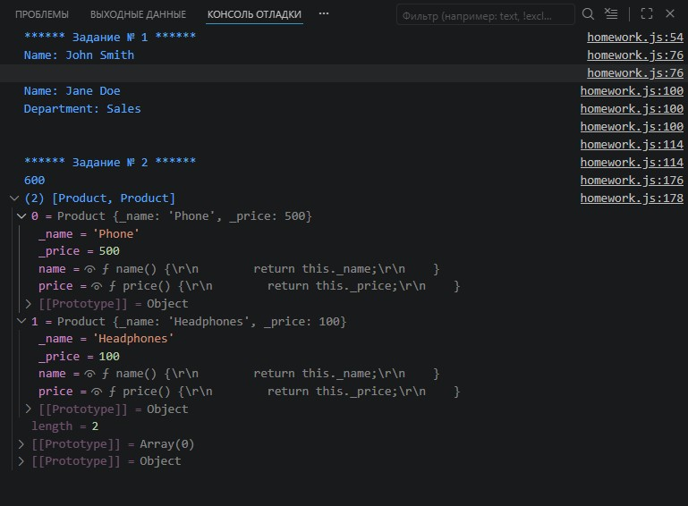
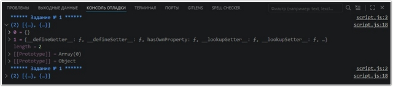
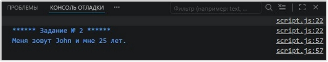
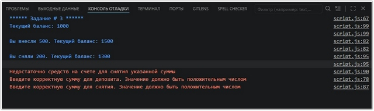

# Урок 6. Семинар: Объектно-ориентированное программирование в Javascript

## План урока

- Выполнение практических заданий в соответствии с [презентацией](https://gbcdn.mrgcdn.ru/uploads/asset/5855357/attachment/c1e93c4cc3d1ba499125c14afbb75bae.pdf) к уроку

## Домашняя работа ([решение](https://github.com/olgashenkel/GeekBrains-technological_specialization-ELECTIVES/blob/main/01.%20JavaScript%20about%20ECMAScript/06.%20Seminar_03/homework/script.js))


**Задание № 1. "Управление персоналом компании":**

Реализуйте класс Employee (сотрудник), который имеет следующие свойства и
методы:
- Свойство `name` (имя) - строка, имя сотрудника.
- Метод `displayInfo()` - выводит информацию о сотруднике (имя).
Реализуйте класс `Manager` (менеджер), который наследует класс `Employee` и имеет дополнительное свойство и метод:
    - Свойство `department` (отдел) - строка, отдел, в котором работает менеджер.
    - Метод `displayInfo()` - переопределяет метод `displayInfo()` родительского класса и выводит информацию о менеджере (имя и отдел).


```
_________________________________________________________
|   // Пример использования классов                     |
|   const employee = new Employee("John Smith");        |
|   employee.displayInfo();                             |
|   // Вывод:                                           |
|   // Name: John Smith                                 |
|   const manager = new Manager("Jane Doe", "Sales");   |
|   manager.displayInfo();                              |
|   // Вывод:                                           |
|   // Name: Jane Doe                                   |
|   // Department: Sales                                |
|_______________________________________________________|
```

**Задание № 2. "Управление списком заказов":**

Реализуйте класс `Order` (заказ), который имеет следующие свойства и методы:
- Свойство `orderNumber` (номер заказа) - число, уникальный номер заказа.
- Свойство `products` (продукты) - массив, содержащий список продуктов в заказе.
- Метод `addProduct(product)` - принимает объект product и добавляет его в
список продуктов заказа.
- Метод `getTotalPrice()` - возвращает общую стоимость заказа, основанную на ценах продуктов.

```
____________________________________________________________________
|   // Пример использования класса                                  |
|   class Product {                                                 |
|       constructor(name, price) {                                  |
|       this.name = name;                                           |
|       this.price = price;                                         |
|       }                                                           |
|   }                                                               |
|   const order = new Order(12345);                                 |
|   const product1 = new Product("Phone", 500);                     |
|   order.addProduct(product1);                                     |
|   const product2 = new Product("Headphones", 100);                |
|   order.addProduct(product2);                                     |
|   console.log(order.getTotalPrice()); // Вывод: 600               |
|___________________________________________________________________|
```

Результат выполнения ДЗ:
```

/* ******************** Задание № 1 ******************** */
console.log('****** Задание № 1 ******');

class Employee {

    constructor(name) {
        this.name = name;
    }

    set name(value) {
        if (typeof value !== 'string' || value.trim() === '') {
            console.error('Введите корректное имя. Значение не может быть пустой строкой');
            this._name = "Unknown";
            return;
        }
        this._name = value;
    }

    get name() {
        return this._name;
    }

    displayInfo() {
        console.log(`Name: ${this.name}\n`);
    }
};

class Manager extends Employee {
    constructor(name, department) {
        super(name);
        this.department = department;
    }

    set department(value) {
        if (typeof value !== 'string' || value.trim() === '') {
            console.error('Введите корректное название отдела. Значение не может быть пустой строкой');
            this._department = "Unknown";
            return;
        }
        this._department = value;
    }

    get department() {
        return this._department;
    }

    displayInfo() {
        console.log(`Name: ${this.name} \nDepartment: ${this.department}\n`);
    }
};

const employee = new Employee("John Smith");
employee.displayInfo(); // Name: John Smith

const manager = new Manager("Jane Doe", "Sales");
manager.displayInfo(); // Name: Jane Doe, Department: Sales


/* ******************** Задание № 2 ******************** */
console.log('\n****** Задание № 2 ******');

class Product {
    constructor(name, price) {
        this.name = name;
        this.price = price;
    }
    set name(value) {
        if (typeof value !== 'string' || value.trim() === '') {
            console.error('Введите корректное название продукта. Значение не может быть пустой строкой');
            this._name = "Unknown";
            return;
        }
        this._name = value;
    }

    get name() {
        return this._name;
    }

    set price(value) {
        if (typeof value !== 'number' || value <= 0) {
            console.error('Введите корректную цену продукта. Значение должно быть положительным числом');
            this._price = 0;
            return;
        }
        this._price = value;
    }

    get price() {
        return this._price;
    }
}


class Order {
    constructor(orderNumber) {
        this.orderNumber = orderNumber;
        this.products = [];
    }

    addProduct(product) {
        if (typeof product !== 'object' || !product.name || typeof product.price !== 'number') {
            console.error('Введите корректный продукт. Продукт должен быть объектом с полями name и price');
            return;
        }
        this.products.push(product);
    }

    getTotalPrice() {
        return this.products.reduce((total, product) => total + product.price, 0);
    }
};

const order = new Order(12345);

const product1 = new Product("Phone", 500);
order.addProduct(product1);

const product2 = new Product("Headphones", 100);
order.addProduct(product2);

console.log(order.getTotalPrice()); // Вывод: 600

console.log(order.products); // Вывод: [ Product { name: 'Phone', price: 500 }, Product { name: 'Headphones', price: 100 } ]
```




## Практическая работа с семинара ([решение](https://github.com/olgashenkel/GeekBrains-technological_specialization-ELECTIVES/blob/main/01.%20JavaScript%20about%20ECMAScript/06.%20Seminar_03/seminar_03/script.js)):


### Задание 1 (тайминг 20 минут)
Текст задания
1. Напишите функцию `getPrototypeChain(obj)`, которая будет возвращать цепочку прототипов для заданного объекта `obj`. Функция должна вернуть массив прототипов, начиная от самого объекта и заканчивая глобальным объектом `Object.prototype`.


***Результат выполнения Задания № 1:***
```
console.log(`****** Задание № 1 ******`);

function getPrototypeChain(obj) {
  const chain = [];
  let current = obj;

  while (current !== null) {
    chain.push(current);
    current = Object.getPrototypeOf(current);
  }

  return chain;
}

const myObject = {};
const prototypeChain = getPrototypeChain(myObject);
console.log(prototypeChain);
```




### Задание 2 (тайминг 20 минут)
Текст задания
1. Напишите конструктор объекта `Person`, который принимает два аргумента: `name` (строка) и `age` (число). Конструктор должен создавать объект с указанными свойствами `name` и `age` и методом `introduce()`, который выводит в консоль строку вида `"Меня зовут [name] и мне [age] лет."`.
   
```
// Пример:
const person1 = new Person("John", 25);
person1.introduce(); // Вывод: Меня зовут John и мне 25 лет.
```

***Результат выполнения Задания № 2:***
```
console.log(`\n****** Задание № 2 ******`);

class Person {
  constructor(name, age) {
    this.name = name;
    this.age = age;
  }

  set name(newName) {
    if (typeof newName !== 'string' || newName.trim() === '') {
      console.error('Введите корректное имя. Значение не может быть пустой строкой');
      this._name = "Unknown";
      return;
    } 
    this._name = newName;
  }

  get name() {
    return this._name;
  }

  set age(newAge) {
    if (typeof newAge !== 'number' || newAge < 0 || newAge > 110) {
      console.error('Введите корректный возраст. Значение должно быть числом от 0 до 110');
      this._age = 0;
      return;
    }
    this._age = newAge;
  }

  get age() {
    return this._age;
  }

  introduce() {
    console.log(`Меня зовут ${this.name} и мне ${this.age} лет.\n`);
  }
}

const person1 = new Person("John", 25);
person1.introduce(); // Меня зовут John и мне 25 лет.
```




### Задание 3. Call, apply (тайминг 20 минут)
Текст задания:

Напишите конструктор объекта `BankAccount`, который будет представлять банковский счет. Конструктор должен принимать два аргумента: `accountNumber` (строка) и `balance` (число). Конструктор должен создавать объект с указанными свойствами `accountNumber` и `balance` и следующими методами:
1. `deposit(amount)`: принимает аргумент amount (число) и увеличивает баланс на указанную сумму.
2. `withdraw(amount)`: принимает аргумент `amount` (число) и уменьшает баланс на указанную сумму, если на счету есть достаточно средств. Если средств недостаточно, выводится сообщение `"Недостаточно средств на счете."`.
3. `getBalance()`: возвращает текущий баланс счета.

```
Задание 3 (Пример)

const account1 = new BankAccount("1234567890", 1000);
console.log(account1.getBalance()); // Вывод: 1000
account1.deposit(500);
console.log(account1.getBalance()); // Вывод: 1500
account1.withdraw(200);
console.log(account1.getBalance()); // Вывод: 1300
account1.withdraw(2000); // Вывод: "Недостаточно средств на счете."
```

***Результат выполнения Задания № 3:***
```
console.log(`****** Задание № 3 ******`);


class BankAccount {
  constructor(accountNumber, balance) {
    this.accountNumber = accountNumber;
    this.balance = balance;
  }

  deposit(amount) {
    if (typeof amount !== 'number' || amount <= 0) {
      console.error('Введите корректную сумму для депозита. Значение должно быть положительным числом');
      return;
    } 
    this.balance += amount;
    console.log(`Вы внесли ${amount}. Текущий баланс: ${this.balance}\n`);
  }

  withdraw(amount) {
    if (typeof amount !== 'number' || amount <= 0) {
      console.error('Введите корректную сумму для снятия. Значение должно быть положительным числом');
      return;
    } else if (amount > this.balance) {
      console.error('Недостаточно средств на счете для снятия указанной суммы');
      return;
    }

    this.balance -= amount;
    console.log(`Вы сняли ${amount}. Текущий баланс: ${this.balance}\n`);
  }

  getBalance() {
    console.log(`Текущий баланс: ${this.balance}\n`);
    return this.balance;
  }
}

const myAccount = new BankAccount("123456789", 1000);
myAccount.getBalance(); // Текущий баланс: 1000
myAccount.deposit(500); // Вы внесли 500. Текущий баланс: 1500
myAccount.withdraw(200); // Вы сняли 200. Текущий баланс: 1300
myAccount.withdraw(1500); // Ошибка: Недостаточно средств на счете для снятия указанной суммы
myAccount.deposit(-100); // Ошибка: Введите корректную сумму для депозита. Значение должно быть положительным числом
myAccount.withdraw(-50); // Ошибка: Введите корректную сумму для снятия. Значение должно быть положительным числом
```




### Задание 4. Class (тайминг 30 минут)
Текст задания

Создайте класс `Animal`, который будет представлять животное. У класса `Animal` должны быть следующие свойства и методы:
● Свойство `name` (строка) - имя животного.
● Метод `speak()` - выводит в консоль звук, издаваемый животным.

Создайте подкласс `Dog`, который наследует класс `Animal`. Для подкласса `Dog` добавьте дополнительное свойство и метод:
● Свойство `breed` (строка) - порода собаки.
● Метод `fetch()` - выводит в консоль сообщение `"Собака [name]
принесла мяч."`.

```
Задание 5 (Пример использования)
const animal1 = new Animal("Животное");
animal1.speak(); // Вывод: Животное издает звук.
const dog1 = new Dog("Бобик", "Дворняжка");
dog1.speak(); // Вывод: Животное Бобик издает звук.
console.log(dog1.breed); // Вывод: Дворняжка
dog1.fetch(); // Вывод: Собака Бобик принесла мяч.
```

***Результат выполнения Задания № 4:***
```
console.log(`****** Задание № 4 ******`);

class Animal {
  constructor(name) {
    this.name = name;
  }

  set name(newName) {
    if (typeof newName !== 'string' || newName.trim() === '') {
      console.error('Введите корректное имя животного. Значение не может быть пустой строкой');
      this._name = "Unknown";
      return;
    }
    this._name = newName;
  }

  get name() {
    return this._name;
  }

  speak() {
    console.log(`${this.name} издает звук.`);
  }
}

class Dog extends Animal {
  constructor(name, breed) {
    super(name);
    this.breed = breed;
  }

  set breed(newBreed) {
    if (typeof newBreed !== 'string' || newBreed.trim() === '') {
      console.log('Ошибка ввода породы собаки');
      this._breed = "Порода собаки неизвестна";
      return;
    }
    this._breed = newBreed;
  }

  get breed() {
    return this._breed;
  }

  fetch() {
    console.log(`Собака ${this.name} принесла мяч.`);
  }
}

const animal1 = new Animal("Животное");
animal1.speak(); // Вывод: Животное издает звук.

const dog1 = new Dog("Бобик", "Дворняжка");
dog1.speak(); // Вывод: Животное Бобик издает звук.

console.log(dog1.breed); // Вывод: Дворняжка
dog1.fetch(); // Вывод: Собака Бобик принесла мяч.
```


