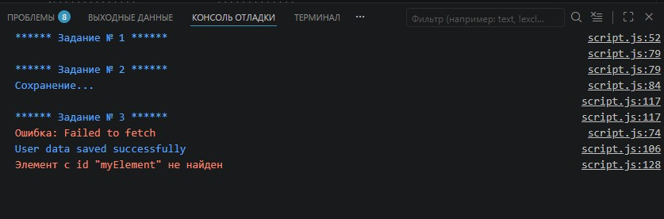
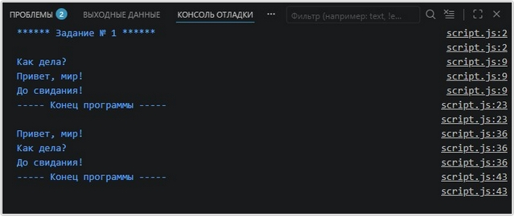
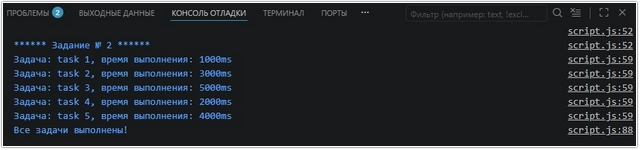
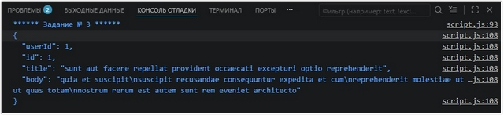
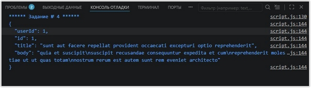
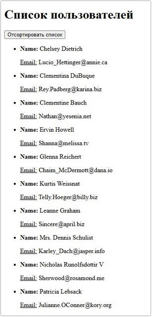

# Урок 8. Семинар: Асинхронность в Javascript

## План урока

- Выполнение практических заданий в соответствии с [презентацией](https://gbcdn.mrgcdn.ru/uploads/asset/5855359/attachment/281be555eb44852439ce42ccd1bfa9b3.pdf) к уроку

## Домашняя работа ([решение](https://github.com/olgashenkel/GeekBrains-technological_specialization-ELECTIVES/blob/main/01.%20JavaScript%20about%20ECMAScript/08.%20Seminar_04/homework/script.js))


**""Получение данных о пользователе""**

Реализуйте функцию `getUserData`, которая принимает идентификатор пользователя (ID) в качестве аргумента и использует `fetch` для получения данных о пользователе с заданным ID с удаленного сервера. Функция должна возвращать промис, который разрешается с данными о пользователе в виде объекта. Если пользователь с указанным ID не найден, промис должен быть отклонен с соответствующим сообщением об ошибке.

Подсказка, с последовательностью действий:
getUserData использует `fetch` для получения данных о пользователе с удаленного сервера. Если запрос успешен (с кодом 200), функция извлекает данные из ответа с помощью `response`.`json()` и возвращает объект с данными о пользователе. Если запрос неуспешен, функция отклоняет промис с сообщением об ошибке.

**""Отправка данных на сервер""**

Реализуйте функцию `saveUserData`, которая принимает объект с данными о пользователе в качестве аргумента и использует `fetch` для отправки этих данных на удаленный сервер для сохранения. Функция должна возвращать промис, который разрешается, если данные успешно отправлены, или отклоняется в случае ошибки.

```
*Подсказка *
// Пример использования функции
const user = {
  name: 'John Smith',
  age: 30,
  email: 'john@example.com'
};

saveUserData(user)
  .then(() => {
  console.log('User data saved successfully');
})
  .catch(error => {
  console.log(error.message);
});
```

`saveUserData` использует `fetch` для отправки данных о пользователе на удаленный сервер для сохранения. Она отправляет POST-запрос на URL-адрес /users с указанием типа содержимого `application/json` и сериализует объект с данными о пользователе в JSON-строку с помощью `JSON.stringify()`. Если запрос успешен (с кодом 200), функция разрешает промис. Если запрос неуспешен, функция отклоняет промис с сообщении

**""Изменение стиля элемента через заданное время""**

Напишите функцию `changeStyleDelayed`, которая принимает идентификатор элемента и время задержки (в миллисекундах) в качестве аргументов. Функция должна изменить стиль элемента через указанное время.

```
// Пример использования функции
changeStyleDelayed('myElement', 2000); // Через 2 секунды изменяет стиль элемента с id 'myElement'"
```


Результат выполнения ДЗ:
```
console.log('\n****** Задание № 2 ******');


const saveUserData = (user) => {
    return new Promise((resolve, reject) => {
        console.log("Сохранение...");
        setTimeout(() => {
            // Имитация валидации: если имя пустое, будет ошибка
            if (!user.name) {
                reject(new Error("Ошибка: Имя пользователя обязательно"));
            } else {
                resolve();
            }
        }, 1500);
    });
};


async function handleUserSave() {
    try {
        const userData = {
            name: 'John Smith',
            age: 30,
            email: 'john@example.com'
        };

        await saveUserData(userData);
        console.log('User data saved successfully');
    } catch (error) {
        console.log(`Ошибка: ${error.message}`);
    }
}

handleUserSave();


/* ******************** Задание № 3 ******************** */
console.log('\n****** Задание № 3 ******');

function changeStyleDelayed(id, delay) {
  setTimeout(() => {
    const element = document.getElementById(id);
    if (element) {
      // Здесь можно указать любые нужные свойства
      element.style.color = 'red';
      element.style.fontWeight = 'bold';
      element.style.backgroundColor = 'yellow';
    } else {
      console.warn(`Элемент с id "${id}" не найден`);
    }
  }, delay);
}

// Пример использования: через 2 секунды текст станет красным на желтом фоне
changeStyleDelayed('myElement', 2000);
```




## Практическая работа с семинара ([решение](https://github.com/olgashenkel/GeekBrains-technological_specialization-ELECTIVES/blob/main/01.%20JavaScript%20about%20ECMAScript/08.%20Seminar_04/seminar_04/script.js)):


### Задание 1 (тайминг 5 минут)
Текст задания
1. Создайте функцию `delayedMessage(message, delay)`, которая принимает аргументы `message` (строка) и `delay` (число). Функция должна выводить заданное сообщение в консоль через указанную задержку.
2. Вызовите функцию `delayedMessage()` три раза с разными сообщениями и задержками. Например:   
  a. delayedMessage("Сообщение 1", 2000)   
  b. delayedMessage("Сообщение 2", 1000)   
  c. delayedMessage("Сообщение 3", 3000)
3. После вызова всех функций `delayedMessage()`, добавьте сообщение вида "Конец программы" с помощью `console.log()`.

```
Ожидаемый результат:

Сообщение 2
Сообщение 1
Сообщение 3
Конец программы
```


***Результат выполнения Задания № 1:***
```
console.log(`****** Задание № 1 ******\n`);

// 1-ый вариант: вывод сообщений в соответствии с задержкой, но не по порядку
function delayedMessage(message, delay) {
  // Возвращаем промис, чтобы Promise.allSettled мог его "ждать"
  return new Promise((resolve) => {
    setTimeout(() => {
      console.log(message);
      resolve();
    }, delay);
  });
}

async function runDelayedMessages() {
  // Добавляем await, чтобы дождаться выполнения всех промисов
  await Promise.allSettled([
    delayedMessage('Привет, мир!', 2000),
    delayedMessage('Как дела?', 1000),
    delayedMessage('До свидания!', 3000),
  ]);

  console.log('----- Конец программы -----')
}

runDelayedMessages();


// // 2-ой вариант: вывод всех сообщений строго по порядку с помощью async/await
// // Функция-таймаут, которая возвращает Promise
// const sleep = (ms) => new Promise(resolve => setTimeout(resolve, ms));

// async function funcMassages() {
//   const delayedMessage = async (message, delay) => {
//     await sleep(delay);
//     console.log(message);
//   };

//    delayedMessage('Привет, мир!', 2000);
//    delayedMessage('Как дела?', 1000);
//    delayedMessage('До свидания!', 3000);

//   console.log('Конец программы');

// }

// funcMassages();
```





### Задание 2 (тайминг 20 минут)
Текст задания

У вас есть список задач, которые необходимо выполнить в определенном порядке. Каждая задача должна быть выполнена через определенный промежуток времени, заданный в миллисекундах. 

Вам необходимо написать функцию, которая принимает список задач и интервал времени, а затем выполняет каждую задачу через определенный промежуток времени.

```
const task = [
  { name: 'task 1', time: 1000 }, 
  { name: 'task 2', time: 3000 }, 
  { name: 'task 3', time: 5000 }, 
  { name: 'task 4', time: 2000 }, 
  { name: 'task 5', time: 4000 }, 
]
```

***Результат выполнения Задания № 2:***
```
console.log(`\n****** Задание № 2 ******`);

const sleep = (ms) => new Promise(resolve => setTimeout(resolve, ms));

async function taskList(tasks, callback) {
  for (const task of tasks) {
    await sleep(task.time);
    console.log(`Задача: ${task.name}, время выполнения: ${task.time}ms`);
  }
  callback();
}


  const task = [{
      name: 'task 1',
      time: 1000
    },
    {
      name: 'task 2',
      time: 3000
    },
    {
      name: 'task 3',
      time: 5000
    },
    {
      name: 'task 4',
      time: 2000
    },
    {
      name: 'task 5',
      time: 4000
    },
  ];

  taskList(task, () => {
    console.log('Все задачи выполнены!');
  });
```




### Задание 3 (тайминг 20 минут)
Текст задания:

Напишите программу, которая загружает данные с сервера с использованием объекта `XMLHttpRequest` и отображает полученную информацию в консоли.
1. Создайте функцию `loadData(url)`, которая принимает аргумент `url` (строка) - адрес сервера для загрузки данных.
2. Внутри функции `loadData()` создайте объект `XMLHttpRequest` с
помощью `new XMLHttpRequest()`.
3. Зарегистрируйте обработчик события `onreadystatechange`, который будет вызываться при изменении состояния запроса. Проверьте, если `readyState` равен 4 (успешно выполнен запрос) и `status` равен 200 (успешный статус ответа сервера), то выведите полученные данные в консоль с помощью `console.log(xhr.responseText)`.


***Результат выполнения Задания № 3:***
```
console.log(`****** Задание № 3 ******`);


  function loadData(url) {
    // 1. Создаем новый объект XMLHttpRequest
    const xhr = new XMLHttpRequest();

    // 2. Настраиваем запрос: тип GET, адрес url, асинхронно (true)
    xhr.open('GET', url, true);

    // 3. Регистрируем обработчик изменения состояния запроса
    xhr.onreadystatechange = function() {
      // Проверяем: запрос завершен (4) и сервер ответил "ОК" (200)
      if (xhr.readyState === 4 && xhr.status === 200) {
        // Выводим полученные данные в консоль
        console.log(xhr.responseText);
      }
    };

    // 4. Отправляем запрос на сервер
    xhr.send();
  }

  
  // Пример использования (с тестовым API):
  loadData('https://jsonplaceholder.typicode.com/posts/1');
  
  /*
  Как это работает:
  - readyState === 4: Означает, что операция полностью завершена.
  - status === 200: Подтверждает, что сервер нашел ресурс и успешно его передал.
  - xhr.responseText: Содержит текстовое тело ответа (чаще всего в формате JSON).
  Таким образом, когда запрос успешно завершится, мы увидим в консоли данные, полученные от сервера.
  */
```




### Задание 4 (тайминг 20 минут)
Текст задания   
Переписать XMLHttpRequest из Задания № 3 на fetch.

***Результат выполнения Задания № 4:***
```
console.log(`****** Задание № 4 ******`);

function loadData(url) {
  // Выполняем запрос
  fetch(url)
    .then(response => {
      // Проверяем, успешен ли ответ (статус 200-299)
      if (response.ok) {
        return response.text(); // Читаем тело ответа как текст
      }
      throw new Error('Ошибка сети: ' + response.status);
    })
    .then(data => {
      // Выводим полученные данные в консоль
      console.log(data);
    })
    .catch(error => {
      // Обрабатываем возможные ошибки (например, отсутствие интернета)
      console.error('Произошла ошибка:', error);
    });
}

// Пример использования:
loadData('https://jsonplaceholder.typicode.com/posts/1');

/*
Основные отличия:
  - Лаконичность: Вместо проверки readyState и status, мы используем свойство response.ok.
  - Цепочки вызовов: С помощью .then() логика обработки данных идет последовательно.
  - Обработка ошибок: Метод .catch() перехватывает любые проблемы, которые могли возникнуть в процессе запроса.
Таким образом, fetch обеспечивает более современный и удобный способ работы с асинхронными запросами по сравнению с XMLHttpRequest.
*/
```




### Задание 5\* (тайминг 40 минут)
Текст задания

Вы разрабатываете простой WEB-интерфейс для отображения списка пользователей с сервера и возможности сортировки этих пользователей по имени. У вас уе есть функциональность для получения списка пользователей с сервера и отображения их в виде списка на странице.

Ваша задача - реализовать сортировку пользователей по имени и добавить кнопку, при нажатии на которую список пользователей будет автоматически сортироваться по имени.

https://jsonplaceholder.typicode.com/users


***Результат выполнения Задания № 5\*:***
```
console.log(`****** Задание № 5 ******`);


"use strict";

const url = "./users.json";
let usersData = []; // Переменная для хранения данных

async function getData(url) {
  try {
    const response = await fetch(url);
    const data = await response.json();
    return data;
  } catch (error) {
    console.log(error.message);
  }
}

// Функция отрисовки данных
function renderUsers(data) {
  const userListsClass = document.querySelector(".userLists__list");
  userListsClass.innerHTML = ""; // Очищаем список перед отрисовкой
  data.forEach((element) => {
    userListsClass.insertAdjacentHTML(
      "beforeend",
      `
      <li class="userLists__item">        
        <p class="userLists__name"><b>Name:</b> ${element.name}</p>
        <p class="userLists__email"><u>Email:</u> ${element.email}</p>
      </li>
    `);
  });
}

document.addEventListener("DOMContentLoaded", async () => {
  usersData = await getData(url); // Сохраняем данные в переменную
  if (usersData) renderUsers(usersData);
});


function sortUsersByName() {
  // Сортируем сохраненный массив usersData
  const sortedUsers = [...usersData].sort((a, b) => {
    return a.name.localeCompare(b.name);
  });
  renderUsers(sortedUsers); // Отрисовываем отсортированный список
}


document.querySelector('.sortedButton').addEventListener('click', sortUsersByName);
```




