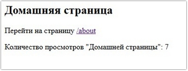
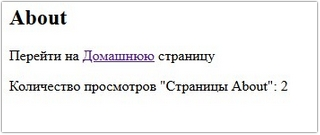
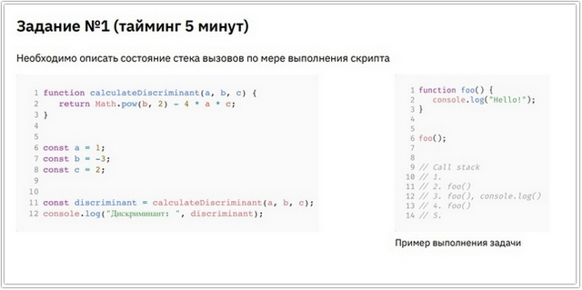
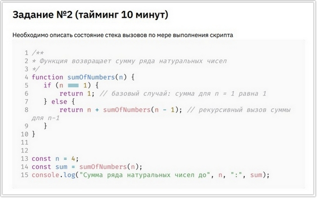
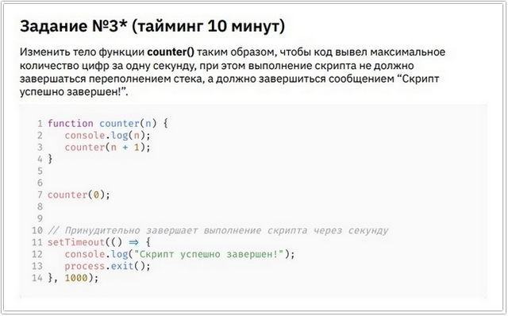
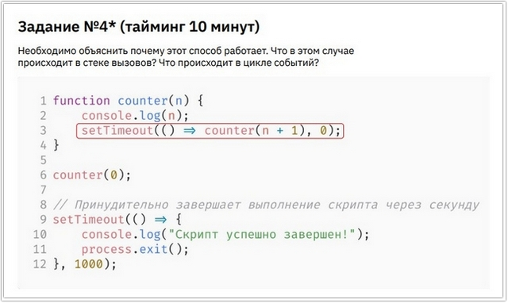
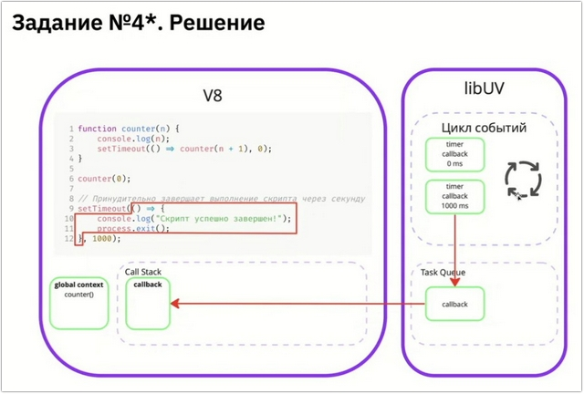
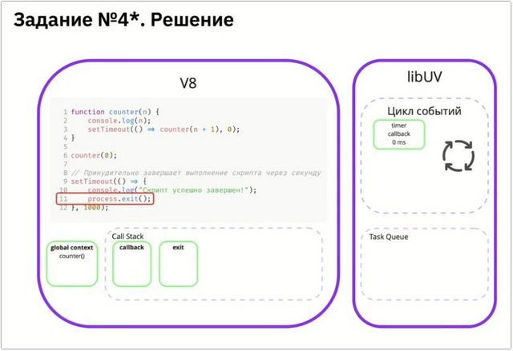
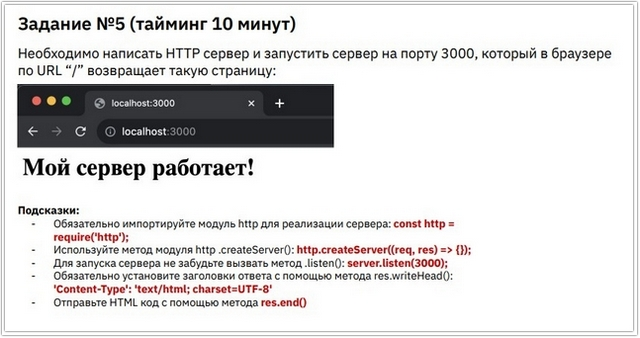
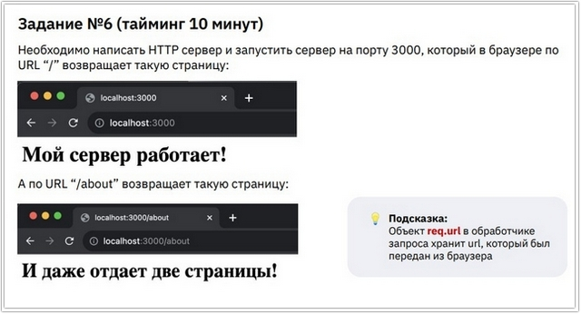

# Урок 2. Семинар: Введение в Node.js

## План урока

- Выполнение практических заданий в соответствии с [презентацией](https://gbcdn.mrgcdn.ru/uploads/asset/5856166/attachment/b3551b5cdcedb3eedbd97eaa02c2db9a.pdf) к уроку
- Ответы на вопросы по лекции
- Подготовимся к выполнению заданий
- Глубоко разберёмся с асинхронностью в Node.js
- Попрактикуемся в написании HTTP сервера 

---
## Домашняя работа ([задание](https://gbcdn.mrgcdn.ru/uploads/asset/5856167/attachment/50ea8eba7de7b44d61526b571bf6cb7b.pdf)) - [решение]()

Напишите HTTP сервер и реализуйте два обработчика, где:
- По `URL “/”` будет возвращаться страница, на которой есть гиперссылка на вторую страницу по ссылке `“/about”`
- А по `URL “/about”` будет возвращаться страница, на которой есть гиперссылка на первую страницу `“/”`
- Также реализуйте обработку несуществующих `роутов (404)`.
- \* На каждой странице реализуйте счетчик просмотров. Значение счетчика должно увеличиваться на единицу каждый раз, когда загружается страница

***Результат выполнения Домашней работы:***
```
import {
    createServer
} from 'http';

let countHome = 0;
let countAbout = 0;

createServer(function (request, response) {

    response.setHeader("Content-Type", "text/html; charset=utf-8;");

    if (request.url === "/") {
        response.write(`
            <h2>Домашняя страница</h2>
            <p>Перейти на страницу <a href = '/about'>/about</a></p>
            <p>Количество просмотров \"Домашней страницы\": ${countHome++}</p>
        `);
    } else if (request.url === "/about") {
        response.write(
            `
            <h2>About</h2>
            <p>Перейти на <a href = '/'>Домашнюю</a> страницу</p>
            <p>Количество просмотров \"Страницы About\": ${countAbout++}</p>
        `)
    } else {
        response.write(`
            <h2>404 - Страница не найдена!</h2>
            <p>Перейти на <a href = '/'>Домашнюю</a> страницу</p>            
            `)
    }
    response.end();
}).listen(3000);
```






---

## Практическая работа с семинара ([решение]()):


### Задание 1 (тайминг 5 минут)




***Результат выполнения Задания № 1:***
```
Состояние стека вызовов по мере выполнения скрипта:

Call stack
1. 
2. const discriminant = calculateDiscriminant(a, b, c);
3. function calculateDiscriminant(a, b, c),     Math.pow(b, 2) - 4 * a *c
4. function calculateDiscriminant(a, b, c)
5. 
6. console.log('Дискриминант: ', discriminant);
7.
```


### Задание 2 (тайминг 10 минут)




***Результат выполнения Задания № 2:***
```
// Call stack
// 1. 
// 2. function suOfNumbers(n)   // 4
// 3. function suOfNumbers(n), function suOfNumbers(n)  // 3
// 4. function suOfNumbers(n), function suOfNumbers(n), function suOfNumbers(n) //2
// 5. function suOfNumbers(n), function suOfNumbers(n), function suOfNumbers(n), function suOfNumbers(n)    // 1
// 6. function suOfNumbers(n), function suOfNumbers(n), function suOfNumbers(n)
// 7. function suOfNumbers(n), function suOfNumbers(n)
// 8. function suOfNumbers(n)
// 9. 
// 10. console.log('Сумма ряда натуральных чисел до ', n, ': ', sum);
// 11. 
```


### Задание 3\* (тайминг 10 минут)




***Результат выполнения Задания № 3:***
```
function counter(n) {
    console.log(n);
    setTimeout(() => counter(n + 1), 0);
}

counter(0);

// Принудительно завершает выполнение скрипта через секунду
setTimeout(() => {
    console.log('Скрипт успешно завершен!');
    process.exit();
}, 1000);
```


### Задание 4\* (тайминг 10 минут)




***Результат выполнения Задания № 4:***







### Задание 5 (тайминг 10 минут)




***Результат выполнения Задания № 5:***
```
import { createServer } from 'http';

createServer(function (request, response) {
    response.setHeader("Content-Type", "text/html; charset=UTF-8;");
    response.write("<h2>Мой сервер работает!</h2>");
    response.end();    
}).listen(3000, function(){
    console.log('Сервер запущен по адресу http://127.0.0.1:3000/');
});
```

### Задание 6 (тайминг 10 минут)



***Результат выполнения Задания № 6:***
```
import { createServer } from "http";

createServer(function(request, response){
    response.setHeader("Content-Type", "text/html; charset=UTF-8;");

    if (request.url === "/") {
        response.write("<h2>Мой сервер работает!</h2>");
    } else if (request.url === "/about") {
        response.write("<h2>И даже отдает две страницы!</h2>")
    } else {
        response.write("<h2>Страница не найдена!</h2>")
    }
    response.end();
}).listen(3000);
```
