# Урок 4. Семинар: Введение в NPM

## План урока

- Выполнение практических заданий в соответствии с [презентацией](https://gbcdn.mrgcdn.ru/uploads/asset/5856170/attachment/c74e1d718f8934e602a5d0248b2d8e83.pdf) к уроку
- Ответы на вопросы по лекции
- Подготовимся к выполнению заданий
- Поработаем с NPM, установим некоторые пакеты
- Попрактикуемся с версионированием
 

---
## Домашняя работа [решение](https://github.com/olgashenkel/GeekBrains-technological_specialization-ELECTIVES/tree/main/02.%20Node.js%20Basics%20and%20Build%20Tools/04.%20Seminar_02/seminar_02/homework) ([проверка](https://github.com/olgashenkel/GeekBrains-technological_specialization-ELECTIVES/tree/main/02.%20Node.js%20Basics%20and%20Build%20Tools/04.%20Seminar_02/seminar_02/homework_check))

**Написать свою собственную библиотеку и опубликовать в NPM.**

Что нужно помнить при реализации:
- Ваш модуль должен обязательно экспортировать функции которые будут полезны вашим пользователям с помощью `modules.exports`
- Не забудьте указать в `package.json` в поле `main` файл, который будет основным в вашей библиотеке
- Обязательно создайте и опишите `README.md` файл в корне вашего проекта
- Если у вас есть репозиторий в `github` или `gitlab`, опубликуйте туда ваш код и в `package.json` укажите ссылку на репозиторий в поле `repository`
- Протестируйте работу вашей библиотеки после публикации. Попробуйте установить её в любом другом проекте с помощью npm `i имя_вашей_библиотеки` и попробуйте ее использовать 
  
Формат сдачи задания:
- Достаточно прислать ссылку на сайт [https://npmjs.com/](https://npmjs.com/) на вашу библиотеку

Идеи для библиотеки:
- Библиотека для генерации случайных данных, таких как имена, адреса, даты, числа и т.д. Это может быть полезно для тестирования или создания заглушек данных.
- Библиотека для работы с математикой: например функции для решения квадратных уравнений.
- Библиотека для генерации паролей, которая позволяет генерировать случайные и безопасные пароли. Можно реализовать методы для указания длины пароля, использования различных типов символов (буквы, цифры, специальные символы) и т.д.


***Результат выполнения Домашней работы:***

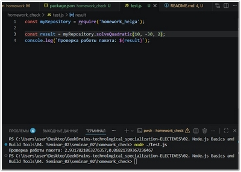
---

## Практическая работа с семинара ([решение](https://github.com/olgashenkel/GeekBrains-technological_specialization-ELECTIVES/tree/main/02.%20Node.js%20Basics%20and%20Build%20Tools/04.%20Seminar_02/seminar_02)):


### Задание 0  (тайминг 5 минут)

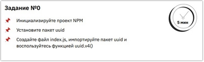


***Результат выполнения Задания № 0:***
```
const uuid = require('uuid');

const id = uuid.v4();
console.log(id);
```


### Задание 1 (тайминг 10 минут)

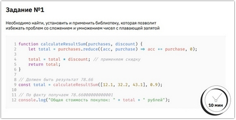


***Результат выполнения Задания № 1:***
```
const NP = require('number-precision');

function calculateResultSum(purchases, discount) {
    let total = purchases.reduce((acc, purchase) => NP.plus(acc += purchase), 0);

    total = NP.times(total, discount);
    return total;
};

const total = calculateResultSum([12.1, 32.2, 43.1], 0.9);

console.log("Общая стоимость покупок: " + total + " рублей");
```


### Задание 2 (тайминг 10 минут)

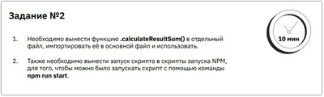


***Результат выполнения Задания № 2:***

**Файл calculateResultSum.js**
```
const NP = require('number-precision');

function calculateResultSum(purchases, discount) {
    let total = purchases.reduce((acc, purchase) => NP.plus(acc += purchase), 0);

    total = NP.times(total, discount);
    return total;
}

exports.calculateResultSum = calculateResultSum;
```

**Файл task_02.js**
```
const { calculateResultSum } = require('./calculateResultSum');

const total = calculateResultSum([12.1, 32.2, 43.1], 0.9);

console.log("Общая стоимость покупок: " + total + " рублей");
```


### Задание 3 (тайминг 10 минут)

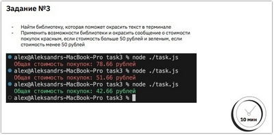


***Результат выполнения Задания № 3:***
```
const { calculateResultSum } = require('./calculateResultSum');

require('colors');

const total = calculateResultSum([12.1, 32.2, 43.1], 0.9);

console.log("Общая стоимость покупок: " + (total > 50? `${total}`.red : `${total}`.green) + " рублей");
```

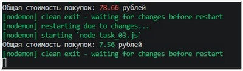


### Задание 4 (тайминг 15 минут)

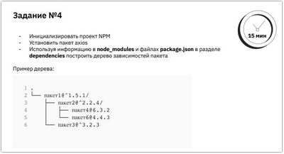

[Инструмент для построения деревьев](https://tree.nathanfriend.com/)


***Результат выполнения Задания № 4:***

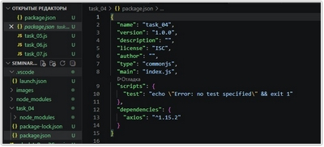


### Задание 5 (тайминг 5 минут)

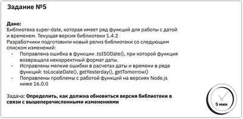


***Результат выполнения Задания № 5:***
```
Ответ: v1.4.3
```


### Задание 6 (тайминг 5 минут)

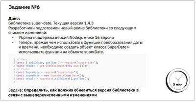

***Результат выполнения Задания № 6:***
```
Ответ: v2.0.0
```


### Задание 7 (тайминг 5 минут)

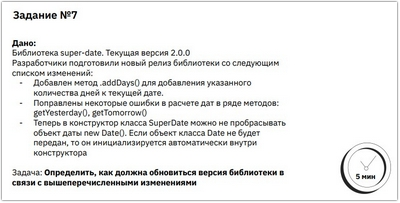

***Результат выполнения Задания № 7:***
```
Ответ: v2.1.0
```