# Урок 6. Семинар: Модули и фреймворк Express (WIP)

## План урока

- Выполнение практических заданий в соответствии с [презентацией](https://gbcdn.mrgcdn.ru/uploads/asset/5856171/attachment/4896640bb04828a30ff137565dc82fef.pdf) к уроку
- Ответы на вопросы по лекции
- Подготовимся к выполнению заданий
- Поработаем со встроенными модулями Node.js
- Реализуем HTTP сервер при помощи express

 

---
## Домашняя работа [решение](https://github.com/olgashenkel/GeekBrains-technological_specialization-ELECTIVES/tree/main/02.%20Node.js%20Basics%20and%20Build%20Tools/04.%20Seminar_02/seminar_02/homework) ([проверка](https://github.com/olgashenkel/GeekBrains-technological_specialization-ELECTIVES/tree/main/02.%20Node.js%20Basics%20and%20Build%20Tools/04.%20Seminar_02/seminar_02/homework_check))


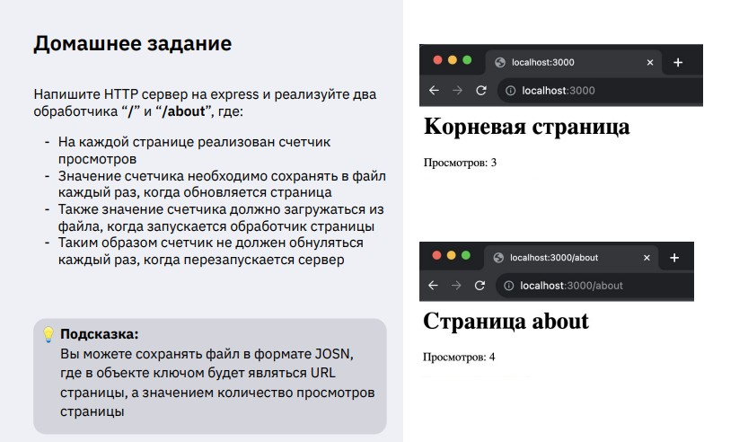
---


***Результат выполнения Домашней работы:***
```
const express = require('express');
const fs = require('fs');
const path = require('path');

const app = express();
const dataPath = path.join(__dirname, 'counters.json');

function getCounters() {
    if (!fs.existsSync(dataPath)) return { "/": 0, "/about": 0 };
    return JSON.parse(fs.readFileSync(dataPath, 'utf8'));
}

function saveCounters(counters) {
    fs.writeFileSync(dataPath, JSON.stringify(counters, null, 2));
}

// Универсальная функция для отправки страницы с заменой счетчика
function sendPage(res, filePath, route) {
    const counters = getCounters();
    counters[route]++;
    saveCounters(counters);

    let html = fs.readFileSync(path.join(__dirname, filePath), 'utf8');
    // Заменяем заглушку "0" в HTML на реальное число
    html = html.replace('<span id="count">0</span>', `<span id="count">${counters[route]}</span>`);
    
    res.send(html);
}

app.get('/index.html', (req, res) => {
    sendPage(res, 'index.html', '/');
});

app.get('/about.html', (req, res) => {
    sendPage(res, 'about.html', '/about');
});

app.listen(3000, () => console.log('Сервер запущен на порту 3000'));
```

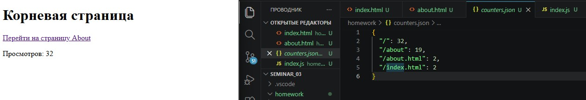
---


## Практическая работа с семинара ([решение](https://github.com/olgashenkel/GeekBrains-technological_specialization-ELECTIVES/tree/main/02.%20Node.js%20Basics%20and%20Build%20Tools/06.%20Seminar_03/seminar_03)):


### Задание 1 (тайминг 5 минут)

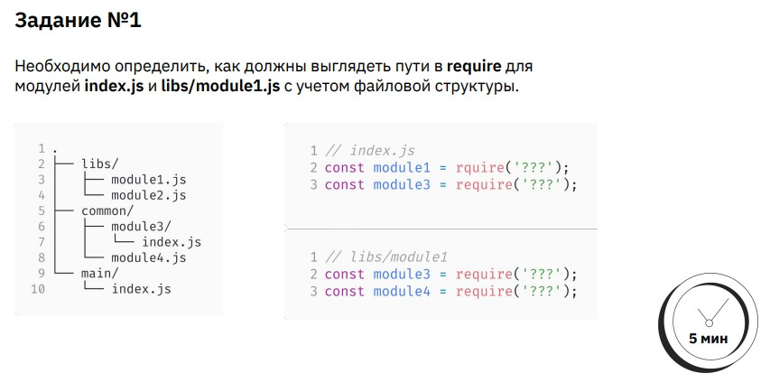


***Результат выполнения Задания № 1:***
```
// index.js
const module1 = require('../libs/module1');
const module3 = require('../common/module3');

// libs/module1
const module3 = require('../common/module3');
const module4 = require('../common/module4');
```


### Задание 2 (тайминг 15 минут)

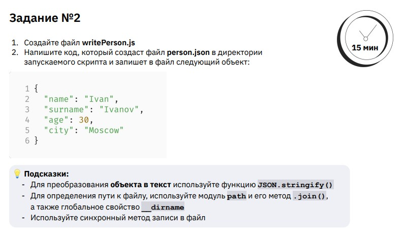


***Результат выполнения Задания № 2:***
```
const fs = require('fs');
const path = require('path');

const person = {
    name: 'Ivan',
    surname: 'Ivanov',
    age: 65,
    city: 'Moscow'
};

fs.writeFileSync(path.join(__dirname, 'person.join'),JSON.stringify(person, null, 2));
```


### Задание 3 (тайминг 15 минут)

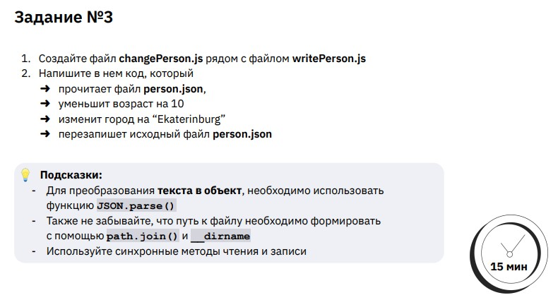


***Результат выполнения Задания № 3:***
```
const fs = require('fs');
const path = require('path');
const pathToFle = path.join(__dirname, 'person.join');

const personData = JSON.parse(fs.readFileSync(pathToFle, 'utf-8'));

personData.age = personData.age - 10;
personData.city = 'Ekaterinburg';

fs.writeFileSync(path.join(__dirname, 'person.join'),JSON.stringify(personData, null, 2));
```


### Задание 4 (тайминг 10 минут)

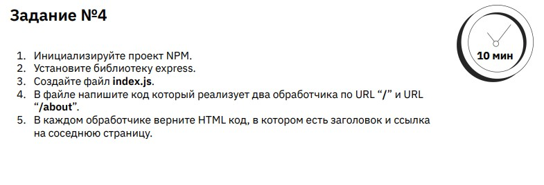


***Результат выполнения Задания № 4:***
```
const express = require('express');

const app = express();

app.get('/', (req, res) => {
    res.send('<h1>Добро пожаловать на мой сайт!</h1><p>Перейти на страницу <a href="/about">About</a></p>');
});

app.get('/about', (req, res) => {
    res.send('<h1>Страница About</h1><p>Перейти на <a href="/">Главную</a> страницу</p>');
});


const port = 3000;

app.listen(port, () => {
    console.log(`Сервер запущен на порту ${port}`);
});
```

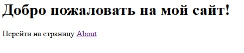

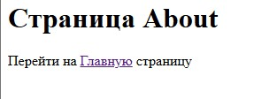


### Задание 5 (тайминг 10 минут)

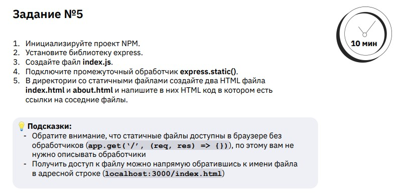


***Результат выполнения Задания № 5:***
```
const express = require('express');

const app = express();

app.use(express.static('./static'))
const port = 3000;

app.listen(port, () => {
    console.log(`Сервер запущен на порту ${port}`);
});
```

### Задание 6 (тайминг 10 минут)

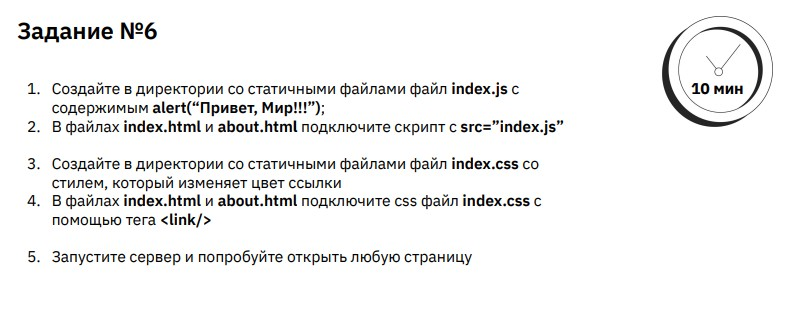

***Результат выполнения Задания № 6:***


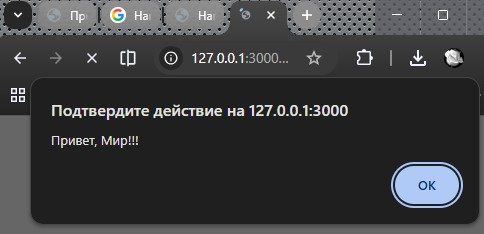
