# Урок 8. Семинар: Создание REST API с Express

## План урока

- Выполнение практических заданий в соответствии с [презентацией](https://gbcdn.mrgcdn.ru/uploads/asset/5856177/attachment/2f1fba60c5024a9bc131ef2543396392.pdf) к уроку
- Ответы на вопросы по лекции
- Подготовимся к выполнению заданий
- Напишем простой сервер для работы с пользователями

 

---
## Домашняя работа + Промежуточная аттестация ([решение](https://github.com/olgashenkel/GeekBrains-technological_specialization-ELECTIVES/tree/main/02.%20Node.js%20Basics%20and%20Build%20Tools/08.%20Seminar_04/seminar_04/homework)) 


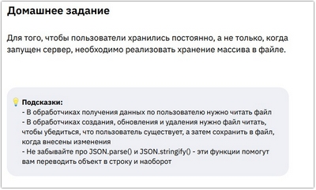
---


***Результат выполнения Домашней работы:***
```
const express = require('express');
const Joi = require('joi');

const fs = require('fs/promises');
const path = require('path');

const filePath = path.join(__dirname, 'users.json');

const app = express();


app.use(express.json());
/* метод POST позволяет
принимать тело запроса в отличие от GET. Для того, чтобы начать принимать тело
запроса, необходимо подключить промежуточный обработчик express.json() */


/**
 * Функция для чтения пользователей из файла
 */

async function readUsers() {
    try {
        const data = await fs.readFile(filePath, 'utf-8');
        return JSON.parse(data);
    } catch (error) {
        // Если файла нет, возвращаем пустой массив
        return [];
    }
}

/**
 * Функция для записи пользователей в файл
 */

async function writeUsers(users) {
    await fs.writeFile(filePath, JSON.stringify(users, null, 2), 'utf-8');
}

/**
 * Схема валидации
 */
const userSchema = Joi.object({
    firstName: Joi.string().min(2).required(),
    secondName: Joi.string().min(1).required(),
    age: Joi.number().min(0).max(150).required(),
    city: Joi.string().min(1)
});


/**
 * Получение всех пользователей
 */
app.get('/users', async (req, res) => {
    const users = await readUsers();
    res.json({
        users
    });
});

/**
 * Получение пользователя по ID
 */
app.get('/users/:id', async (req, res) => {
    const users = await readUsers();

    const userID = Number(req.params.id);
    const user = users.find(user => user.id === userID);

    if (user) {
        res.send({
            user
        });
    } else {
        res.status(404);
        res.send({
            article: null
        });
    }
});


/**
 * Создание пользователя
 */
app.post('/users', async (req, res) => {
    console.log(req.body);

    const result = userSchema.validate(req.body);
    if (result.error) {
        return res.status(400).send({ // 400 Bad Request для ошибок валидации
            error: result.error.details
        });
    }

    const users = await readUsers();


    // Находим максимальный существующий ID. 
    // Если пользователей нет, начинаем с 0.
    const maxId = users.reduce((max, user) => (user.id > max ? user.id : max), 0);
    const nextId = maxId + 1; // Увеличиваем ID на 1

    const newUser = {
        id: nextId,
        ...req.body
    };
    
    users.push(newUser);
    await writeUsers(users);

    res.status(201).json({
        user: newUser
    });
});


/**
 * Обновление сведений о пользователе с валидацией данных
 */

app.put('/users/:id', async (req, res) => {

    const result = userSchema.validate(req.body);
    if (result.error) {
        return res.status(404).send({
            error: result.error.details
        });
    }

    const users = await readUsers(); // Читаем актуальные данные
    const userID = Number(req.params.id);
    const userIndex = users.findIndex(user => user.id === userID);

    if (userIndex !== -1) {
        // Обновляем данные пользователя
        users[userIndex] = {
            id: userID,
            ...req.body
        };
        await writeUsers(users); // Сохраняем изменения в файл

        res.send({
            user: users[userIndex]
        });
    } else {
        res.status(404).send({
            user: null
        });
    }
});


/**
 * Удаление пользователя по ID
 */

app.delete('/users/:id', async (req, res) => {
    const users = await readUsers(); // Читаем актуальные данные

    const userID = Number(req.params.id);
    const userIndex = users.find(user => user.id === userID);

    if (userIndex !== -1) {
        const deletedUser = users[userIndex];
        users.splice(userIndex, 1);
        await writeUsers(users); // Сохраняем изменения в файл

        res.send({
            user: deletedUser
        });
    } else {
        res.status(404).send({
            user: null
        });
    }
});


app.listen(3000);
```

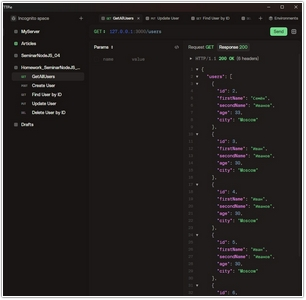
---


## Практическая работа с семинара ([решение](https://github.com/olgashenkel/GeekBrains-technological_specialization-ELECTIVES/tree/main/02.%20Node.js%20Basics%20and%20Build%20Tools/08.%20Seminar_04/seminar_04)):


### Задание 0 (тайминг 5 минут)

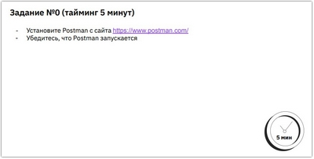

***Результат выполнения Задания № 0:***
```
Вместо программы Postman была установлена программа HTTPie
```

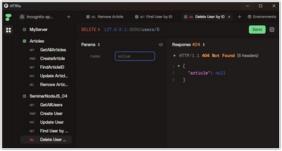


### Задание 1 (тайминг 5 минут)

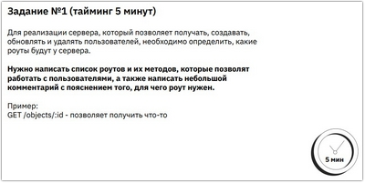


***Результат выполнения Задания № 1:***
```
GET /users - позволяет получить всех пользователей
GET /users/:id - позволяет получить одного пользователя по ID
POST /users - позволяет создать пользователя
PUT /users/:id - позволяет обновить пользователя (данные пользователя)
DELETE /users/:id - позволяет удалить пользователя по ID
```


### Задание 2 (тайминг 10 минут)

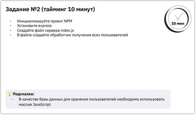


***Результат выполнения Задания № 2:***
```
const express = require('express');

const app = express();

const users = [];
let uniqueID = 0;

app.use(express.json());
/* метод POST позволяет
принимать тело запроса в отличие от GET. Для того, чтобы начать принимать тело
запроса, необходимо подключить промежуточный обработчик express.json() */


/**
 * Получение всех пользователей
 */
app.get('/users', (req, res) => {
    res.send({
        users
    });
});

/**
 * Получение пользователя по ID
 */
app.get('/users/:id', (req, res) => {
    const userID = Number(req.params.id);
    const user = users.find(user => user.id === userID);

    if (user) {    
        res.send({
            user
        });
    } else {
        res.status(404);
        res.send({
            article: null
        });
    }
});

app.listen(3000);
```


### Задание 3 (тайминг 15 минут)

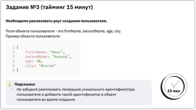


***Результат выполнения Задания № 3:***
```
app.post('/users', (req, res) => {
    console.log(req.body);

    uniqueID += 1;
    users.push({
        id: uniqueID,
        ...req.body
    });

    res.send({
        id: uniqueID
    });
});
```


### Задание 4 (тайминг 10 минут)

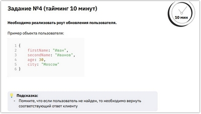


***Результат выполнения Задания № 4:***
```
app.put('/users/:id', (req, res) => {

    const userID = Number(req.params.id);
    const user = users.find(user => user.id === userID);

    if (user) {
        user.firstName = req.body.firstName;
        user.secondName = req.body.secondName;
        user.age = req.body.age;
        user.city = req.body.city;

        res.send({
            user
        });
    } else {
        res.status(404);
        res.send({
            article: null
        });
    }
});
```

### Задание 5 (тайминг 15 минут)

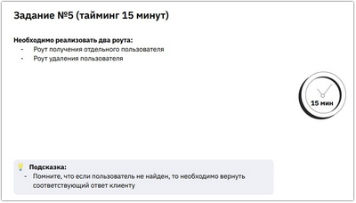


***Результат выполнения Задания № 5:***
```
/**
 * Получение пользователя по ID
 */
app.get('/users/:id', (req, res) => {
    const userID = Number(req.params.id);
    const user = users.find(user => user.id === userID);

    if (user) {    
        res.send({
            user
        });
    } else {
        res.status(404);
        res.send({
            article: null
        });
    }
});


/**
 * Удаление пользователя по ID
 */

app.delete('/users/:id', (req, res) => {

    const userID = Number(req.params.id);
    const user = users.find(user => user.id === userID);

    if (user) {
        const userIndex = users.indexOf(user);
        users.splice(userIndex, 1);
        res.send({
            user
        });
    } else {
        res.status(404);
        res.send({
            article: null
        });
    }
});
```


### Задание 6 (тайминг 10 минут)

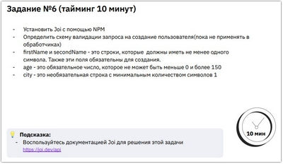

***Результат выполнения Задания № 6:***
```
/**
 * Обновление сведений о пользователе с валидацией данных
 */

app.put('/users/:id', (req, res) => {

    const result = userSchema.validate(req.body);
    if (result.error) {
        return res.status(404).send({error: result.error.details});
    } 
    
    const userID = Number(req.params.id);
    const user = users.find(user => user.id === userID);

    if (user) {
        user.firstName = req.body.firstName;
        user.secondName = req.body.secondName;
        user.age = req.body.age;
        user.city = req.body.city;

        res.send({
            user
        });
    } else {
        res.status(404);
        res.send({
            article: null
        });
    }
});
```


### Задание 7 (тайминг 10 минут)

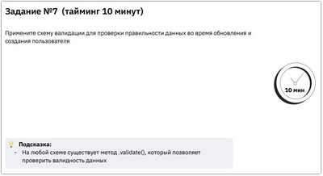

***Результат выполнения Задания № 7:***


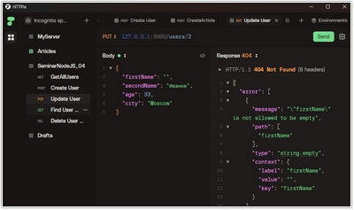
