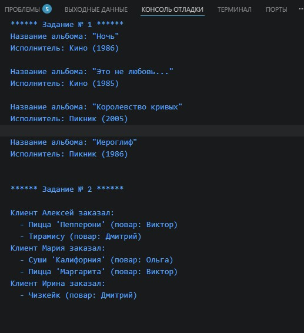
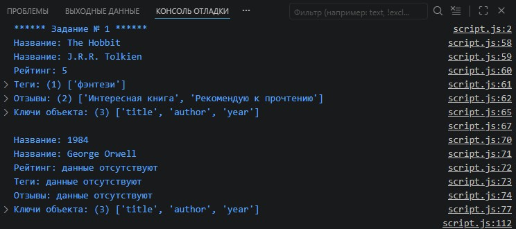
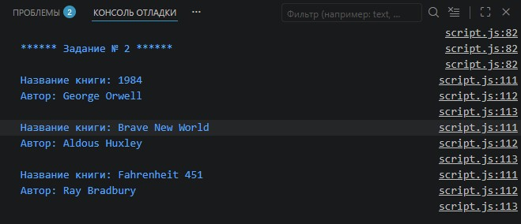
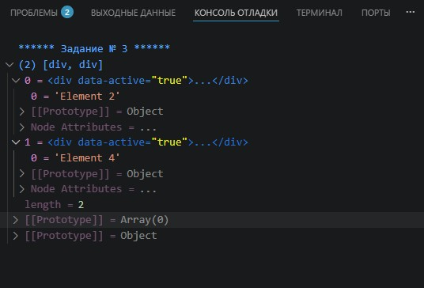
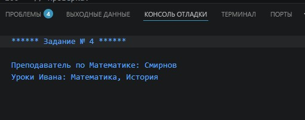

# Урок 2. Семинар: Коллекции и итераторы. Модули

## План урока

- Выполнение практических заданий в соответствии с [презентацией](https://gbcdn.mrgcdn.ru/uploads/asset/5860209/attachment/2494af3b090b889074d0e6017e6d7678.pdf) к уроку

## Домашняя работа ([решение]())

**Задание 1**
- Используя `Symbol.iterator`, создайте объект `"Музыкальная коллекция"`, который можно итерировать. Каждая итерация должна возвращать следующий альбом из коллекции.

- Создайте объект `musicCollection`, который содержит массив альбомов и имеет свойство-символ `Symbol.iterator`. Каждый альбом имеет следующую структуру:
  
```
{
title: "Название альбома",
artist: "Исполнитель",
year: "Год выпуска"
}
```

- Реализуйте кастомный итератор для объекта `musicCollection`. Итератор должен перебирать альбомы по порядку.
- Используйте цикл `for...of` для перебора альбомов в музыкальной коллекции и вывода их на консоль в формате: Название альбома - Исполнитель (Год выпуска)


**Задание 2**
- Вы управляете рестораном, в котором работают разные повара, специализирующиеся на определенных блюдах. Клиенты приходят и делают заказы на разные блюда.

- Необходимо создать систему управления этими заказами, которая позволит:   
        - Отслеживать, какой повар готовит какое блюдо.   
        - Записывать, какие блюда заказал каждый клиент.

- Используйте коллекции Map для хранения блюд и их поваров, а также для хранения заказов каждого клиента. В качестве ключей для клиентов используйте объекты.

```
Повара и их специализации:

Виктор - специализация: Пицца.
Ольга - специализация: Суши.
Дмитрий - специализация: Десерты.

****************************************
Блюда и их повара:

Пицца "Маргарита" - повар: Виктор.
Пицца "Пепперони" - повар: Виктор.
Суши "Филадельфия" - повар: Ольга.
Суши "Калифорния" - повар: Ольга.
Тирамису - повар: Дмитрий.
Чизкейк - повар: Дмитрий.

****************************************
Заказы:

Клиент Алексей заказал: Пиццу "Пепперони" и Тирамису.
Клиент Мария заказала: Суши "Калифорния" и Пиццу "Маргарита".
Клиент Ирина заказала: Чизкейк.
```

***Результат выполнения Домашней работы:***
```
/* **************** Задание № 1 **************** */
console.log(`****** Задание № 1 ******`);

const musicCollection = {
    albums: [{
            title: "Ночь",
            artist: "Кино",
            year: 1986
        },
        {
            title: "Это не любовь...",
            artist: "Кино",
            year: 1985
        },
        {
            title: "Королевство кривых",
            artist: "Пикник",
            year: 2005
        },
        {
            title: "Иероглиф",
            artist: "Пикник",
            year: 1986
        },
    ],

    // 1. Свойство-символ Symbol.iterator
    [Symbol.iterator]() {
        let index = 0;
        const albums = this.albums;

        // 2. Реализация кастомного итератора
        return {
            next() {
                if (index < albums.length) {
                    return {
                        value: albums[index++],
                        done: false
                    };
                } else {
                    return {
                        done: true
                    };
                }
            }
        };
    }
};

// 3. Перебор альбомов через цикл for...of
for (const album of musicCollection) {
    console.log(`Название альбома: "${album.title}"`);
    console.log(`Исполнитель: ${album.artist} (${album.year})`);
    console.log('');
}


/* **************** Задание № 2 **************** */
console.log(`\n****** Задание № 2 ******\n`);

// 1. Хранилище: Блюдо -> Повар
const dishToChef = new Map([
  ["Пицца 'Маргарита'", "Виктор"],
  ["Пицца 'Пепперони'", "Виктор"],
  ["Суши 'Филадельфия'", "Ольга"],
  ["Суши 'Калифорния'", "Ольга"],
  ["Тирамису", "Дмитрий"],
  ["Чизкейк", "Дмитрий"]
]);

// 2. Объекты клиентов
const alexey = { name: "Алексей" };
const maria = { name: "Мария" };
const irina = { name: "Ирина" };

// 3. Хранилище: Клиент -> Список блюд
const orders = new Map();

orders.set(alexey, ["Пицца 'Пепперони'", "Тирамису"]);
orders.set(maria, ["Суши 'Калифорния'", "Пицца 'Маргарита'"]);
orders.set(irina, ["Чизкейк"]);

// Функция для вывода заказов в консоль
function printOrders(ordersMap, dishesMap) {
  for (let [client, dishes] of ordersMap) {
    console.log(`Клиент ${client.name} заказал:`);
    dishes.forEach(dish => {
      const chef = dishesMap.get(dish);
      console.log(`  - ${dish} (повар: ${chef})`);
    });
  }
}

printOrders(orders, dishToChef);
```




## Практическая работа с семинара ([решение]()):


### Задание 1 (тайминг 20 минут)
Текст задания

Создать механизм для безопасного добавления метаданных к объектам книг с использованием `Symbol`.
1. Создать уникальные символы для метаданных: отзывы, рейтинг, теги.
2. Реализовать функции `addMetadata` (добавление метаданных) и `getMetadata` (получение метаданных).
3. Создать объект книги, добавить метаданные и вывести их на консоль.


***Результат выполнения Задания № 1:***
```
console.log(`****** Задание № 1 ******`);

const REVIEWS = Symbol('rivers');
const RATING = Symbol('rating');
const TAGS = Symbol('tags');


function addMetadata(book, key, value) {

        if (!book[key]) {
                book[key] = [];
        }
        // Если это рейтинг, просто перезаписываем, если отзывы или теги — добавляем в массив
        if (key === RATING) {
                book[key] = value;
        } else {
                book[key].push(value);
        }
}

function getMetadata(book, key) {
        const data = book[key];

        // Проверяем: если данных нет (undefined) или это пустой массив
        if (data === undefined || (Array.isArray(data) && data.length === 0)) {
                return "данные отсутствуют";
        }

        return data;
}

const books = {
        book1: {
                title: "Hitchhiker's Guide to the Galaxy",
                author: "Douglas Adams",
                year: 1979
        },
        book2: {
                title: "The Hobbit",
                author: "J.R.R. Tolkien",
                year: 1937
        },
        book3: {
                title: "1984",
                author: "George Orwell",
                year: 1949
        }
};


addMetadata(books.book2, REVIEWS, 'Интересная книга');
addMetadata(books.book2, REVIEWS, 'Рекомендую к прочтению');
addMetadata(books.book2, RATING, 5);
addMetadata(books.book2, TAGS, "фэнтези");

// Выводим результат
console.log("Название:", books.book2.title);
console.log("Название:", books.book2.author);
console.log("Рейтинг:", getMetadata(books.book2, RATING));
console.log("Теги:", getMetadata(books.book2, TAGS));
console.log("Отзывы:", getMetadata(books.book2, REVIEWS));

// Демонстрация скрытности: символы не видны при обычном перечислении
console.log("Ключи объекта:", Object.keys(books.book1)); 

console.log('');

// Выводим результат
console.log("Название:", books.book3.title);
console.log("Название:", books.book3.author);
console.log("Рейтинг:", getMetadata(books.book3, RATING));
console.log("Теги:", getMetadata(books.book3, TAGS));
console.log("Отзывы:", getMetadata(books.book3, REVIEWS));

// Демонстрация скрытности: символы не видны при обычном перечислении
console.log("Ключи объекта:", Object.keys(books.book2)); // ['title', 'author']
```




### Задание 2 (тайминг 20 минут)
Текст задания

Используя `Symbol.iterator`, создайте объект `"Библиотека"`, который можно итерировать. Каждая итерация должна возвращать следующую книгу из библиотеки.
1. Создайте объект `library`, который содержит массив книг и имеет свойство-символ `Symbol.iterator`.
2. Реализуйте кастомный итератор для объекта `library`. Итератор должен перебирать книги по порядку.
3. Используйте цикл `for...of` для перебора книг в библиотеке и вывода их на консоль.

Массив книг:
```
const books = [
{ title: "1984", author: "George Orwell" },
{ title: "Brave New World", author: "Aldous Huxley" },
{ title: "Fahrenheit 451", author: "Ray Bradbury" }
];
```

***Результат выполнения Задания № 2:***
```
console.log(`\n****** Задание № 2 ******`);

const library = {
  books: [
    { title: "1984", author: "George Orwell" },
    { title: "Brave New World", author: "Aldous Huxley" },
    { title: "Fahrenheit 451", author: "Ray Bradbury" }
  ],

  // 1. Свойство-символ Symbol.iterator
  [Symbol.iterator]() {
    let index = 0;
    const books = this.books;

    // 2. Реализация кастомного итератора
    return {
      next() {
        if (index < books.length) {
          return { value: books[index++], done: false };
        } else {
          return { done: true };
        }
      }
    };
  }
};

// 3. Перебор книг через цикл for...of
for (const book of library) {
  console.log(`Название книги: ${book.title}`);
  console.log(`Автор: ${book.author}`);
  console.log('');
}
```




### Задание 3 (тайминг 15 минут)
Текст задания

Часто при работе с DOM мы сталкиваемся с коллекциями элементов, которые не являются стандартными массивами, но похожи на них. Однако у таких коллекций нет методов массива, и здесь на помощь приходит `Array.from`. В этом задании вы научитесь конвертировать коллекции `DOM-элементов` в массивы и работать с ними.

Дан код html:
```
<div>Element 1</div>
<div data-active="true">Element 2</div>
<div>Element 3</div>
<div data-active="true">Element 4</div>
```
Напишите функцию, которая собирает все элементы `<div>` на странице, преобразует их в массив и
фильтрует только те из них, у которых есть атрибут `data-active`.

Выведите результат на консоль.


***Результат выполнения Задания № 3:***
```
console.log(`\n****** Задание № 3 ******`);

function getActiveElements() {
  // Собираем все div и превращаем NodeList в массив
  const divs = Array.from(document.querySelectorAll('div'));

  // Фильтруем элементы, у которых есть атрибут data-active
  const activeDivs = divs.filter(el => el.hasAttribute('data-active'));

  console.log(activeDivs);
}

getActiveElements();
```





### Задание 4 (тайминг 20 минут)
Текст задания

Представьте себе ситуацию: у нас есть группа студентов, и мы хотим отследить,
кто из них посетил какие уроки и кто из преподавателей вёл данные уроки.
1. `Map` будет использоваться для хранения соответствия между уроком и преподавателем.
2. `Set` будет использоваться для хранения уникальных уроков, которые посетил каждый студент.

```
// 1. Map: урок => преподаватель 

let lessons = new Map();

// "Математика", "Смирнов"
// "История", "Иванова"

// 2. Map: студент => Set уроков


// Проверка:
console.log(`Преподаватель по Математике: 
  ${lessons.get("Математика")}`); // Смирнов
console.log(`Уроки Ивана: тут вывод уроков Ивана`); // Математика, История
```


***Результат выполнения Задания № 4:***
```

// 1. Map: урок => преподаватель
let lessons = new Map();
lessons.set("Математика", "Смирнов");
lessons.set("История", "Иванова");

// 2. Map: студент => Set уникальных уроков
let studentVisits = new Map();

// Функция для добавления посещения
function addVisit(student, lesson) {
    if (!studentVisits.has(student)) {
        studentVisits.set(student, new Set());
    }
    studentVisits.get(student).add(lesson);
}

// Добавляем данные для Ивана
addVisit("Иван", "Математика");
addVisit("Иван", "История");
addVisit("Иван", "Математика"); // Дубликат не добавится благодаря Set

// Проверка:
console.log(`Преподаватель по Математике: ${lessons.get("Математика")}`); 

// Вывод уроков Ивана через запятую
let ivansLessons = Array.from(studentVisits.get("Иван")).join(", ");
console.log(`Уроки Ивана: ${ivansLessons}`); 
```



