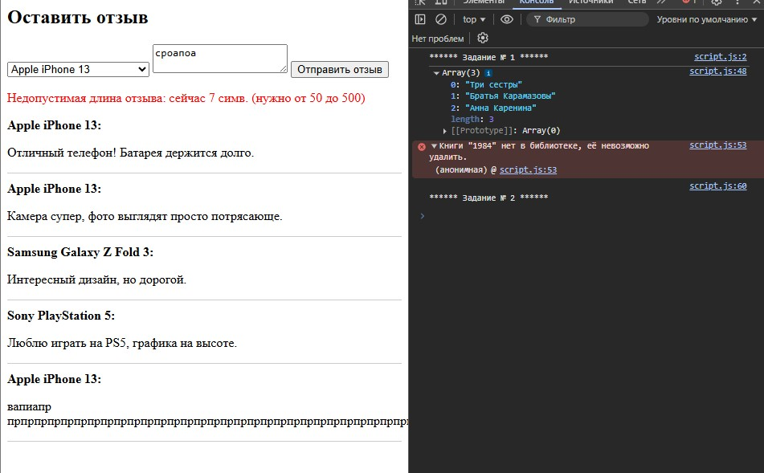
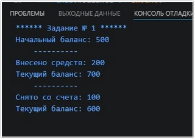
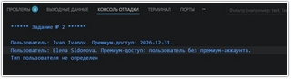
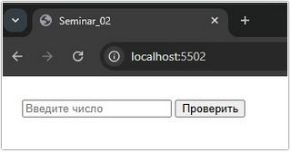
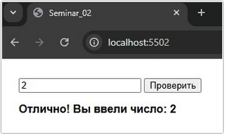
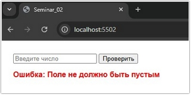
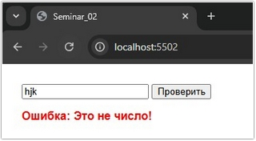
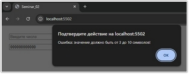
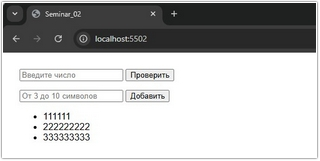

# Урок 4. Семинар: Продвинутая работа с функциями и классами

## План урока

- Выполнение практических заданий в соответствии с [презентацией](https://gbcdn.mrgcdn.ru/uploads/asset/5860210/attachment/3994581853b1598eefecd3f2d955c3b1.pdf) к уроку

## Домашняя работа ([решение](https://github.com/olgashenkel/GeekBrains-technological_specialization-ELECTIVES/blob/main/03.%20Advanced%20JavaScript/02.%20Seminar_01/homework/script.js))

**Задание 1**

Представьте, что у вас есть класс для управления библиотекой. В этом классе будет приватное свойство для хранения списка книг, а также методы для добавления книги, удаления книги и получения информации о наличии книги.

Класс должен содержать приватное свойство `#books`, которое инициализируется пустым массивом и представляет собой список книг в библиотеке.

Реализуйте геттер `allBooks`, который возвращает текущий список книг.

Реализуйте метод `addBook(title)`, который позволяет добавлять книгу в список. Если книга с таким названием уже существует в списке, выбросьте ошибку с соответствующим сообщением.

Реализуйте метод `removeBook(title)`, который позволит удалять книгу из списка по названию. Если книги с таким названием нет в списке, выбросьте ошибку с соответствующим сообщением.

Реализуйте метод `hasBook(title)`, который будет проверять наличие книги в библиотеке и возвращать `true` или `false` в зависимости от того, есть ли такая книга в списке или нет.

Реализуйте конструктор, который принимает начальный список книг (массив) в качестве аргумента. Убедитесь, что предоставленный массив не содержит дубликатов; в противном случае выбрасывайте ошибку.


**Задание 2**

Вы разрабатываете систему отзывов для вашего веб-сайта. Пользователи могут оставлять отзывы, но чтобы исключить слишком короткие или слишком длинные сообщения, вы решаете установить некоторые ограничения.

Создайте HTML-структуру с текстовым полем для ввода отзыва, кнопкой для отправки и контейнером, где будут отображаться отзывы.

Напишите функцию, которая будет добавлять отзыв в контейнер с отзывами. Однако если длина введенного отзыва менее 50 или более 500 символов, функция должна генерировать исключение.

При добавлении отзыва, он должен отображаться на странице под предыдущими отзывами, а не заменять их.

```
const initialData = [{
        product: "Apple iPhone 13",
        reviews: [{
                id: "1",
                text: "Отличный телефон! Батарея держится долго.",
            },
            {
                id: "2",
                text: "Камера супер, фото выглядят просто потрясающе.",
            },
        ],
    },
    {
        product: "Samsung Galaxy Z Fold 3",
        reviews: [{
            id: "3",
            text: "Интересный дизайн, но дорогой.",
        }, ],
    },
    {
        product: "Sony PlayStation 5",
        reviews: [{
            id: "4",
            text: "Люблю играть на PS5, графика на высоте.",
        }, ],
    },
];
```
Вы можете использовать этот массив initialData для начальной загрузки данных при запуске вашего приложения

***Результат выполнения Домашней работы:***
```
/* **************** Задание № 1 **************** */
console.log(`****** Задание № 1 ******`);

class Library {
  #books = [];

  constructor(initialBooks = []) {
    // Проверка на дубликаты в начальном списке
    const uniqueBooks = new Set(initialBooks);
    if (uniqueBooks.size !== initialBooks.length) {
      throw new Error("Начальный список книг содержит дубликаты.");
    }
    this.#books = [...initialBooks];
  }

  // Геттер для получения списка всех книг
  get allBooks() {
    return this.#books;
  }

  // Добавление новой книги
  addBook(title) {
    if (this.hasBook(title)) {
      throw new Error(`Книга с названием "${title}" уже есть в библиотеке.`);
    }
    this.#books.push(title);
  }

  // Удаление книги
  removeBook(title) {
    const index = this.#books.indexOf(title);
    if (index === -1) {
      throw new Error(`Книги "${title}" нет в библиотеке, её невозможно удалить.`);
    }
    this.#books.splice(index, 1);
  }

  // Проверка наличия книги
  hasBook(title) {
    return this.#books.includes(title);
  }
}

// Пример использования:
try {
  const myLibrary = new Library(["Три сестры", "Братья Карамазовы"]);
  myLibrary.addBook("Анна Каренина");
  console.log(myLibrary.allBooks); // ['Три сестры', 'Братья Карамазовы', 'Анна Каренина']
  
  myLibrary.removeBook("1984");
  console.log(myLibrary.hasBook("1984")); // false
} catch (error) {
  console.error(error.message);
}


/* **************** Задание № 2 **************** */
console.log(`\n****** Задание № 2 ******\n`);

const initialData = [
    {
        product: "Apple iPhone 13",
        reviews: [
            { id: "1", text: "Отличный телефон! Батарея держится долго." },
            { id: "2", text: "Камера супер, фото выглядят просто потрясающе." },
        ],
    },
    {
        product: "Samsung Galaxy Z Fold 3",
        reviews: [
            { id: "3", text: "Интересный дизайн, но дорогой." },
        ],
    },
    {
        product: "Sony PlayStation 5",
        reviews: [
            { id: "4", text: "Люблю играть на PS5, графика на высоте." },
        ],
    },
];

const productSelect = document.getElementById('product-select');
const reviewText = document.getElementById('review-text');
const submitBtn = document.getElementById('submit-btn');
const reviewsContainer = document.getElementById('reviews-container');
const errorMessage = document.getElementById('error-message');

// 1. Инициализация: загружаем товары и существующие отзывы
function init() {
    initialData.forEach(item => {
        // Добавляем товар в выпадающий список
        const option = document.createElement('option');
        option.value = item.product;
        option.textContent = item.product;
        productSelect.appendChild(option);

        // Отображаем начальные отзывы
        item.reviews.forEach(review => {
            displayReview(item.product, review.text);
        });
    });
}

// 2. Функция отображения отзыва в DOM
function displayReview(productName, text) {
    const reviewDiv = document.createElement('div');
    reviewDiv.style.borderBottom = "1px solid #ccc";
    reviewDiv.style.marginBottom = "10px";
    reviewDiv.innerHTML = `<strong>${productName}:</strong> <p>${text}</p>`;
    reviewsContainer.appendChild(reviewDiv);
}

// 3. Основная функция добавления отзыва с генерацией исключения
function addReview() {
    const text = reviewText.value.trim();
    const product = productSelect.value;

    try {
        if (text.length < 50 || text.length > 500) {
            throw new Error(`Недопустимая длина отзыва: сейчас ${text.length} симв. (нужно от 50 до 500)`);
        }

        displayReview(product, text);
        reviewText.value = ''; // Очистка поля
        errorMessage.textContent = ''; // Сброс ошибки
    } catch (e) {
        errorMessage.textContent = e.message;
    }
}

submitBtn.addEventListener('click', addReview);

// Запуск приложения
init();
```





## Практическая работа с семинара ([решение](https://github.com/olgashenkel/GeekBrains-technological_specialization-ELECTIVES/blob/main/03.%20Advanced%20JavaScript/02.%20Seminar_01/seminar_01/script.js)):


### Задание 1 (тайминг 25 минут)
Текст задания

Давайте создадим класс для управления банковским счетом. В этом классе будет приватное свойство для хранения текущего баланса, а также методы для внесения и снятия денег со счета.
1. Класс должен содержать приватное свойство `#balance`, которое инициализируется значением 0 и представляет собой текущий баланс счета.
2. Реализуйте геттер `balance`, который позволит получить информацию о текущем балансе.
3. Реализуйте метод `deposit(amount)`, который позволит вносить средства на счет.
Убедитесь, что сумма внесения не отрицательная; в противном случае выбрасывайте ошибку.
4. Реализуйте метод `withdraw(amount)`, который позволит снимать средства со счета.
Убедитесь, что сумма для снятия неотрицательная и что на счете достаточно средств; в
противном случае выбрасывайте ошибку.
5. Реализуйте конструктор, который принимает начальный баланс в качестве аргумента.
Убедитесь, что начальный баланс не отрицательный; в противном случае выбрасывайте
ошибку.


***Результат выполнения Задания № 1:***
```
console.log(`****** Задание № 1 ******`);

class BankAccount {
  #balance = 0;

  constructor(initialBalance) {
    if (initialBalance < 0) {
      throw new Error("Начальный баланс не может быть отрицательным");
    }
    this.#balance = initialBalance;
  }

  // Геттер для чтения баланса
  get balance() {
    return this.#balance;
  }

  // Метод для пополнения
  deposit(amount) {
    if (amount <= 0) {
      throw new Error("Сумма пополнения должна быть больше нуля");
    }
    console.log(`Внесено средств: ${amount}`);
    this.#balance += amount;
  }

  // Метод для снятия
  withdraw(amount) {
    if (amount <= 0) {
      throw new Error("Сумма снятия должна быть больше нуля");
    }
    if (amount > this.#balance) {
      throw new Error("Недостаточно средств на счете");
    }
    console.log(`Снято со счета: ${amount}`);
    this.#balance -= amount;
  }
}

// Пример использования:
let account = new BankAccount(500);
console.log(`Начальный баланс: ${account.balance}`); // 500
console.log('    ----------');

account.deposit(200);
console.log(`Текущий баланс: ${account.balance}`); // 700
console.log('    ----------');

account.withdraw(100);
console.log(`Текущий баланс: ${account.balance}`); // 600
```




### Задание 2 (тайминг 35 минут)
Текст задания

У вас есть базовый список пользователей. Некоторые из них имеют информацию о своем премиум-аккаунте, а
некоторые – нет.

Ваша задача – создать структуру классов для этих пользователей и функцию для получения информации о
наличии премиум-аккаунта, используя Опциональную цепочку вызовов методов, оператор нулевого слияния
и `instanceof`.
1. Создайте базовый класс `User` с базовой информацией (например, имя и фамилия).
2. Создайте классы `PremiumUser` и `RegularUser`, которые наследуются от `User`. `Класс PremiumUser` должен иметь свойство `premiumAccount` (допустим, дата истечения срока
действия), а у `RegularUser` такого свойства нет.
3. Создайте функцию `getAccountInfo(user)`, которая принимает объект класса `User` и
возвращает информацию о наличии и сроке действия премиум-аккаунта, используя
Опциональную цепочку вызовов методов и оператор нулевого слияния.
4. В функции getAccountInfo используйте `instanceof` для проверки типа переданного
пользователя и дайте соответствующий ответ.


***Результат выполнения Задания № 2:***
```
console.log(`\n****** Задание № 2 ******\n`);

class User {
  constructor(firstName, lastName) {
    this.firstName = firstName;
    this.lastName = lastName;
  }
}

class PremiumUser extends User {
  constructor(firstName, lastName, expiryDate) {
    super(firstName, lastName);
    this.premiumAccount = {
      expiryDate: expiryDate
    };
  }
}

class RegularUser extends User {
  constructor(firstName, lastName) {
    super(firstName, lastName);
  }
}

function getAccountInfo(user) {
  // Проверка типа через instanceof
  if (!(user instanceof User)) {
    return "Тип пользователя не определен";
  }

  // Опциональная цепочка (?.) и оператор нулевого слияния (??)
  const expiry = user.premiumAccount?.expiryDate ?? "пользователь без премиум-аккаунта";

  return `Пользователь: ${user.firstName} ${user.lastName}. Премиум-доступ: ${expiry}.`;
}

// Примеры использования:
const client1 = new PremiumUser("Ivan", "Ivanov", "2026-12-31");
const client2 = new RegularUser("Elena", "Sidorova");
let client3;

console.log(getAccountInfo(client1));  // Пользователь: Ivan Ivanov. Премиум-доступ: 2026-12-31.
console.log(getAccountInfo(client2)); // Пользователь: Elena Sidorova. Премиум-доступ: отсутствует.
console.log(getAccountInfo(client3)); // Тип пользователя не определен
```




### Задание 3 (тайминг 15 минут)
Текст задания

Вы создаете интерфейс, где пользователь вводит число.

Ваша задача — проверить, является ли введенное значение числом или нет, и дать
соответствующий ответ.
1. Создайте `HTML-структуру`: текстовое поле для ввода числа и кнопку
`"Проверить"`.
2. Добавьте место (например, `div`) для вывода сообщения пользователю.
3. Напишите функцию, которая будет вызвана при нажатии на кнопку. Эта функция
должна использовать `try` и `catch` для проверки вводимого значения.


***Результат выполнения Задания № 3:***

***HTML***
```
<!doctype html>
<html lang="en">
  <head>
    <meta charset="UTF-8" />
    <meta name="viewport" content="width=device-width, initial-scale=1.0" />
    <title>Seminar_02</title>
    <style>
      body {
        font-family: sans-serif;
        padding: 20px;
      }
      #message {
        margin-top: 15px;
        font-weight: bold;
      }
      .error {
        color: red;
      }
      .success {
        color: rgb(0, 0, 0);
      }
    </style>

  </head>
  <body>

    <!-- Задание № 3 -->
    <input type="text" id="userInput" placeholder="Введите число" />
    <button onclick="checkNumber()">Проверить</button>

    <div id="message"></div>
```

***JavaScript***
```
console.log(`\n****** Задание № 3 ******`);

function checkNumber() {
    const input = document.getElementById('userInput').value;
    const messageDiv = document.getElementById('message');

    // Очищаем предыдущие сообщения и стили
    messageDiv.textContent = "";
    messageDiv.className = "";

    try {
        // 1. Проверяем на пустоту
        if (input.trim() === "") throw "Поле не должно быть пустым";

        // 2. Проверяем, является ли значение числом
        if (isNaN(input)) throw "Это не число!";

        // Если проверки пройдены:
        messageDiv.textContent = "Отлично! Вы ввели число: " + input;
        messageDiv.classList.add("success");

    } catch (err) {
        // Обработка ошибок из блока try
        messageDiv.textContent = "Ошибка: " + err;
        messageDiv.classList.add("error");
    }
};
```







### Задание 4 (тайминг 25 минут)
Текст задания

Пользователи вашего сайта могут добавлять элементы в список. Но есть условие:
введенное значение должно содержать от 3 до 10 символов.
1. Создайте HTML-структуру с текстовым полем, кнопкой и списком.
2. Напишите функцию, которая будет добавлять элементы в список или
генерировать исключение, если длина введенного значения не соответствует
требованиям


***Результат выполнения Задания № 4:***

***HTML***
```    
    <input type="text" id="itemInput" placeholder="От 3 до 10 символов">
    <button onclick="addItem()">Добавить</button>
    
    <ul id="itemList"></ul>
```

JavaScript
```

function addItem() {
    const input = document.getElementById('itemInput');
    const list = document.getElementById('itemList');
    const value = input.value.trim();

    try {
        // Проверка условия и генерация исключения
        if (value.length < 3 || value.length > 10) {
            throw new Error("Ошибка: значение должно быть от 3 до 10 символов!");
        }

        // Если всё ок, создаем элемент списка
        const li = document.createElement('li');
        li.textContent = value;
        list.appendChild(li);

        // Очищаем поле ввода
        input.value = '';

    } catch (error) {
        // Выводим сообщение об исключении
        alert(error.message);
    }
}
```




