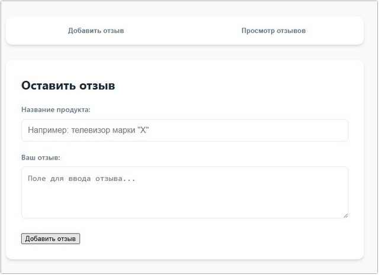
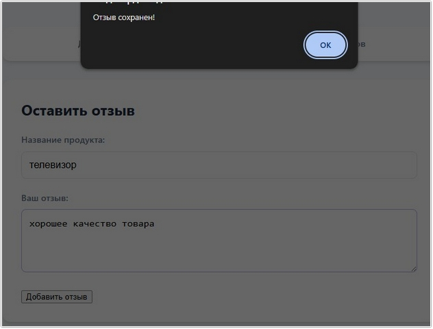
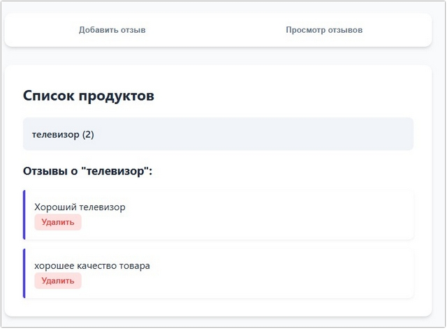
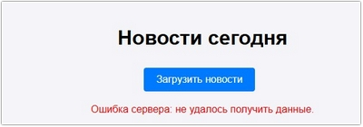
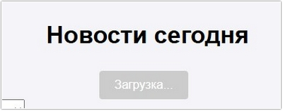
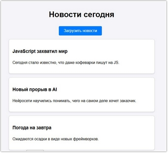
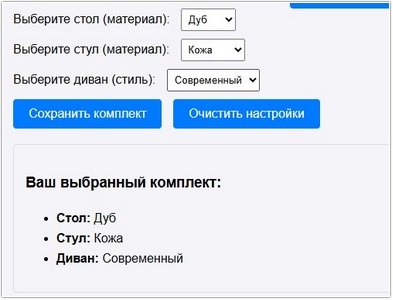
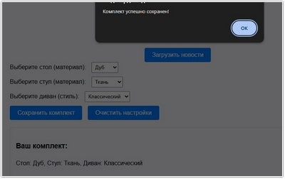
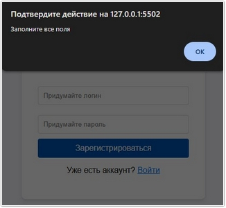
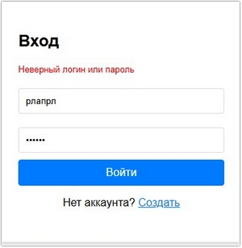

# Урок 6. Семинар: Промисы. Хранилище

## План урока

- Выполнение практических заданий в соответствии с [презентацией](https://gbcdn.mrgcdn.ru/uploads/asset/5860211/attachment/8ee33fbc410b9c5165b6e6f5ae520f24.pdf) к уроку

## Домашняя работа ([решение](https://github.com/olgashenkel/GeekBrains-technological_specialization-ELECTIVES/blob/main/03.%20Advanced%20JavaScript/02.%20Seminar_01/homework/script.js))

Создайте интерактивную веб-страницу для оставления и просмотра отзывов о продуктах. Пользователи могут добавлять отзывы о различных продуктах и просматривать добавленные отзывы.

**Страница добавления отзыва:**

- Поле для ввода названия продукта.
- Текстовое поле для самого отзыва.
Кнопка `"Добавить отзыв"`, которая сохраняет отзыв о продукте в `LocalStorage`.

**Страница просмотра отзывов:**

- Показывает список всех продуктов, о которых были оставлены отзывы.
- При клике на название продукта отображается список всех отзывов по этому продукту. 
- Возможность удаления отзыва (при нажатии на кнопку `"Удалить"` рядом с отзывом, данный отзыв удаляется из LocalStorage).


***Результат выполнения Домашней работы:***

**HTML**
```
<nav>
  <button onclick="showSection('add-section')">Добавить отзыв</button>
  <button
    onclick="
      showSection('view-section');
      renderProductList();
    "
  >
    Просмотр отзывов
  </button>
</nav>

<!-- Секция добавления -->
<div id="add-section" class="section active">
  <h2>Оставить отзыв</h2>
  <div class="form-group">
    <label>Название продукта:</label>
    <input
      type="text"
      id="product-name"
      placeholder='Например: телевизор марки "X"'
    />
  </div>
  <div class="form-group">
    <label>Ваш отзыв:</label>
    <textarea
      id="review-text"
      rows="4"
      placeholder="Поле для ввода отзыва..."
    ></textarea>
  </div>
  <button onclick="saveReview()">Добавить отзыв</button>
</div>

<!-- Секция просмотра -->
<div id="view-section" class="section">
  <h2>Список продуктов</h2>
  <div id="product-list"></div>
  <div id="reviews-detail"></div>
</div>
```

**CSS**
```
:root {
    --primary: #4f46e5;
    --primary-hover: #4338ca;
    --bg: #f8fafc;
    --card-bg: #ffffff;
    --text-main: #1e293b;
    --text-muted: #64748b;
    --danger: #ef4444;
    --danger-hover: #dc2626;
    --radius: 12px;
    --shadow: 0 4px 6px -1px rgba(0, 0, 0, 0.1), 0 2px 4px -1px rgba(0, 0, 0, 0.06);
}

body { 
    font-family: 'Inter', -apple-system, system-ui, sans-serif; 
    background-color: var(--bg);
    color: var(--text-main);
    max-width: 700px; 
    margin: 40px auto; 
    padding: 0 20px; 
    line-height: 1.5;
}

/* Навигация */
nav { 
    display: flex;
    gap: 10px;
    margin-bottom: 30px; 
    background: #fff;
    padding: 8px;
    border-radius: var(--radius);
    box-shadow: var(--shadow);
}

nav button { 
    flex: 1;
    cursor: pointer; 
    padding: 12px; 
    border: none;
    background: transparent;
    border-radius: 8px;
    font-weight: 600;
    color: var(--text-muted);
    transition: all 0.2s;
}

nav button:hover {
    background: #f1f5f9;
    color: var(--text-main);
}

/* Активная кнопка навигации (можно добавить класс через JS) */
nav button.active-nav {
    background: var(--primary);
    color: white;
}

/* Секции */
.section { 
    display: none; 
    background: var(--card-bg);
    padding: 30px;
    border-radius: var(--radius);
    box-shadow: var(--shadow);
    animation: fadeIn 0.3s ease-out;
}

@keyframes fadeIn {
    from { opacity: 0; transform: translateY(10px); }
    to { opacity: 1; transform: translateY(0); }
}

.active { display: block; }

h2 { margin-top: 0; font-size: 1.5rem; font-weight: 700; }

/* Поля ввода */
.form-group { margin-bottom: 20px; }

label { 
    display: block; 
    margin-bottom: 8px; 
    font-weight: 500; 
    font-size: 0.9rem;
    color: var(--text-muted);
}

input, textarea { 
    width: 100%; 
    padding: 12px; 
    border: 1px solid #e2e8f0; 
    border-radius: 8px; 
    box-sizing: border-box; 
    font-size: 1rem;
    transition: border-color 0.2s;
}

input:focus, textarea:focus {
    outline: none;
    border-color: var(--primary);
    ring: 2px solid var(--primary);
}

/* Кнопки */
button.main-btn { 
    width: 100%;
    background: var(--primary); 
    color: white; 
    border: none; 
    padding: 14px; 
    border-radius: 8px; 
    font-size: 1rem;
    font-weight: 600;
    cursor: pointer; 
    transition: background 0.2s;
}

button.main-btn:hover { background: var(--primary-hover); }

/* Список продуктов */
.product-item { 
    padding: 15px;
    background: #f1f5f9;
    border-radius: 8px;
    margin-bottom: 10px;
    cursor: pointer; 
    font-weight: 600;
    transition: all 0.2s;
    display: flex;
    justify-content: space-between;
}

.product-item:hover { 
    background: #e2e8f0;
    transform: translateX(5px);
}

/* Карточка отзыва */
.review-card { 
    background: #fff;
    border-left: 4px solid var(--primary);
    padding: 15px; 
    margin-top: 15px; 
    border-radius: 4px 8px 8px 4px; 
    box-shadow: 0 2px 4px rgba(0,0,0,0.05);
}

.review-text {
    margin-bottom: 10px;
    color: var(--text-main);
}

.del-btn { 
    background: #fee2e2; 
    color: var(--danger);
    font-size: 13px; 
    border: none;
    padding: 6px 12px;
    border-radius: 6px;
    cursor: pointer;
    font-weight: 600;
}

.del-btn:hover { 
    background: var(--danger); 
    color: white;
}
```

JavaScript
```
console.log(`****** Задание № 1 ******`);

const STORAGE_KEY = 'product_reviews';

// Переключение между "страницами"
function showSection(id) {
  document.querySelectorAll('.section').forEach(s => s.classList.remove('active'));
  document.getElementById(id).classList.add('active');
  document.getElementById('reviews-detail').innerHTML = '';
}

// Сохранение в LocalStorage
function saveReview() {
  const product = document.getElementById('product-name').value.trim();
  const text = document.getElementById('review-text').value.trim();

  if (!product || !text) return alert("Заполните все поля!");

  const data = JSON.parse(localStorage.getItem(STORAGE_KEY) || '{}');

  if (!data[product]) data[product] = [];
  data[product].push({
    id: Date.now(),
    text: text
  });

  localStorage.setItem(STORAGE_KEY, JSON.stringify(data));

  // Очистка полей
  document.getElementById('product-name').value = '';
  document.getElementById('review-text').value = '';
  alert("Отзыв сохранен!");
}

// Рендер списка продуктов
function renderProductList() {
  const data = JSON.parse(localStorage.getItem(STORAGE_KEY) || '{}');
  const listDiv = document.getElementById('product-list');
  listDiv.innerHTML = '';

  const products = Object.keys(data);
  if (products.length === 0) {
    listDiv.innerHTML = 'Отзывов пока нет.';
    return;
  }

  products.forEach(p => {
    const item = document.createElement('div');
    item.className = 'product-item';
    item.textContent = `${p} (${data[p].length})`;
    item.onclick = () => showReviewsFor(p);
    listDiv.appendChild(item);
  });
}

// Показ отзывов конкретного продукта
function showReviewsFor(productName) {
  const data = JSON.parse(localStorage.getItem(STORAGE_KEY) || '{}');
  const reviews = data[productName] || [];
  const detailDiv = document.getElementById('reviews-detail');

  detailDiv.innerHTML = `<h3>Отзывы о "${productName}":</h3>`;

  reviews.forEach(rev => {
    const card = document.createElement('div');
    card.className = 'review-card';
    card.innerHTML = `
                    <div>${rev.text}</div>
                    <button class="del-btn" onclick="deleteReview('${productName}', ${rev.id})">Удалить</button>
                `;
    detailDiv.appendChild(card);
  });
}

// Удаление отзыва
function deleteReview(productName, reviewId) {
  let data = JSON.parse(localStorage.getItem(STORAGE_KEY) || '{}');

  data[productName] = data[productName].filter(r => r.id !== reviewId);

  // Если у продукта больше нет отзывов — удаляем сам ключ продукта
  if (data[productName].length === 0) delete data[productName];

  localStorage.setItem(STORAGE_KEY, JSON.stringify(data));

  // Обновляем интерфейс
  renderProductList();
  if (data[productName]) {
    showReviewsFor(productName);
  } else {
    document.getElementById('reviews-detail').innerHTML = '';
  }
}
```








## Практическая работа с семинара ([решение](https://github.com/olgashenkel/GeekBrains-technological_specialization-ELECTIVES/blob/main/03.%20Advanced%20JavaScript/06.%20Seminar_03/seminar_03/script.js)):


### Задание 1 (тайминг 30 минут)
Текст задания

Вы разрабатываете прототип веб-приложения для чтения новостей. Статьи "хранятся" во внутреннем массиве (имитируя базу данных). Когда пользователь нажимает на кнопку `"Загрузить новости"`, ваш код должен имитировать задержку, словно происходит реальная загрузка данных из внешнего источника, а после этой задержки — отображать новости на странице.
1. Создайте базовую `HTML-структуру` с кнопкой для загрузки новостей и контейнером для их отображения.
2. Реализуйте функцию `fetchNews()`, возвращающую промис. Эта функция должна имитировать
задержку в 2 секунды перед успешным возвращением данных из "виртуальной" базы данных. Для
добавления интереса: с вероятностью 10% она должна возвращать ошибку вместо данных.
3. При нажатии на кнопку `"Загрузить новости"` вызывайте функцию `fetchNews()`, обрабатывая успешное выполнение и ошибки с использованием `then()` и `catch()`.
4. При успешной загрузке отобразите статьи на странице. При ошибке покажите сообщение об ошибке.
5. Добавьте функционал, который отключает кнопку загрузки на время "загрузки" новостей и активирует
её снова после завершения операции (будь то успешная загрузка или ошибка).


***Результат выполнения Задания № 1:***

**HTML**
```
<div class="container">
    <h1>Новости сегодня</h1>
    <button id="load-btn">Загрузить новости</button>
    <div id="news-container"></div>
</div>
```

**CSS**
```
body {
    font-family: sans-serif;
    background: #f4f4f9;
    padding: 20px;
}

.container {
    max-width: 600px;
    margin: 0 auto;
    text-align: center;
}

button {
    padding: 10px 20px;
    font-size: 16px;
    cursor: pointer;
    background: #007bff;
    color: white;
    border: none;
    border-radius: 4px;
}

button:disabled {
    background: #ccc;
    cursor: not-allowed;
}

.news-card {
    background: white;
    border: 1px solid #ddd;
    padding: 15px;
    margin-top: 15px;
    border-radius: 8px;
    text-align: left;
    box-shadow: 0 2px 4px rgba(0, 0, 0, 0.1);
}
```


**JavaScript**
```
console.log(`****** Задание № 1 ******`);

// Имитация базы данных
const mockDB = [
    { title: "JavaScript захватил мир", content: "Сегодня стало известно, что даже кофеварки пишут на JS." },
    { title: "Новый прорыв в AI", content: "Нейросети научились понимать, чего на самом деле хочет заказчик." },
    { title: "Погода на завтра", content: "Ожидаются осадки в виде новых фреймворков." }
];

const loadBtn = document.getElementById('load-btn');
const newsContainer = document.getElementById('news-container');

// Функция-промис с имитацией сети
function fetchNews() {
    return new Promise((resolve, reject) => {
        setTimeout(() => {
            const isError = Math.random() < 0.1; // 10% вероятность ошибки
            if (isError) {
                reject("Ошибка сервера: не удалось получить данные.");
            } else {
                resolve(mockDB);
            }
        }, 2000);
    });
}

loadBtn.addEventListener('click', () => {
    // 1. Подготовка интерфейса
    loadBtn.disabled = true;
    loadBtn.textContent = "Загрузка...";
    newsContainer.innerHTML = ""; 

    // 2. Вызов функции
    fetchNews()
        .then((articles) => {
            // Отрисовка новостей
            articles.forEach(article => {
                const card = document.createElement('div');
                card.className = 'news-card';
                card.innerHTML = `<h3>${article.title}</h3><p>${article.content}</p>`;
                newsContainer.appendChild(card);
            });
        })
        .catch((error) => {
            // Обработка ошибки
            newsContainer.innerHTML = `<p style="color: red;">${error}</p>`;
        })
        .finally(() => {
            // 3. Возврат кнопки в исходное состояние в любом случае
            loadBtn.disabled = false;
            loadBtn.textContent = "Загрузить новости";
        });
});
```







### Задание 2 (тайминг 35 минут)
Текст задания

Создать интерактивную веб-страницу, где пользователи могут выбирать различные элементы мебели (например, столы, стулья, диваны) и их параметры (материал, цвет, стиль). Выбранные параметры должны быть сохранены так, чтобы при повторном посещении сайта пользователь мог видеть свой ранее собранный комплект мебели.
1. Пользователи могут выбирать из различных типов мебели (например, столы, стулья, диваны).
2. Для каждого типа мебели доступен выбор параметров (цвет, материал, стиль).
3. Предусмотреть кнопку `"Сохранить комплект"`, при нажатии на которую текущий выбор пользователя
сохраняется в `localStorage`.
4. При повторном посещении сайта автоматически загружать сохраненные параметры из `localStorage` и
отображать ранее созданный комплект.
5. Предусмотреть возможность для пользователя очистить сохраненные настройки через специальную
кнопку.
6. После нажатия на кнопку `"Сохранить"` на странице должен отображаться выбранный комплект.
7. При нажатии на кнопку `"Очистить"` должно появляться сообщение о том, что выбор не сделан и предыдущие настройки удалены.


```
<div>
  <label for="table">Выберите стол:</label>
  <select id="table">
    <option value="oak">Дуб</option>
    <option value="pine">Сосна</option>
    <option value="walnut">Орех</option>
  </select>
</div>

<div>
  <label for="chair">Выберите стул:</label>
  <select id="chair">
    <option value="leather">Кожа</option>
    <option value="fabric">Ткань</option>
    <option value="plastic">Пластик</option>
  </select>
</div>

<div>
  <label for="sofa">Выберите диван:</label>
  <select id="sofa">
    <option value="modern">Современный</option>
    <option value="classic">Классический</option>
    <option value="rustic">Деревенский</option>
  </select>
</div>
<button id="save">Сохранить комплект</button>
<button id="clear">Очистить настройки</button>
<div id="result"></div>
```


***Результат выполнения Задания № 2:***

**HTML**
```
<style>
  body {
    font-family: sans-serif;
    padding: 20px;
    line-height: 1.6;
  }
  .controls {
    margin-bottom: 20px;
  }
  .controls div {
    margin-bottom: 10px;
  }
  select {
    padding: 5px;
    margin-left: 10px;
  }
  button {
    padding: 8px 15px;
    cursor: pointer;
    margin-right: 10px;
  }
  #result {
    margin-top: 20px;
    padding: 15px;
    border: 1px solid #ddd;
    border-radius: 5px;
    min-height: 50px;
  }
  .empty-msg {
    color: #888;
    font-style: italic;
  }
</style>

<div class="controls">
  <div>
    <label for="table">Выберите стол (материал):</label>
    <select id="table">
      <option value="Дуб">Дуб</option>
      <option value="Сосна">Сосна</option>
      <option value="Орех">Орех</option>
    </select>
  </div>

  <div>
    <label for="chair">Выберите стул (материал):</label>
    <select id="chair">
      <option value="Кожа">Кожа</option>
      <option value="Ткань">Ткань</option>
      <option value="Пластик">Пластик</option>
    </select>
  </div>

  <div>
    <label for="sofa">Выберите диван (стиль):</label>
    <select id="sofa">
      <option value="Современный">Современный</option>
      <option value="Классический">Классический</option>
      <option value="Деревенский">Деревенский</option>
    </select>
  </div>

  <button id="save">Сохранить комплект</button>
  <button id="clear">Очистить настройки</button>
</div>

<div id="result"></div>
```

**JavaScript**
```
/* **************** Задание № 2 **************** */
console.log(`\n****** Задание № 2 ******\n`);

const tableSelect = document.getElementById('table');
const chairSelect = document.getElementById('chair');
const sofaSelect = document.getElementById('sofa');
const saveBtn = document.getElementById('save');
const clearBtn = document.getElementById('clear');
const resultDiv = document.getElementById('result');

// Функция для отображения комплекта на странице
function displaySet(data) {
    if (data) {
        resultDiv.innerHTML = `
                    <h3>Ваш выбранный комплект:</h3>
                    <ul>
                        <li><strong>Стол:</strong> ${data.table}</li>
                        <li><strong>Стул:</strong> ${data.chair}</li>
                        <li><strong>Диван:</strong> ${data.sofa}</li>
                    </ul>
                `;
    } else {
        resultDiv.innerHTML = '<p class="empty-msg">Выбор не сделан и предыдущие настройки удалены.</p>';
    }
}

// Загрузка данных при старте
function loadSettings() {
    const savedData = localStorage.getItem('furnitureSet');
    if (savedData) {
        const data = JSON.parse(savedData);
        // Устанавливаем значения в селектах
        tableSelect.value = data.table;
        chairSelect.value = data.chair;
        sofaSelect.value = data.sofa;
        // Показываем результат
        displaySet(data);
    } else {
        resultDiv.innerHTML = '<p class="empty-msg">Комплект еще не сохранен.</p>';
    }
}

// Сохранение
saveBtn.addEventListener('click', () => {
    const furnitureSet = {
        table: tableSelect.value,
        chair: chairSelect.value,
        sofa: sofaSelect.value
    };
    localStorage.setItem('furnitureSet', JSON.stringify(furnitureSet));
    displaySet(furnitureSet);
});

// Очистка
clearBtn.addEventListener('click', () => {
    localStorage.removeItem('furnitureSet');
    displaySet(null);
});

// Инициализация при загрузке страницы
loadSettings();
```





### Задание 3 (тайминг 15 минут)
Текст задания

1. Решить предыдущую задачу, только вместо куки использовать `localstorage`


***Результат выполнения Задания № 3:***
```
console.log(`\n****** Задание № 3 ******`);

const table = document.getElementById('table');
const chair = document.getElementById('chair');
const sofa = document.getElementById('sofa');
const result = document.getElementById('result');

// Ключ, под которым мы храним данные в браузере
const STORAGE_KEY = 'furniture_config';

// 1. Функция отображения результата
function updateUI(data) {
    if (data) {
        result.innerHTML = `<h3>Ваш комплект:</h3>
                                   <p>Стол: ${data.table}, Стул: ${data.chair}, Диван: ${data.sofa}</p>`;
    } else {
        result.innerHTML = '<p>Выбор не сделан и предыдущие настройки удалены.</p>';
    }
}

// 2. ЗАГРУЗКА: При загрузке страницы проверяем localStorage
window.addEventListener('DOMContentLoaded', () => {
    const saved = localStorage.getItem(STORAGE_KEY);
    if (saved) {
        const data = JSON.parse(saved); // Превращаем строку обратно в объект
        table.value = data.table;
        chair.value = data.chair;
        sofa.value = data.sofa;
        updateUI(data);
    }
});

// 3. СОХРАНЕНИЕ: Записываем объект в localStorage
document.getElementById('save').addEventListener('click', () => {
    const config = {
        table: table.value,
        chair: chair.value,
        sofa: sofa.value
    };
    // Сохраняем как строку (localStorage умеет хранить только строки)
    localStorage.setItem(STORAGE_KEY, JSON.stringify(config));
    updateUI(config);
    alert('Комплект успешно сохранен!');
});

// 4. ОЧИСТКА: Удаляем ключ из localStorage
document.getElementById('clear').addEventListener('click', () => {
    localStorage.removeItem(STORAGE_KEY);
    updateUI(null);
});
```





### Задание 4 (тайминг 55 минут)
Текст задания

Создать интерактивную веб-страницу, которая позволяет пользователям регистрироваться и входить в
систему, используя данные, сохраненные в `LocalStorage`.
Приложение будет состоять из трёх основных страниц:
1. Страница регистрации:
   - Предлагает пользователю ввести логин и пароль.
   - После ввода данных, они сохраняются в `LocalStorage`.
   - Пользователь перенаправляется на страницу входа.
2. Страница входа:
   - Предлагает пользователю ввести логин и пароль.
   - Если введенные данные совпадают с данными из `LocalStorage`, пользователь перенаправляется на страницу приветствия.
   - Если данные не совпадают, выводится сообщение об ошибке.
3. Страница приветствия:
   - Простое приветственное сообщение для авторизованного пользователя.
   - Кнопка "Выйти", при нажатии на которую пользователь возвращается на страницу входа.


***Результат выполнения Задания № 4:***

**HTML**
```
<style>
  body {
    font-family: sans-serif;
    display: flex;
    justify-content: center;
    padding-top: 50px;
    background: #f4f4f9;
  }
  .card {
    background: white;
    padding: 2rem;
    border-radius: 8px;
    box-shadow: 0 4px 6px rgba(0, 0, 0, 0.1);
    width: 300px;
  }
  input {
    width: 100%;
    padding: 10px;
    margin: 10px 0;
    border: 1px solid #ddd;
    border-radius: 4px;
    box-sizing: border-box;
  }
  button {
    width: 100%;
    padding: 10px;
    background: #007bff;
    color: white;
    border: none;
    border-radius: 4px;
    cursor: pointer;
  }
  button:hover {
    background: #0056b3;
  }
  .error {
    color: red;
    font-size: 0.8rem;
    margin-bottom: 10px;
  }
  .hidden {
    display: none;
  }
  p {
    text-align: center;
  }
  a {
    color: #007bff;
    cursor: pointer;
    text-decoration: underline;
  }
</style>


<!-- 1. Страница регистрации -->
<div id="registerPage" class="card">
  <h2>Регистрация</h2>
  <input type="text" id="regLogin" placeholder="Придумайте логин" />
  <input type="password" id="regPass" placeholder="Придумайте пароль" />
  <button onclick="register()">Зарегистрироваться</button>
  <p>Уже есть аккаунт? <a onclick="showPage('loginPage')">Войти</a></p>
</div>

<!-- 2. Страница входа -->
<div id="loginPage" class="card hidden">
  <h2>Вход</h2>
  <div id="loginError" class="error"></div>
  <input type="text" id="loginUser" placeholder="Логин" />
  <input type="password" id="loginPass" placeholder="Пароль" />
  <button onclick="login()">Войти</button>
  <p>Нет аккаунта? <a onclick="showPage('registerPage')">Создать</a></p>
</div>

<!-- 3. Страница приветствия -->
<div id="welcomePage" class="card hidden">
  <h2 id="welcomeText">Привет!</h2>
  <p>Вы успешно авторизованы в системе.</p>
  <button onclick="logout()" style="background: #6c757d">Выйти</button>
</div>
```

**JavaScript**
```
console.log(`\n****** Задание № 4 ******\n`);


// Функция переключения страниц
function showPage(pageId) {
    document.querySelectorAll('.card').forEach(card => card.classList.add('hidden'));
    document.getElementById(pageId).classList.remove('hidden');
    document.getElementById('loginError').innerText = '';
}

// Регистрация
function register() {
    const login = document.getElementById('regLogin').value;
    const pass = document.getElementById('regPass').value;

    if (login && pass) {
        localStorage.setItem('user_' + login, pass); // Сохраняем пару логин:пароль
        alert('Регистрация успешна! Теперь войдите.');
        showPage('loginPage');
    } else {
        alert('Заполните все поля');
    }
}

// Вход
function login() {
    const login = document.getElementById('loginUser').value;
    const pass = document.getElementById('loginPass').value;
    const storedPass = localStorage.getItem('user_' + login);

    if (storedPass && storedPass === pass) {
        document.getElementById('welcomeText').innerText = `Добро пожаловать, ${login}!`;
        showPage('welcomePage');
    } else {
        document.getElementById('loginError').innerText = 'Неверный логин или пароль';
    }
}

// Выход
function logout() {
    document.getElementById('loginUser').value = '';
    document.getElementById('loginPass').value = '';
    showPage('loginPage');
}
```




