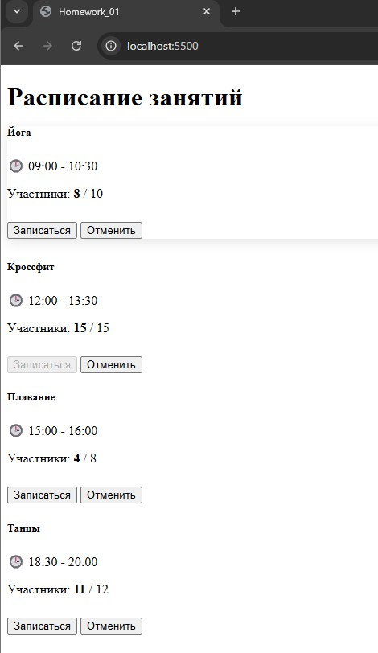
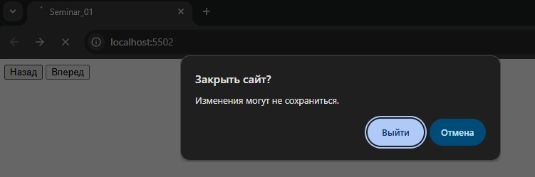
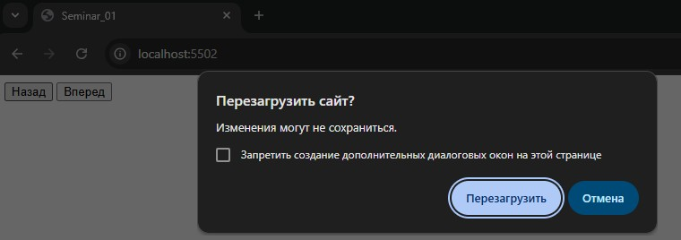
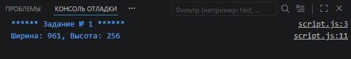
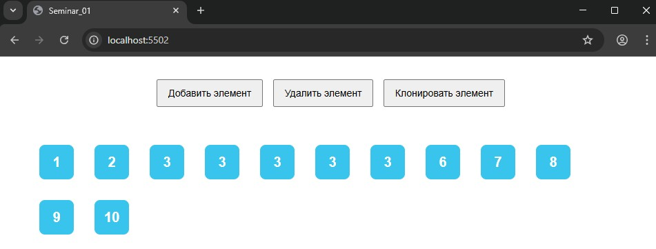
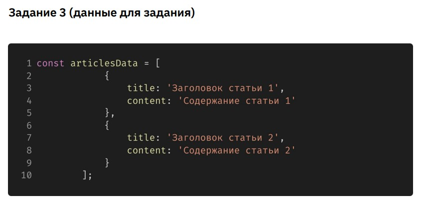
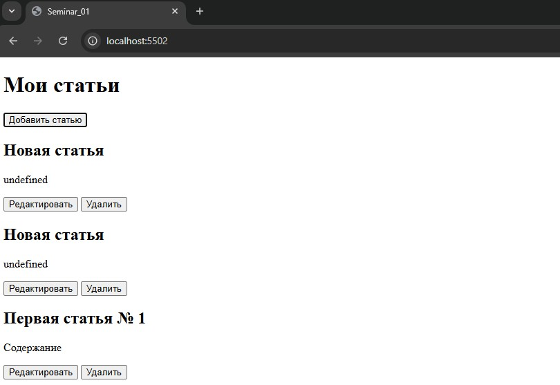

# Урок 2. Семинар: Dom-дерево

## План урока

- Выполнение практических заданий в соответствии с [презентацией](https://gbcdn.mrgcdn.ru/uploads/asset/5860236/attachment/14c717500acc4e87809390aaeeca4670.pdf) к уроку

## Домашняя работа ([решение]())

Вы разрабатываете веб-страницу для отображения расписания занятий в спортивном клубе. Каждое занятие имеет название, время проведения, максимальное количество участников и текущее количество записанных участников.

1. Создайте веб-страницу с заголовком `"Расписание занятий"` и областью для отображения занятий.

2. Загрузите информацию о занятиях из предоставленных `JSON-данных`. Каждое занятие должно отображаться на странице с указанием его названия, времени проведения, максимального количества участников и текущего количества записанных участников.

3. Пользователь может нажать на кнопку `"Записаться"` для записи на занятие. Если максимальное количество участников уже достигнуто, кнопка `"Записаться"` становится неактивной.

4. После успешной записи пользователя на занятие, обновите количество записанных участников и состояние кнопки `"Записаться"`.

5. Запись пользователя на занятие можно отменить путем нажатия на кнопку `"Отменить запись"`. После отмены записи, обновите количество записанных участников и состояние кнопки.

6. Все изменения (запись, отмена записи) должны сохраняться и отображаться в реальном времени на странице.

7. При разработке используйте `Bootstrap` для стилизации элементов.


***Результат выполнения Домашней работы:***

***CSS***
```
<style>
    .card {
        height: 100%;
        transition: transform 0.2s;
    }

    .card:hover {
        transform: translateY(-5px);
        box-shadow: 0 4px 15px rgba(0, 0, 0, 0.1);
    }
</style>
```


***HTML***
```
<body class="bg-light">
    <div class="container py-5">
        <h1 class="text-center mb-5">Расписание занятий</h1>
        <div id="schedule-container" class="row g-4">
            <!-- Занятия будут загружены сюда -->
        </div>
    </div>

    <script src="script.js"></script>
</body>
```

***JavaScript***
```
console.log(`****** Задание № 1 ******`);

// 1. Исходные JSON-данные
const initialData = [{
                id: 1,
                name: "Йога",
                time: "09:00 - 10:30",
                maxParticipants: 10,
                currentParticipants: 8
        },
        {
                id: 2,
                name: "Кроссфит",
                time: "12:00 - 13:30",
                maxParticipants: 15,
                currentParticipants: 15
        },
        {
                id: 3,
                name: "Плавание",
                time: "15:00 - 16:00",
                maxParticipants: 8,
                currentParticipants: 4
        },
        {
                id: 4,
                name: "Танцы",
                time: "18:30 - 20:00",
                maxParticipants: 12,
                currentParticipants: 11
        }
];

// Загрузка данных из localStorage или использование начальных данных
let lessons = JSON.parse(localStorage.getItem('lessons')) || initialData;

const container = document.getElementById('schedule-container');

function renderSchedule() {
        container.innerHTML = '';

        lessons.forEach(lesson => {
                const isFull = lesson.currentParticipants >= lesson.maxParticipants;

                const cardHtml = `
            <div class="col-md-6 col-lg-4">
                <div class="card h-100">
                    <div class="card-body d-flex flex-column">
                        <h5 class="card-title">${lesson.name}</h5>
                        <p class="card-text text-muted mb-2">🕒 ${lesson.time}</p>
                        <p class="card-text mb-1">Участники: <strong id="count-${lesson.id}">${lesson.currentParticipants}</strong> / ${lesson.maxParticipants}</p>
                        
                        <div class="progress mb-3" style="height: 10px;">
                            <div class="progress-bar ${isFull ? 'bg-danger' : 'bg-success'}" 
                                 role="progressbar" 
                                 style="width: ${(lesson.currentParticipants / lesson.maxParticipants) * 100}%">
                            </div>
                        </div>

                        <div class="mt-auto d-flex gap-2">
                            <button class="btn btn-primary flex-grow-1" 
                                    onclick="signUp(${lesson.id})" 
                                    ${isFull ? 'disabled' : ''}>
                                Записаться
                            </button>
                            <button class="btn btn-outline-danger" 
                                    onclick="cancelRegistration(${lesson.id})">
                                Отменить
                            </button>
                        </div>
                    </div>
                </div>
            </div>
        `;
                container.insertAdjacentHTML('beforeend', cardHtml);
        });
}

// Функция записи
window.signUp = (id) => {
        const lesson = lessons.find(l => l.id === id);
        if (lesson && lesson.currentParticipants < lesson.maxParticipants) {
                lesson.currentParticipants++;
                saveAndRefresh();
        }
};

// Функция отмены записи
window.cancelRegistration = (id) => {
        const lesson = lessons.find(l => l.id === id);
        if (lesson && lesson.currentParticipants > 0) {
                lesson.currentParticipants--;
                saveAndRefresh();
        }
};

// Сохранение и обновление интерфейса
function saveAndRefresh() {
        localStorage.setItem('lessons', JSON.stringify(lessons));
        renderSchedule();
}

// Инициализация
renderSchedule();
```





## Практическая работа с семинара ([решение]()):


### Задание 1 (тайминг 30 минут)

Работа с BOM:
1. Определение текущего размера окна браузера:
   - Напишите функцию, которая будет выводить текущую ширину и высоту окна браузера при его изменении.
2. Подтверждение закрытия страницы:
   - Создайте всплывающее окно или диалоговое окно, которое появляется при попытке закрыть вкладку
браузера и спрашивает пользователя, уверен ли он в своем решении закрыть страницу.
1. Управление историей переходов:
   - Используйте объект `history` для управления историей переходов на веб-странице. Создайте кнопки `"Назад"` и `"Вперед"` для перемещения по истории.


***Результат выполнения Задания № 1:***

***HTML***
```
<button id="backBtn">Назад</button>
<button id="forwardBtn">Вперед</button>
```

***JavaScript***
```
console.log(`****** Задание № 1 ******`);

/**
 * Определение размера окна
*/ 

function logWindowSize() {
  console.log(`Ширина: ${window.innerWidth}, Высота: ${window.innerHeight}`);
}

// Слушаем событие изменения размера
window.addEventListener('resize', logWindowSize);

// Вызываем один раз при загрузке, чтобы увидеть текущий размер
logWindowSize();


/**
 * Подтверждение закрытия страницы
*/ 
window.addEventListener('beforeunload', (event) => {
  event.preventDefault();
  event.returnValue = ''; // Необходимо для активации диалога в Chrome/Edge
});

document.getElementById('backBtn').onclick = () => history.back();
document.getElementById('forwardBtn').onclick = () => history.forward();
```







### Задание 2 (тайминг 30 минут)

Вы должны создать веб-страницу, которая позволяет пользователю динамически управлять элементами на странице. Ниже приведены основные требования и функциональность:
1. На странице должны быть кнопки `"Добавить элемент"`, `"Удалить элемент"` и
`"Клонировать элемент"`.
2. При нажатии на кнопку `"Добавить элемент"` на страницу добавляется новый
квадратный элемент (`<div>`) с размерами `100x100 пикселей`. Этот элемент
должен иметь класс `.box` и содержать текст, указывающий порядковый номер
элемента (1, 2, 3 и так далее).
3. При нажатии на кнопку `"Удалить элемент"` удаляется последний добавленный
элемент, если таковой имеется.
4. При нажатии на кнопку `"Клонировать элемент"` создается копия последнего
добавленного элемента и добавляется на страницу.
5. Все элементы имеют класс `.box` и стилизованы с помощью `CSS` (см. пример).
6. Элементы могут быть добавлены, удалены и клонированы в любом порядке и в
любом количестве.


***Результат выполнения Задания № 2:***

***HTML***
```
<div class="controls">
    <button id="add">Добавить элемент</button>
    <button id="remove">Удалить элемент</button>
    <button id="clone">Клонировать элемент</button>
</div>

<div id="container" class="container"></div>
```

***CSS***
```
body {
    font-family: sans-serif;
    padding: 20px;
    text-align: center;
}

.controls {
    margin-bottom: 20px;
}

.container {
    display: flex;
    flex-wrap: wrap;
    gap: 10px;

    padding: 20px;
    justify-content: flex-start;
}

.box {
    width: 50px;
    height: 50px;
    background-color: #39c4ee;
    color: white;
    display: flex;
    flex-wrap: wrap;
    margin: 10px;
    align-items: center;
    justify-content: center;
    font-size: 20px;
    font-weight: bold;
    border-radius: 8px;
    transition: transform 0.2s;
}

button {
    padding: 10px 15px;
    margin: 5px;
    cursor: pointer;
    font-size: 14px;
}
```

***JavaScript***
```
console.log(`****** Задание № 2 ******`);

const container = document.getElementById('container');
let counter = 0;

// 1. Добавление элемента
document.getElementById('add').addEventListener('click', () => {
  counter++;
  const newBox = document.createElement('div');
  newBox.className = 'box';
  newBox.textContent = counter;
  container.appendChild(newBox);
});

// 2. Удаление последнего элемента
document.getElementById('remove').addEventListener('click', () => {
  const boxes = container.querySelectorAll('.box');
  if (boxes.length > 0) {
    boxes[boxes.length - 1].remove();
  }
});

// 3. Клонирование последнего элемента
document.getElementById('clone').addEventListener('click', () => {
  const boxes = container.querySelectorAll('.box');
  if (boxes.length > 0) {
    const lastBox = boxes[boxes.length - 1];
    const clone = lastBox.cloneNode(true);
    container.appendChild(clone);
  }
});
```




### Задание 3 (тайминг 50 минут)

1. Вы создаете веб-страницу для отображения списка статей. Каждая статья состоит из заголовка и
текста. Вам необходимо использовать `Bootstrap` для стилизации элементов.
2. Используйте `Bootstrap`, чтобы стилизовать элементы:
    - a. Заголовок статьи (`<h2>`)
    - b. Текст статьи (`<p>`)
    - c. Кнопки `"Добавить статью"`, `"Удалить"` и `"Редактировать"`.
3. Создайте начальный список статей, который будет загружаться при загрузке страницы. Используйте `JSON-данные` для определения заголовков и текстов статей.
4. Позвольте пользователю добавлять новые статьи. При нажатии на кнопку `"Добавить статью"` должна появиться новая статья с заголовком `"Новая статья"` и текстом `"Введите содержание статьи..."`.
5. Реализуйте функциональность удаления статей. При нажатии на кнопку `"Удалить"` соответствующая статья должна быть удалена из списка.
6. Реализуйте функциональность редактирования статей. При нажатии на кнопку `"Редактировать"`
пользователь должен иметь возможность изменить заголовок и текст статьи. Используйте
всплывающее окно или `prompt` для ввода новых данных.
7. Все изменения (добавление, удаление, редактирование) должны быть сохранены в локальное
хранилище браузера, чтобы они сохранялись после перезагрузки страницы.




***Результат выполнения Задания № 3:***

***HTML***
```
<div class="container py-5">
    <div class="d-flex justify-content-between align-items-center mb-4">
        <h1>Мои статьи</h1>
        <button id="add-btn" class="btn btn-primary">Добавить статью</button>
    </div>

    <div id="articles-container" class="row">
        <!-- Статьи появятся здесь -->
    </div>
</div>
```


***JavaScript***
```
console.log(`****** Задание № 3 ******`);

// 3. Начальные данные
const defaultArticles = [{
    id: 1,
    title: "Первая статья",
    text: "Это текст первой статьи для примера."
  },
  {
    id: 2,
    title: "Вторая статья",
    text: "Bootstrap делает стилизацию очень быстрой."
  }
];

let articles = JSON.parse(localStorage.getItem('articles')) || defaultArticles;

const container = document.getElementById('articles-container');
const addBtn = document.getElementById('add-btn');

// Рендеринг списка
function render() {
  container.innerHTML = '';
  articles.forEach(art => {
    const card = document.createElement('div');
    card.className = 'col-12 mb-3';
    card.innerHTML = `
                <div class="card shadow-sm">
                    <div class="card-body">
                        <h2 class="card-title h4 text-primary">${art.title}</h2>
                        <p class="card-text text-muted">${art.text}</p>
                        <button onclick="editArticle(${art.id})" class="btn btn-outline-secondary btn-sm me-2">Редактировать</button>
                        <button onclick="deleteArticle(${art.id})" class="btn btn-outline-danger btn-sm">Удалить</button>
                    </div>
                </div>
            `;
    container.appendChild(card);
  });
  // 7. Сохранение
  localStorage.setItem('articles', JSON.stringify(articles));
}

// 4. Добавление
addBtn.addEventListener('click', () => {
  const newArt = {
    id: Date.now(),
    title: "Новая статья",
    text: "Введите содержание статьи..."
  };
  articles.push(newArt);
  render();
});

// 5. Удаление
function deleteArticle(id) {
  articles = articles.filter(art => art.id !== id);
  render();
}

// 6. Редактирование
function editArticle(id) {
  const art = articles.find(a => a.id === id);
  const newTitle = prompt("Измените заголовок:", art.title);
  const newText = prompt("Измените текст:", art.text);

  if (newTitle !== null) art.title = newTitle;
  if (newText !== null) art.text = newText;

  render();
}

render();
```



