# Урок 4. Урок 4. Семинар: События, формы


## План урока

- Выполнение практических заданий в соответствии с [презентацией](https://gbcdn.mrgcdn.ru/uploads/asset/5860237/attachment/887e785dbf3869e79ee0bea89d89c818.pdf) к уроку

## Домашняя работа ([решение](https://github.com/olgashenkel/GeekBrains-technological_specialization-ELECTIVES/tree/main/04.%20JavaScript%20about%20Browser%20APIs/02.%20Seminar_02/homework))

Вашей задачей является создание веб-слайдера для отображения изображений на веб-странице. Слайдер должен позволять переключаться между изображениями и отображать их в центре экрана.

1. Создайте интерфейс веб-страницы, который включает в себя следующие элементы:

    a. Контейнер для отображения текущего изображения.

    b. Кнопки "Предыдущее изображение" и "Следующее изображение" для переключения между изображениями.

    c. Навигационные точки (индикаторы) для быстрого переключения между изображениями.

2. Используйте HTML для создания элементов интерфейса.

3. Используйте JavaScript для обработки событий:

    a. При клике на кнопку "Предыдущее изображение" должно отображаться предыдущее изображение.

    b. При клике на кнопку "Следующее изображение" должно отображаться следующее изображение.

    c. При клике на навигационные точки, слайдер должен переключаться к соответствующему изображению.

4. Слайдер должен циклически переключаться между изображениями, то есть после последнего изображения должно отображаться первое, и наоборот.

5. Добавьте стилизацию для слайдера и элементов интерфейса с использованием CSS для улучшения внешнего вида.


***Результат выполнения Домашней работы:***

***HTML***
```
<div class="slider-container">
    <div id="slider">
        <!-- Слайды загрузятся из JS -->
    </div>

    <button class="nav-btn prev" onclick="moveSlide(-1)">❮</button>
    <button class="nav-btn next" onclick="moveSlide(1)">❯</button>

    <div id="dotsContainer" class="dots-container"></div>
</div>
```

***CSS***
```
@charset "UTF-8";
* {
  margin: 0;
  padding: 0;
  box-sizing: border-box;
}

body {
  font-family: "Raleway", sans-serif;
  overflow-x: hidden;
}

/* Контейнер слайдера */
.slider-container {
  position: relative;
  width: 95%;
  max-width: 1200px;
  height: 60vh;
  margin: 80px auto 40px;
  overflow: hidden;
  border-radius: 12px;
  box-shadow: 0 4px 15px rgba(0, 0, 0, 0.2);
  touch-action: pan-y;
  background: #eee;
}

/* Лента слайдов */
#slider {
  display: flex;
  height: 100%;
  transition: transform 0.5s ease-in-out;
  will-change: transform;
}

/* Отдельный слайд */
.slide {
  min-width: 100%;
  height: 100%;
  position: relative;
}

.slide img {
  width: 100%;
  height: 100%;
  -o-object-fit: cover;
     object-fit: cover;
  display: block;
}

.slide-content {
  position: absolute;
  bottom: 0;
  background: linear-gradient(transparent, rgba(0, 0, 0, 0.8));
  color: #fff;
  width: 100%;
  padding: 40px 20px;
}

/* Навигация */
.nav-btn {
  position: absolute;
  top: 50%;
  transform: translateY(-50%);
  background: rgba(255, 255, 255, 0.3);
  border: none;
  padding: 15px;
  cursor: pointer;
  border-radius: 50%;
  z-index: 10;
}

.prev {
  left: 15px;
}

.next {
  right: 15px;
}

.dots-container {
  position: absolute;
  bottom: 15px;
  left: 50%;
  transform: translateX(-50%);
  display: flex;
  gap: 8px;
  z-index: 10;
}

.dot {
  width: 10px;
  height: 10px;
  background: rgba(255, 255, 255, 0.5);
  border-radius: 50%;
  cursor: pointer;
  transition: 0.3s;
}

.dot.active {
  background: #fff;
  transform: scale(1.3);
}
```


***.JSON***
```
[
    {
        "image": "images/content/1.jpg",
        "title": "Картинка № 1",
        "desc": "Картинка № 1 из просторов интернета"
    },
    {
        "image": "images/content/2.jpg",
        "title": "Картинка № 2",
        "desc": "Картинка № 2 из просторов интернета"
    },
    {
        "image": "images/content/3.jpg",
        "title": "Картинка № 3",
        "desc": "Картинка № 3 из просторов интернета"
    }
]
```

***JavaScript***
```
console.log(`****** Домашняя работа ******`);


const navbar = document.getElementById('navbar');
const slider = document.getElementById('slider');
const dotsContainer = document.getElementById('dotsContainer');

let currentIndex = 1; // Стартуем с 1 из-за клона
let slidesCount = 0;
let isTransitioning = false;

// 1. Скролл навигации
window.addEventListener('scroll', () => {
    navbar.classList.toggle('scrolled', window.scrollY > 50);
});

// 2. Загрузка данных
async function loadNews() {
    try {
        const response = await fetch('new_facts.json');
        const newsData = await response.json();
        slidesCount = newsData.length;

        renderSlider(newsData);
        updateSlider(false); // Мгновенная позиция на 1-й слайд
    } catch (error) {
        console.error("Ошибка:", error);
        slider.innerHTML = "<p style='padding:20px'>Ошибка загрузки JSON</p>";
    }
}

function createSlideElement(item) {
    const slide = document.createElement('div');
    slide.classList.add('slide');
    slide.innerHTML = `
                
                <div class="slide-content">
                    <h3>${item.title}</h3>
                    <p>${item.desc}</p>
                </div>`;
    return slide;
}

function renderSlider(data) {
    slider.innerHTML = '';
    dotsContainer.innerHTML = '';

    // Клон последнего в начало
    slider.appendChild(createSlideElement(data[data.length - 1]));

    // Основные слайды
    data.forEach((item, index) => {
        slider.appendChild(createSlideElement(item));
        const dot = document.createElement('div');
        dot.classList.add('dot');
        dot.onclick = () => goToSlide(index + 1);
        dotsContainer.appendChild(dot);
    });

    // Клон первого в конец
    slider.appendChild(createSlideElement(data[0]));
}

function moveSlide(step) {
    if (isTransitioning) return;
    isTransitioning = true;

    currentIndex += step;
    slider.style.transition = "transform 0.5s ease-in-out";
    updateSlider(true);

    slider.addEventListener('transitionend', () => {
        isTransitioning = false;
        if (currentIndex > slidesCount) {
            slider.style.transition = "none";
            currentIndex = 1;
            updateSlider(false);
        }
        if (currentIndex < 1) {
            slider.style.transition = "none";
            currentIndex = slidesCount;
            updateSlider(false);
        }
    }, {
        once: true
    });
}

function updateSlider(animate) {
    const offset = -currentIndex * 100;
    slider.style.transform = `translateX(${offset}%)`;

    // Логика точек
    let dotIndex = currentIndex - 1;
    if (currentIndex > slidesCount) dotIndex = 0;
    if (currentIndex < 1) dotIndex = slidesCount - 1;

    const dots = document.querySelectorAll('.dot');
    dots.forEach((dot, idx) => {
        dot.classList.toggle('active', idx === dotIndex);
    });
}

function goToSlide(index) {
    if (isTransitioning) return;
    currentIndex = index;
    slider.style.transition = "transform 0.5s ease-in-out";
    updateSlider(true);
}

// Свайпы
let touchStartX = 0;
slider.addEventListener('touchstart', e => {
    touchStartX = e.changedTouches[0].screenX;
}, {
    passive: true
});
slider.addEventListener('touchend', e => {
    const touchEndX = e.changedTouches[0].screenX;
    const diff = touchStartX - touchEndX;
    if (Math.abs(diff) > 50) moveSlide(diff > 0 ? 1 : -1);
}, {
    passive: true
});

loadNews();
```

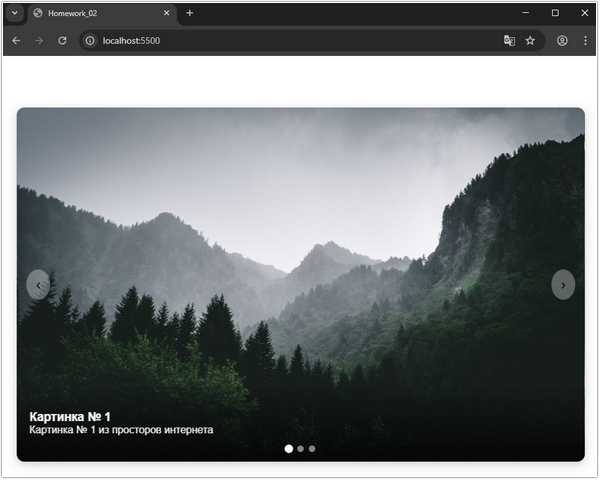

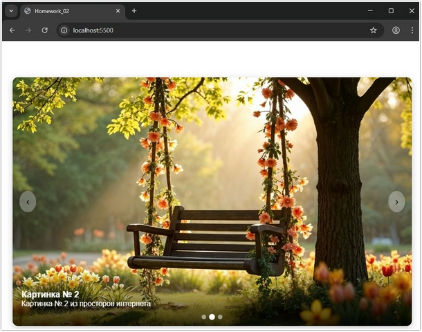


## Практическая работа с семинара ([решение](https://github.com/olgashenkel/GeekBrains-technological_specialization-ELECTIVES/tree/main/04.%20JavaScript%20about%20Browser%20APIs/02.%20Seminar_02/seminar_02)):

### Задание 1 (тайминг 15 минут)

Текст задания

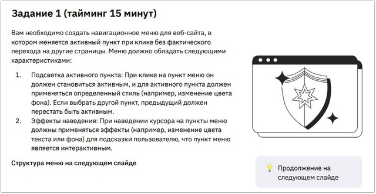

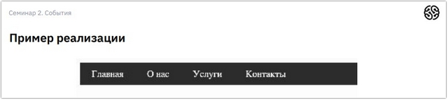


***Результат выполнения Задания № 1:***

***HTML***
```
<nav class="menu">
    <a href="javascript:void(0)" class="menu-item active">Главная</a>
    <a href="javascript:void(0)" class="menu-item">О нас</a>
    <a href="javascript:void(0)" class="menu-item">Услуги</a>
    <a href="javascript:void(0)" class="menu-item">Контакты</a>
</nav>
```

***CSS***
```
.menu {
    display: flex;
    justify-content: center;
    align-items: center;
    max-width: 400px;
    gap: 10px;
    background: #ebebeb;
    padding: 10px;
    border-radius: 8px;
}

.menu-item {
    text-decoration: none;
    color: #333;
    padding: 10px 15px;
    border-radius: 5px;
    transition: all 0.3s ease;
    /* Плавный переход цветов */
}

/* Эффект наведения */
.menu-item:hover {
    background-color: #e0e0e0;
    color: #007bff;
}

/* Стиль для активного пункта */
.menu-item.active {
    background-color: #007bff;
    color: white;
}
```

***JavaScript***
```
console.log(`****** Задание № 1 ******`);

const menuItems = document.querySelectorAll('.menu-item');

menuItems.forEach(item => {
  item.addEventListener('click', function() {
    // Удаляем класс active у всех пунктов
    menuItems.forEach(el => el.classList.remove('active'));
    
    // Добавляем класс active тому пункту, по которому кликнули
    this.classList.add('active');
  });
});
```

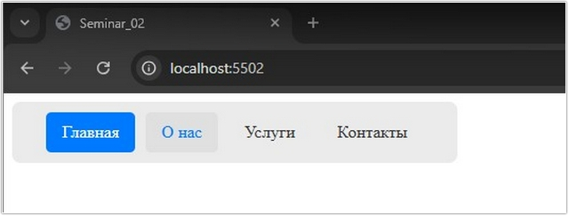


### Задание 2 (тайминг 15 минут)

Текст задания

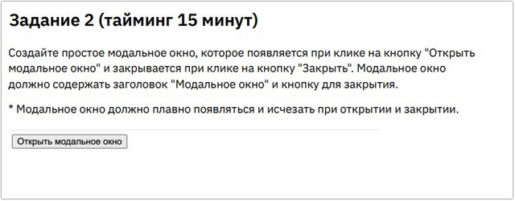


***Результат выполнения Задания № 2:***

***HTML***
```
<button id="openBtn">Открыть модальное окно</button>

<!-- Разметка модального окна -->
<div id="myModal" class="modal">
    <div class="modal-content">
        <h2>Модальное окно</h2>
        <p>Нажмите кнопку "Закрыть", чтобы закрыть окно</p>
        <button id="closeBtn">Закрыть</button>
    </div>
</div>
```

***CSS***
```
/* Фон модального окна */
.modal {
    position: fixed;
    top: 0;
    left: 0;
    width: 100%;
    height: 100%;
    background-color: rgba(0, 0, 0, 0.5);
    display: flex;
    justify-content: center;
    align-items: center;

    /* Эффект плавности */
    opacity: 0;
    visibility: hidden;
    transition: opacity 0.3s ease, visibility 0.3s ease;
}

/* Состояние при открытии */
.modal.is-open {
    opacity: 1;
    visibility: visible;
}

/* Контент окна */
.modal-content {
    background: white;
    padding: 20px;
    border-radius: 8px;
    text-align: center;
    min-width: 300px;
}
/* Стилистика для кнопки "Закрыть" */
#closeBtn {
    background-color: lightskyblue;
    border: none;
    height: 30px;
    width: 150px;
    text-align: center;
}

#closeBtn:hover {
    background-color: rgba(135, 206, 250, 0.6);
    border: 1px solid #000;
    border-radius: 3px;
}
```

***JavaScript***
```
console.log(`\n****** Задание № 2 ******`);

const modal = document.getElementById('myModal');
const openBtn = document.getElementById('openBtn');
const closeBtn = document.getElementById('closeBtn');

// Открыть
openBtn.addEventListener('click', () => {
    modal.classList.add('is-open');
});

// Закрыть
closeBtn.addEventListener('click', () => {
    modal.classList.remove('is-open');
});

// Дополнительно: закрытие при клике на серый фон
window.addEventListener('click', (event) => {
    if (event.target === modal) {
        modal.classList.remove('is-open');
    }
});
```

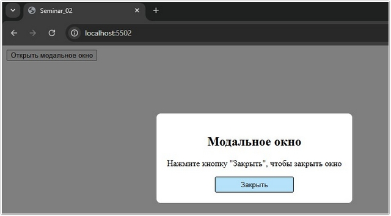


### Задание 3 (тайминг 10 минут)

Текст задания


***Результат выполнения Задания № 3:***

***HTML***
```
<button class="buy-button">Купить</button>
```

***CSS***
```
.buy-button {
    background-color: hsl(224, 100%, 60%);
    border: 1px solid #00000027;
    border-radius: 3px;
    height: 40px;
    min-width: 100px;
    text-align: center;
    font-size: 16px;
    color: #ffffff;
}

.buy-button:hover {
    background-color: hsl(224, 100%, 60%, 0.6);
    border: 1px solid #000;
    border-radius: 3px;
}
```

***JavaScript***
```
console.log(`****** Задание № 3 ******`);

const buyButton = document.querySelector('.buy-button');

buyButton.addEventListener('click', (event) => {
  // Проверка на "доверенное" событие (настоящий клик пользователя)
  if (event.isTrusted) {
    const originalText = buyButton.textContent;
    buyButton.textContent = 'Товар добавлен в корзину';

    setTimeout(() => {
      buyButton.textContent = originalText;
    }, 2000);
  }
});
```

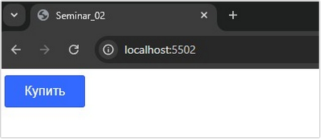

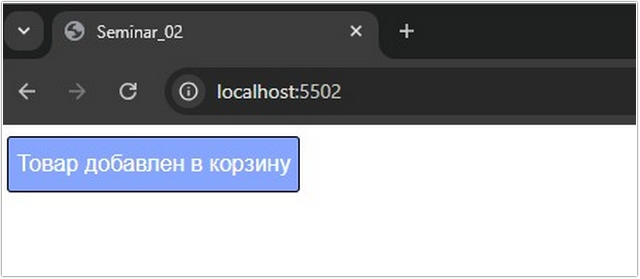


### Задание 4 (тайминг 20 минут)

Текст задания


***Результат выполнения Задания № 4:***


***HTML***
```
<div class="quiz-container">
<h1>Мини-опрос</h1>

<div id="quiz-form">
    <!-- Вопрос 1 -->
    <div class="question" data-q="1">
        <p>1. Какой ваш любимый язык программирования?</p>
        <label><input type="radio" name="q1" value="JavaScript"> JavaScript</label>
        <label><input type="radio" name="q1" value="Python"> Python</label>
        <label><input type="radio" name="q1" value="C++"> C++</label>
    </div>

    <!-- Вопрос 2 -->
    <div class="question" data-q="2">
        <p>2. Какую среду разработки вы предпочитаете?</p>
        <label><input type="radio" name="q2" value="VS Code"> VS Code</label>
        <label><input type="radio" name="q2" value="WebStorm"> WebStorm</label>
        <label><input type="radio" name="q2" value="Vim/Emacs"> Vim/Emacs</label>
    </div>

    <div id="error-msg" class="error">Пожалуйста, ответьте на все вопросы!</div>
    <button onclick="finishQuiz()">Завершить опрос</button>
</div>

<div id="results">
    <h3>Ваши ответы:</h3>
    <div id="results-content"></div>
</div>
</div>
```

***CSS***
```
body {
    font-family: sans-serif;
    background: #f4f4f9;
    display: flex;
    justify-content: center;
    padding: 20px;
}

.quiz-container {
    background: white;
    padding: 25px;
    border-radius: 10px;
    box-shadow: 0 4px 15px rgba(0, 0, 0, 0.1);
    width: 100%;
    max-width: 500px;
}

h1 {
    text-align: center;
    color: #333;
}

.question {
    margin-bottom: 20px;
    border-bottom: 1px solid #eee;
    padding-bottom: 15px;
}

.question p {
    font-weight: bold;
    margin-bottom: 10px;
}

label {
    display: block;
    margin: 5px 0;
    cursor: pointer;
}

button {
    width: 100%;
    padding: 12px;
    background: #28a745;
    color: white;
    border: none;
    border-radius: 5px;
    font-size: 16px;
    cursor: pointer;
}

button:hover {
    background: #218838;
}

#results {
    margin-top: 20px;
    padding: 15px;
    background: #e9ecef;
    border-radius: 5px;
    display: none;
}

.error {
    color: #dc3545;
    font-weight: bold;
    text-align: center;
    margin-bottom: 15px;
    display: none;
}
```

***JavaScript***
```
console.log(`****** Задание № 4 ******`);

function finishQuiz() {
    const questions = document.querySelectorAll('.question');
    const resultsDiv = document.getElementById('results');
    const resultsContent = document.getElementById('results-content');
    const errorMsg = document.getElementById('error-msg');

    let allAnswered = true;
    let summary = '';

    questions.forEach((q, index) => {
        const selected = q.querySelector('input[type="radio"]:checked');
        if (!selected) {
            allAnswered = false;
        } else {
            const questionText = q.querySelector('p').innerText;
            summary += `<p><strong>${questionText}</strong> — ${selected.value}</p>`;
        }
    });

    if (allAnswered) {
        errorMsg.style.display = 'none';
        resultsContent.innerHTML = summary;
        resultsDiv.style.display = 'block';
        document.querySelector('button').style.display = 'none'; // Скрываем кнопку после завершения
    } else {
        errorMsg.style.display = 'block';
        resultsDiv.style.display = 'none';
    }
}
```


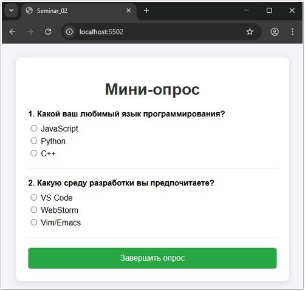

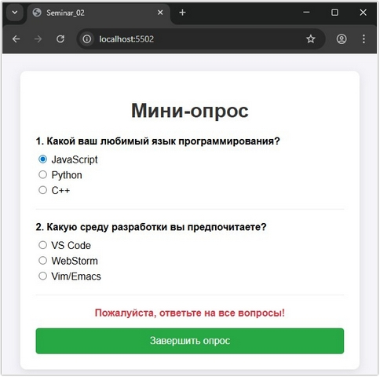

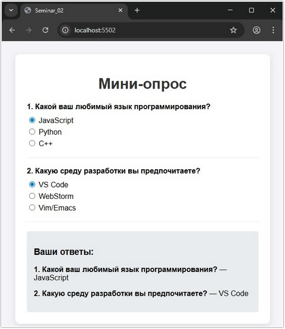
