# Урок 6. Семинар: Сетевые запросы

## План урока

- Выполнение практических заданий в соответствии с [презентацией](https://gbcdn.mrgcdn.ru/uploads/asset/5860239/attachment/c88429f9790fd9688f71deb969ab0e7b.pdf) к уроку

## Домашняя работа + Промежуточная аттестация ([решение]())

**Цель:** Разработать веб-приложение, которое каждый день будет отображать новое случайное изображение из коллекции Unsplash, давая пользователю возможность узнать больше о фотографе и сделать "лайк" изображению.

Регистрация на Unsplash:

- Перейдите на веб-сайт Unsplash (https://unsplash.com/).
- Зарегистрируйтесь или войдите в свой аккаунт. (если у вас не было регистрации до этого, новый аккаунт создавать не нужно).

Создание приложения:

- Перейдите на страницу разработчика Unsplash (https://unsplash.com/developers).
- Нажмите "New Application".
- Заполните необходимую информацию о приложении (можете использовать http://localhost для тестирования).
- Получите свой API-ключ после создания приложения.

Разработка веб-приложения:

- Создайте HTML-страницу с элементами: изображение, имя фотографа, кнопка "лайк" и счетчик лайков.
- Используя JavaScript и ваш API-ключ, получите случайное изображение из Unsplash каждый раз, когда пользователь загружает страницу.
- Отобразите информацию о фотографе под изображением.
- Реализуйте функционал "лайка". Каждый раз, когда пользователь нажимает кнопку "лайк", счетчик должен увеличиваться на единицу.

\* Дополнительные задачи (по желанию):

- Добавьте функцию сохранения количества лайков в локальное хранилище, чтобы при новой загрузке страницы счетчик не сбрасывался.
- Реализуйте возможность просмотра предыдущих "фото дня" с сохранением их в истории просмотров.

Результат выполнения ДЗ:

*В связи с ограничением возможности подключения к сервису `Unsplash API` результат выполнения задания отличается от предлагаемого*

***HTML***
```
<div class="container">
    <div id="photo-card">
        
        <div class="info">
            <p>Автор: <span id="author-name">Загрузка...</span></p>
            <div class="actions">
                <button id="like-btn">❤️ <span id="like-count">0</span></button>
                <button id="next-btn">Следующее →</button>
            </div>
        </div>
    </div>

    <div class="history">
        <h3>История просмотров</h3>
        <ul id="history-list"></ul>
    </div>
</div>
```

***CSS***
```
body {
    font-family: 'Segoe UI', sans-serif;
    display: flex;
    justify-content: center;
    background: #ececec;
    margin: 0;
    padding: 20px;
}

.container {
    max-width: 500px;
    width: 100%;
    background: white;
    padding: 20px;
    border-radius: 15px;
    box-shadow: 0 10px 25px rgba(0, 0, 0, 0.1);
}

#main-img {
    width: 100%;
    height: 350px;
    object-fit: cover;
    border-radius: 10px;
    background: #eee;
}

.info {
    margin-top: 15px;
}

.actions {
    display: flex;
    gap: 10px;
    margin-top: 10px;
}

#like-btn,
#next-btn {
    cursor: pointer;
    padding: 10px 15px;
    border-radius: 8px;
    border: 1px solid #ddd;
    background: white;
    flex-grow: 1;
}

#like-btn:hover {
    background: #fff0f0;
    border-color: #ff4d4d;
}

#next-btn:hover {
    background: #f0f0f0;
}

.history {
    margin-top: 25px;
    border-top: 1px solid #eee;
}

.history h3 {
    font-size: 16px;
    color: #333;
}

#history-list {
    list-style: none;
    padding: 0;
    max-height: 150px;
    overflow-y: auto;
    font-size: 13px;
    color: #666;
}

#history-list li {
    padding: 5px 0;
    border-bottom: 1px solid #fafafa;
}
```

***JavaScript***
```
const imgElement = document.getElementById('main-img');
const authorElement = document.getElementById('author-name');
const likeCountElement = document.getElementById('like-count');
const likeBtn = document.getElementById('like-btn');
const nextBtn = document.getElementById('next-btn');
const historyList = document.getElementById('history-list');

let currentPhotoData = null;

// Функция получения случайного фото через Picsum
async function fetchPhoto() {
    try {
        // Запрашиваем список фото (около 100 шт) и берем случайное из них
        // Это позволяет получить ID и имя автора сразу
        const response = await fetch(`https://picsum.photos{Math.floor(Math.random() * 10)}&limit=10`);
        const photos = await response.json();
        const randomPhoto = photos[Math.floor(Math.random() * photos.length)];
        
        currentPhotoData = randomPhoto;
        updateUI(randomPhoto);
        addToHistory(randomPhoto);
    } catch (error) {
        console.error("Ошибка загрузки:", error);
    }
}

function updateUI(photo) {
    imgElement.src = `https://picsum.photos{photo.id}/600/400`;
    authorElement.textContent = photo.author;
    
    // Загружаем лайки именно для этого фото из LocalStorage
    const savedLikes = localStorage.getItem(`likes_${photo.id}`) || 0;
    likeCountElement.textContent = savedLikes;
}

// Кнопка лайка
likeBtn.addEventListener('click', () => {
    if (!currentPhotoData) return;
    
    let count = parseInt(likeCountElement.textContent);
    count++;
    likeCountElement.textContent = count;
    
    localStorage.setItem(`likes_${currentPhotoData.id}`, count);
});

// Кнопка «Следующее»
nextBtn.addEventListener('click', fetchPhoto);

// История просмотров
function addToHistory(photo) {
    let history = JSON.parse(localStorage.getItem('my_history')) || [];
    
    // Добавляем в начало массива
    const entry = { author: photo.author, time: new Date().toLocaleTimeString() };
    history.unshift(entry);
    
    // Храним только последние 10 записей
    if (history.length > 10) history.pop();
    
    localStorage.setItem('my_history', JSON.stringify(history));
    renderHistory();
}

function renderHistory() {
    const history = JSON.parse(localStorage.getItem('my_history')) || [];
    historyList.innerHTML = history
        .map(item => `<li>[${item.time}] — ${item.author}</li>`)
        .join('');
}

// Инициализация
fetchPhoto();
renderHistory();
```


## Практическая работа с семинара ([решение](https://github.com/olgashenkel/GeekBrains-technological_specialization-ELECTIVES/tree/main/04.%20JavaScript%20about%20Browser%20APIs/03.%20Seminar_03/seminar_03)):

### Задание 1 (тайминг 35 минут)

Текст задания

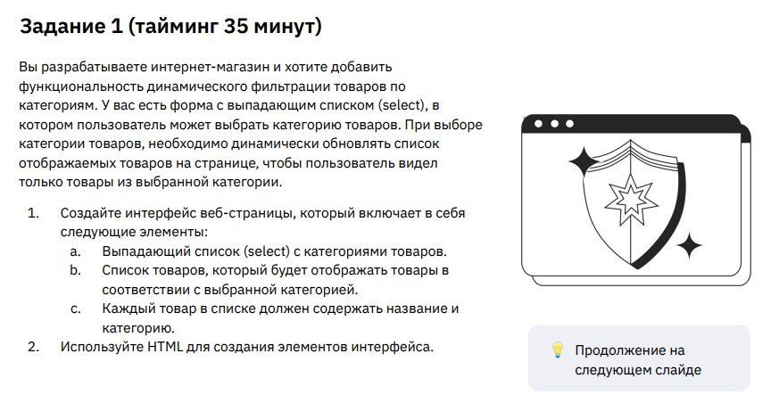

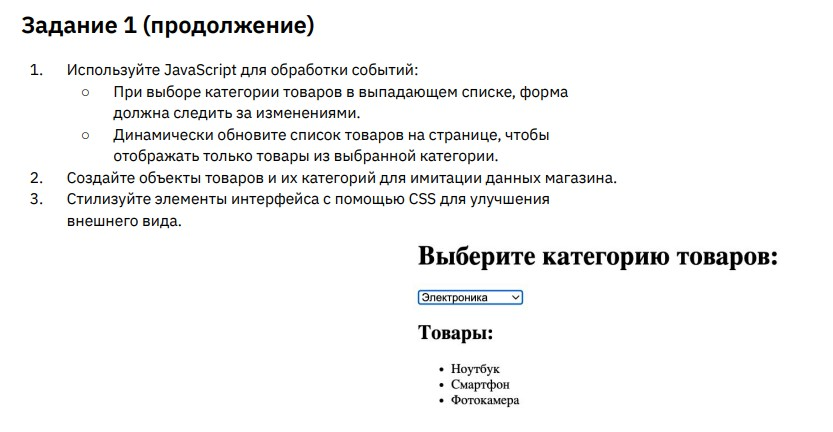


***Результат выполнения Задания № 1:***

***HTML***
```
<h1>Магазин электроники</h1>
<h2>Выберите категорию товаров:</h2>

<div class="filter-container">
    <label for="categorySelect">Категория:</label>
    <select id="categorySelect">
        <option value="all">Все категории</option>
        <option value="Электроника">Электроника</option>
        <option value="Одежда">Одежда</option>
        <option value="Дом">Дом</option>
    </select>
</div>

<div id="productList">
    <!-- Сюда JS будет вставлять товары -->
</div>
```

***CSS***
```
body {
    font-family: 'Segoe UI', Tahoma, Geneva, Verdana, sans-serif;
    background-color: #f4f7f6;
    color: #333;
    display: flex;
    flex-direction: column;
    align-items: center;
    padding: 40px;
}

.filter-container {
    background: white;
    padding: 20px 30px;
    border-radius: 12px;
    box-shadow: 0 4px 15px rgba(0, 0, 0, 0.1);
    margin-bottom: 30px;
    display: flex;
    align-items: center;
    gap: 15px;
}

label {
    font-weight: 600;
}

select {
    padding: 8px 12px;
    border-radius: 6px;
    border: 1px solid #ccc;
    outline: none;
    cursor: pointer;
    font-size: 1rem;
}

#productList {
    display: grid;
    grid-template-columns: repeat(auto-fill, minmax(250px, 1fr));
    gap: 20px;
    width: 100%;
    max-width: 1000px;
}

.product-card {
    background: white;
    padding: 20px;
    border-radius: 10px;
    border-left: 5px solid #3498db;
    transition: transform 0.2s;
    box-shadow: 0 2px 8px rgba(0, 0, 0, 0.05);
}

.product-card:hover {
    transform: translateY(-5px);
}

.product-card h3 {
    margin: 0 0 10px 0;
    font-size: 1.2rem;
}

.category-tag {
    display: inline-block;
    background: #e1f0fa;
    color: #3498db;
    padding: 4px 10px;
    border-radius: 20px;
    font-size: 0.8rem;
    font-weight: bold;
    text-transform: uppercase;
}
```


***JavaScript***
```
console.log(`****** Задание № 1 ******`);

// Объекты товаров (Имитация данных)
const products = [{
        name: "Смартфон Galaxy",
        category: "Электроника"
    },
    {
        name: "Ноутбук Pro",
        category: "Электроника"
    },
    {
        name: "Футболка хлопок",
        category: "Одежда"
    },
    {
        name: "Джинсы Denim",
        category: "Одежда"
    },
    {
        name: "Кофеварка",
        category: "Дом"
    },
    {
        name: "Лампа настольная",
        category: "Дом"
    },
    {
        name: "Наушники Wireless",
        category: "Электроника"
    }
];

const selectElement = document.getElementById('categorySelect');
const container = document.getElementById('productList');

// Функция для отрисовки списка
function renderProducts(filter) {
    // Очищаем текущий список
    container.innerHTML = '';

    // Фильтруем массив
    const filteredProducts = filter === 'all' ?
        products :
        products.filter(p => p.category === filter);

    // Создаем HTML-элементы для каждого товара
    filteredProducts.forEach(product => {
        const card = document.createElement('div');
        card.className = 'product-card';
        card.innerHTML = `
                    <h3>${product.name}</h3>
                    <span class="category-tag">${product.category}</span>
                `;
        container.appendChild(card);
    });
}

// Обработка событий
selectElement.addEventListener('change', (event) => {
    renderProducts(event.target.value);
});

// Первичная отрисовка при загрузке страницы
renderProducts('all');
```

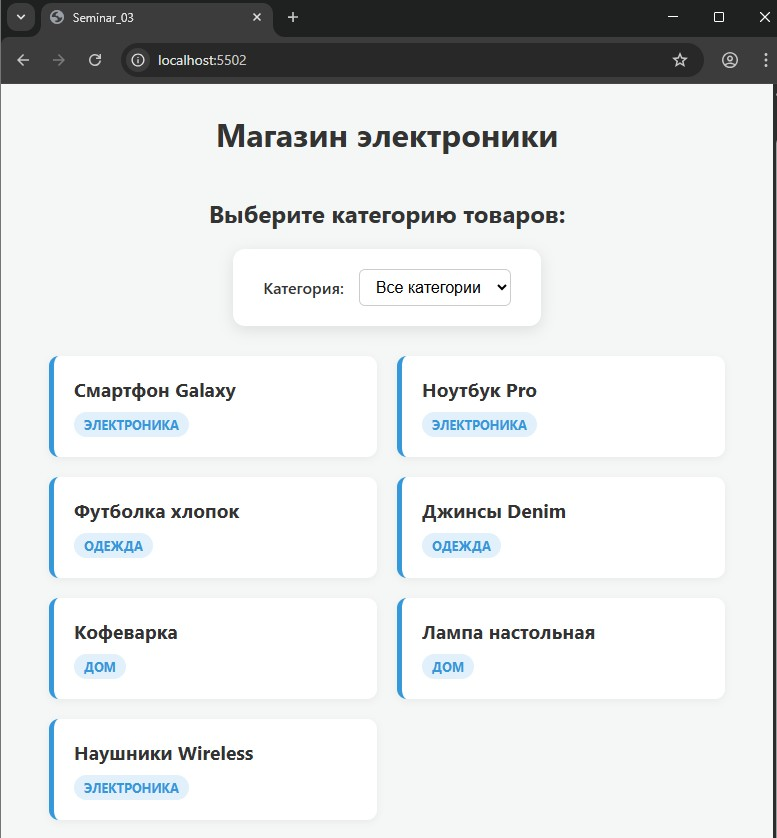

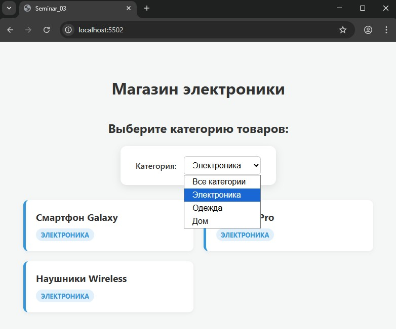


### Задание 2 (тайминг 55 минут)

Текст задания

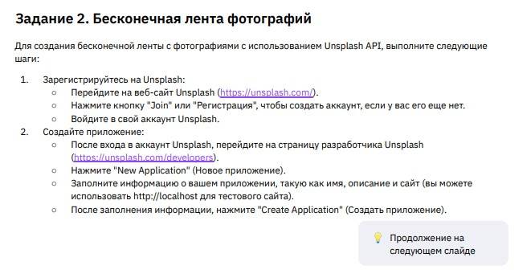

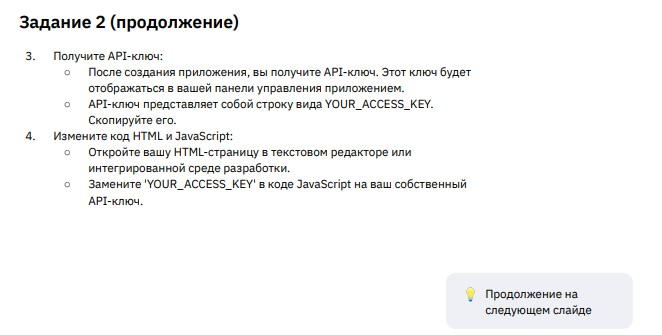

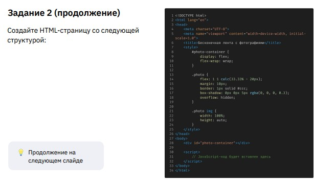

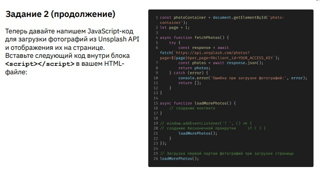

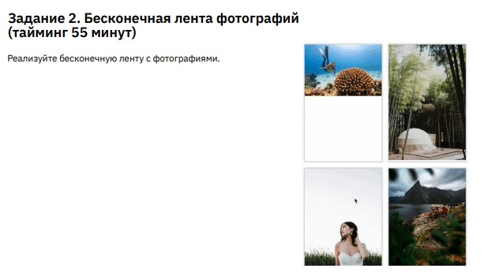

*В связи с ограничением возможности подключения к сервису `Unsplash API` результат выполнения задания отличается от предлагаемого*

***Результат выполнения Задания № 2:***


***HTML***
```
<header>
    <h1>Моя бесконечная галерея</h1>
</header>
<!-- Основной контейнер для фото -->
<main id="gallery" class="gallery-container"></main>

<!-- Индикатор загрузки -->
<div id="loader" class="loader">Загрузка новых фото...</div>
```

***CSS***
```
/* Общие настройки страницы */
body {
    font-family: sans-serif;
    margin: 0;
    padding: 20px;
    background-color: #f0f2f5;
    display: flex;
    flex-direction: column;
    align-items: center;
}

h1 {
    color: #333;
}

/* Сетка галереи */
.gallery-container {
    display: grid;
    grid-template-columns: repeat(auto-fill, minmax(300px, 1fr));
    gap: 20px;
    max-width: 1200px;
    width: 100%;
}

/* Стилизация самих картинок */
.gallery-image {
    width: 100%;
    height: 250px;
    object-fit: cover;
    border-radius: 15px;
    box-shadow: 0 4px 10px rgba(0, 0, 0, 0.1);
    transition: transform 0.3s ease;
    background-color: #ddd;
    /* Цвет-заполнитель пока фото грузится */
}

.gallery-image:hover {
    transform: scale(1.03);
}

/* Стили индикатора загрузки */
.loader {
    margin: 30px 0;
    font-weight: bold;
    color: #666;
}
```


***JavaScript***
```
console.log(`****** Задание № 2 ******`);

const gallery = document.getElementById('gallery');
const loader = document.getElementById('loader');

// Настройки: сколько фото подгружать за раз
const PHOTO_BATCH_COUNT = 6;

/**
 * Создает и добавляет фотографии в DOM
 */
function appendPhotos() {
    for (let i = 0; i < PHOTO_BATCH_COUNT; i++) {
        const img = document.createElement('img');

        // Используем сервис Picsum для получения случайных фото
        const randomId = Math.floor(Math.random() * 1000);
        img.src = `https://dummyimage.com{randomId}`;
        img.alt = "Случайное фото";
        img.className = 'gallery-image';
        img.loading = 'lazy'; // Ленивая загрузка для производительности

        gallery.appendChild(img);
    }
}

/**
 * Следит за появлением футера/лоадера внизу экрана
 */
const observer = new IntersectionObserver((entries) => {
    // Если лоадер попал в зону видимости, грузим еще фото
    if (entries[0].isIntersecting) {
        appendPhotos();
    }
}, {
    rootMargin: '200px' // Начинаем подгрузку заранее (за 200px до конца)
});

// Запускаем слежку за индикатором загрузки
observer.observe(loader);

// Первая подгрузка при открытии сайта
appendPhotos();
```


### Задание 3 (тайминг 30 минут)

Текст задания

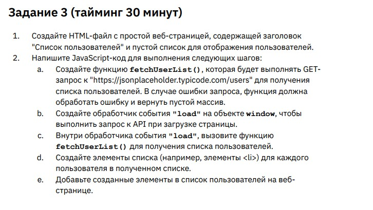


***Результат выполнения Задания № 3:***


***HTML***
```
<div class="container">
    <header>
        <h1>Список пользователей</h1>
        <button id="refresh-btn">Обновить данные</button>
    </header>

    <ul id="user-list">
        <li class="loading">Загрузка пользователей...</li>
    </ul>
</div>
```

***CSS***
```
body {
    font-family: 'Segoe UI', Tahoma, Geneva, Verdana, sans-serif;
    background-color: #f4f7f6;
    padding: 20px;
    color: #333;
}

.container {
    max-width: 800px;
    margin: 0 auto;
}

header {
    display: flex;
    justify-content: space-between;
    align-items: center;
    margin-bottom: 20px;
}

button {
    background-color: #007bff;
    color: white;
    border: none;
    padding: 10px 20px;
    border-radius: 5px;
    cursor: pointer;
    transition: background 0.3s;
}

button:hover {
    background-color: #0056b3;
}

button:disabled {
    background-color: #ccc;
}

/* Стили сетки и карточек */
#user-list {
    display: grid;
    grid-template-columns: repeat(auto-fill, minmax(250px, 1fr));
    gap: 20px;
    padding: 0;
    list-style: none;
}

.user-card {
    background: white;
    padding: 15px;
    border-radius: 10px;
    box-shadow: 0 4px 6px rgba(0, 0, 0, 0.1);
    border-left: 5px solid #007bff;
}

.user-card h3 {
    margin: 0 0 10px 0;
    font-size: 1.1em;
}

.user-card p {
    margin: 5px 0;
    font-size: 0.9em;
    color: #666;
}

.loading {
    text-align: center;
    font-style: italic;
    color: #888;
}
```


***JavaScript***
```
console.log(`****** Задание № 3 ******`);

const userListElement = document.getElementById('user-list');
const refreshBtn = document.getElementById('refresh-btn');

// Функция запроса (Шаг а)
async function fetchUserList() {
    try {
        const response = await fetch('./users.json');
        if (!response.ok) throw new Error('Ошибка сети');
        return await response.json();
    } catch (error) {
        console.error(error);
        return [];
    }
}

// Основная логика отрисовки (Шаги d, e)
async function renderUsers() {
    refreshBtn.disabled = true;
    userListElement.innerHTML = '<li class="loading">Секунду, получаем данные...</li>';

    const users = await fetchUserList();
    userListElement.innerHTML = ''; // Очищаем список

    if (users.length === 0) {
        userListElement.innerHTML = '<li>Не удалось загрузить пользователей. Проверьте интернет.</li>';
    } else {
        users.forEach(user => {
            const li = document.createElement('li');
            li.className = 'user-card';
            li.innerHTML = `
                    <h3>${user.name}</h3>
                    <p><strong>Email:</strong> ${user.email}</p>
                    <p><strong>Компания:</strong> ${user.company.name}</p>
                `;
            userListElement.appendChild(li);
        });
    }
    refreshBtn.disabled = false;
}

// Обработчик загрузки (Шаги b, c)
window.addEventListener('load', renderUsers);

// Обработчик для кнопки обновления
refreshBtn.addEventListener('click', renderUsers);
```


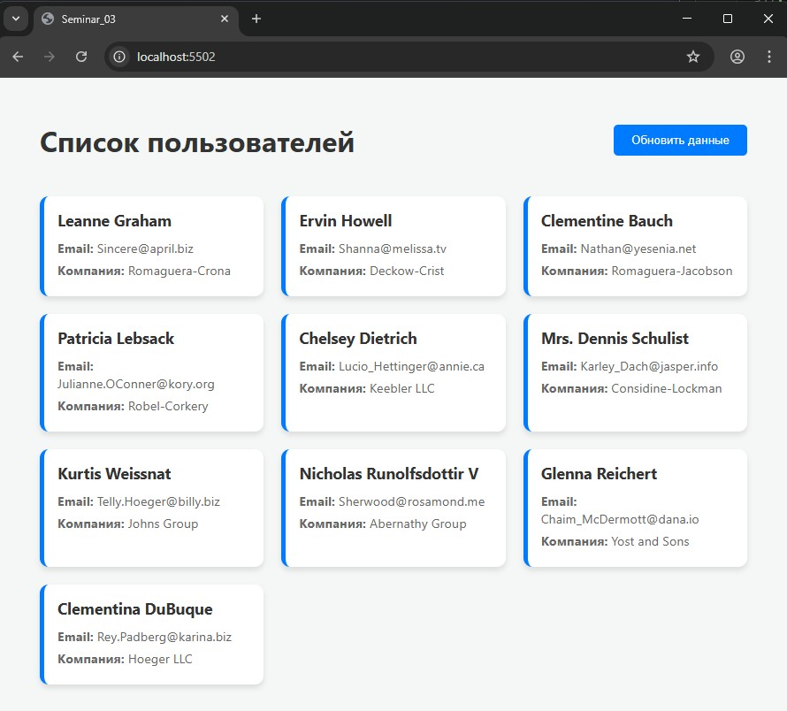
