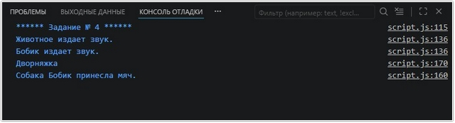

# Урок 6. Семинар: Сетевые запросы

## План урока

- Выполнение практических заданий в соответствии с [презентацией](https://gbcdn.mrgcdn.ru/uploads/asset/5860239/attachment/c88429f9790fd9688f71deb969ab0e7b.pdf) к уроку

## Домашняя работа ([решение]())


Результат выполнения ДЗ:
```
```


